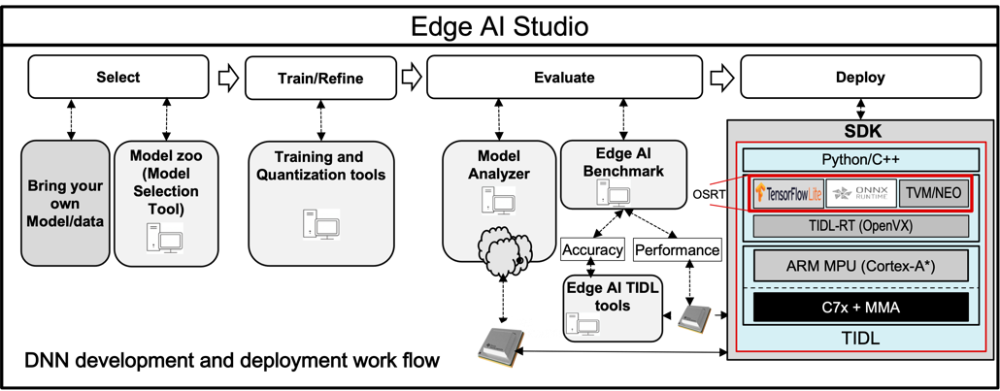
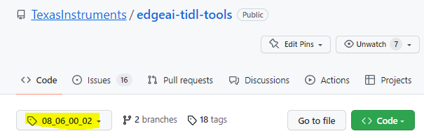
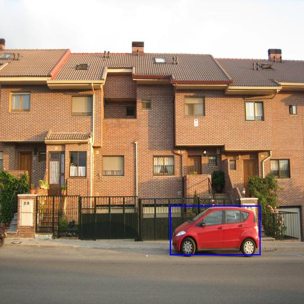

# TIDL - TI Deep Learning Product
TIDL is a comprehensive software product for acceleration of Deep Neural Networks (DNNs) on TI's embedded devices. It supports heterogeneous execution of DNNs across cortex-A based MPUs, TI’s latest generation C7x DSP and TI's DNN accelerator (MMA). TIDL is released as part of TI's Software Development Kit (SDK) along with additional computer vision functions and optimized libraries including OpenCV. TIDL is available on a variety of embedded devices from Texas Instruments.

TIDL is a fundamental software component of [**TI’s Edge AI solution**](https://www.ti.com/edgeai).
TI's Edge AI solution simplifies the whole product life cycle of DNN development and deployment by providing a rich set of tools and optimized libraries. DNN based product development requires two main streams of expertise:
* **Data Scientists**, who can design and train DNNs for targeted applications
* **Embedded System Engineers**, who can design and develop inference solutions for real time execution of DNNs on low power embedded device


TI's Edge AI solution provides the right set of tools for both of these categories:

* [**Edge AI Studio**](https://dev.ti.com/edgeai/): Integrated development environment for development of AI applications for edge processors, hosting tools like **Model Composer** to train, compile and deploy models with click of mouse button and **Model Analyzer** to let you evaluate and analyze deep learning model performance on TI devices from your browser in minutes
* [**Model zoo**](https://github.com/TexasInstruments/edgeai-tensorlab/tree/main/edgeai-modelzoo): A large collection of pre-trained models for data scientists, which along with TI's Model Selection Tool enables picking the ideal model for TI's embedded devices
* [**Training and quantization tools**](https://github.com/TexasInstruments/edgeai) for popular frameworks, allowing data scientists to make DNNs more suitable for TI devices
* [**Edge AI Benchmark**](https://github.com/TexasInstruments/edgeai-tensorlab/tree/main/edgeai-benchmark): A python based framework which can allow you to  perform accuracy and performance benchmark. Accuracy benchmark can be performed without development board, but for  performance benchmark, a development board is needed.
* [**Edge AI TIDL Tools**](#edgeai-tidl-tools): Edge AI TIDL Tools provided in this repository shall be used for model compilation on X86. Artifacts from compilation process can used for Model inference. Model inference can happen on X86 machine (host emulation mode) or on development board with TI SOC. This repository also provides examples to be directly used on X86 target and can be used on development board with TI SOC. For deployment and execution on the development board, one has to use this package.

The figure below illustrates the work flow of DNN development and deployment on TI devices:



# EdgeAI TIDL Tools

<!-- TOC -->

- [TIDL - TI Deep Learning Product](#tidl---ti-deep-learning-product)
- [EdgeAI TIDL Tools](#edgeai-tidl-tools)
  - [Introduction](#introduction)
    - [What IS Supported](#what-is-supported)
    - [What IS NOT Supported](#what-is-not-supported)
    - [Supported Devices](#supported-devices)
  - [Setup](#setup)
    - [Pre-requisites to setup on x86\_PC](#pre-requisites-to-setup-on-x86_pc)
    - [Setup on X86\_PC](#setup-on-x86_pc)
  - [Validate and Benchmark out-of-box examples](#validate-and-benchmark-out-of-box-examples)
    - [Compile and Validate on X86\_PC](#compile-and-validate-on-x86_pc)
    - [Benchmark on TI SOC](#benchmark-on-ti-soc)
  - [Compile and Benchmark Custom Model](#compile-and-benchmark-custom-model)
  - [User Guide](#user-guide)
  - [License](#license)

<!-- /TOC -->

## Introduction
TIDL provides multiple deployment options with industry defined inference engines as listed below. These inference engines are being referred as Open Source Runtimes (OSRT) in this document.
* **TFLite Runtime**: [TensorFlow Lite](https://www.tensorflow.org/lite/guide/inference) based inference with heterogeneous execution on cortex-A** + C7x-MMA, using TFlite Delegates [TFLite Delgate](https://www.tensorflow.org/lite/performance/delegates) API
* **ONNX RunTime**: [ONNX Runtime]( https://www.onnxruntime.ai/) based inference with heterogeneous execution on cortex-A** + C7x-MMA.
* **TVM/Neo-AI RunTime**: [TVM]( https://tvm.apache.org)/[Neo-AI-DLR]( https://github.com/neo-ai/neo-ai-dlr) based inference with heterogeneous execution on cortex-A** + C7x-MMA

>** *AM68PA has cortex-A72 as its MPU, refer to the device TRM to know which cortex-A MPU* it contains.

These heterogeneous execution enables:
1. OSRT as the top level inference  for user applications
2. Offloading subgraphs to C7x/MMA for accelerated execution with TIDL
3. Runs optimized code on ARM core for layers that are not supported by TIDL
   
Edge AI TIDL Tools provided in this repository supports model compilation and model inference. The diagram below illustrates the TFLite based work flow as an example. ONNX Runtime and TVM/Neo-AI Runtime also follows similar work flow.

<p align="center">  </p>

The below table covers the supported operations with this repository on X86_PC and TI's development board.
<div align="center">

| Operation  | X86_PC | TI SOC |Python API |CPP API|
| ------- |:-----------:|:-----------:|:-----------:|:-----------:|
| Model Compilation  | :heavy_check_mark: |:x: | :heavy_check_mark: |:x:|
| Model Inference  | :heavy_check_mark: | :heavy_check_mark: |:heavy_check_mark: |:heavy_check_mark:|
 
</div>

### What IS Supported
- Benchmark latency and Memory bandwidth of out of box example models (10+)
- Compile user / custom model for deployment with TIDL
- Inference of compiled models on X86_PC or TI SOC using file base input and output

### What IS NOT Supported
- Camera , Display and DL runtime based end-to-end pipeline development or benchmarking. 
  - Please refer [Processor SDK Linux for Edge AI](https://software-dl.ti.com/jacinto7/esd/processor-sdk-linux-am68a/latest/exports/edgeai-docs/common/sdk_overview.html) for such applications. This is for AM68A and similar inofmration can be found for other devices
-  Benchmarking accuracy of models using TIDL acceleration with standard datasets, for e.g. - accuracy benchmarking using MS COCO dataset for object detection models. 
   - Please refer  [edgeai-benchmark](https://github.com/TexasInstruments/edgeai-tensorlab/tree/main/edgeai-benchmark) for the same.

### Supported Devices
- Following table shows the devices supported by this repository
- Device with hardware acceleration have TI-DSP and MMA(Matrix Multiplier Accelerator) for faster execution. 
<div align="center">

| Device Family(Product)	| Environment Variable	| Hardware Acceleration |
| ------- |:------:|:------:|
|AM62            |am62       |  :x:|
|AM62A           |am62a      |  :heavy_check_mark:|
|AM67A	         |am67a      |  :heavy_check_mark:|
|AM68PA	         |am68pa     |  :heavy_check_mark:|
|AM68A	         |am68a      |  :heavy_check_mark:|
|AM69A	         |am69a      |  :heavy_check_mark:|
|J721E (TDA4VM)  |am68pa     |  :heavy_check_mark:|
|J721S2 (TDA4AL, TDA4VL) | am68a           |  :heavy_check_mark:|
|J722S  | am67a           |  :heavy_check_mark:|
|J784S4 (TDA4AP, TDA4VP,<br /> TDA4AH, TDA4VH)	| am69a     |  :heavy_check_mark:|

</div>

## Setup

> **Note**
> Please select / checkout to the tag compatible with the SDK version that you are using with the TI's Evaluation board before continuing on the below steps. Refer to [SDK Version compatibility Table](docs/version_compatibility_table.md) for the tag of your SDK version

<p align="center"> <kbd>  </kbd> </p>


### Pre-requisites to setup on x86_PC

 - X86_PC mode for this repository is validated with below configuration:
<div align="center">

| OS  | Python Version|
|:-------:|:-----------:|
|Ubuntu 22.04 |3.10|

</div>
  
  - We recommend [Docker](docs/advanced_setup.md#docker-based-setup-for-x86_pc) based setup to avoid dependency issues <br>
  
  - Tools built with GPU acceleration need to be run inside the appropriate Docker container. Refer to relevant [steps](docs/advanced_setup.md#docker-based-setup-for-x86_pc) to build and run the container <br>

### Setup on X86_PC
  - Run below one time setup for system level packages. This needs sudo permission, get it installed by your system administrator if required.

```
  sudo apt-get install libyaml-cpp-dev libglib2.0-dev
```

  - Make sure you have all permission for the current directory before proceeding 
  - Run the below commands to install the dependent components on your machine and set all the required environments

> **Note**
> **source** in the setup command is important as this script is exporting all required environment variables. Without this, user may encounter some compilation/runtime issues

 ```
 git clone https://github.com/TexasInstruments/edgeai-tidl-tools.git
 cd edgeai-tidl-tools
 git checkout <TAG Compatible with your SDK version>
 # Supported SOC name strings am62, am62a, am68a, am68pa, am69a, am67a
 export SOC=<Your SOC name>
 source ./setup.sh
```

- While opening new terminal in a system where above setup is already done once for a given SDK version, set below environment variables 

 ```
 cd edgeai-tidl-tools
 export SOC=<Your SOC name>
 export TIDL_TOOLS_PATH=$(pwd)/tidl_tools
 export LD_LIBRARY_PATH=$LD_LIBRARY_PATH:$TIDL_TOOLS_PATH
 export ARM64_GCC_PATH=$(pwd)/gcc-arm-9.2-2019.12-x86_64-aarch64-none-linux-gnu
```


## Validate and Benchmark out-of-box examples

- We provide 10+ out-of-box examples for model compilation on X86_PC and Inference on X86_PC and  TI SOC in the below category of tasks. Refer  [**Model zoo**](https://github.com/TexasInstruments/edgeai-tensorlab/tree/main/edgeai-modelzoo) for complete set of validated models across multiple categories
  - Image classification
  - Object detection
  - Pixel level semantic Segmentation

### Compile and Validate on X86_PC
- Execute below to compile and run inference of the model in  X86_PC 
    - Inference is validated with both Python and CPP APIs

 ```
mkdir build && cd build
cmake ../examples && make -j && cd ..
source ./scripts/run_python_examples.sh
python3 ./scripts/gen_test_report.py
```

- You can find the models used and their corresponding inference parameters at ```./examples/osrt_python/model_configs.py```
- The execution of above step will generate compiled-model artifacts at ```./edgeai-tidl-tools/model-artifacts```, output images at ```./edgeai-tidl-tools/output_images``` and output binary at ```./edgeai-tidl-tools/output_binaries```. 
- The outputs binaries is compared against the expected output binary in ```/edgeai-tidl-tools/test_data/refs-pc-{soc}/bin/```. A list of which output binaries to compare can be found in ```/edgeai-tidl-tools/test_data/refs-pc-{soc}/golden_ref_pc_{soc}.csv```

This confirms successful installation / setup on PC

```
model-artifacts/
models/
output_images/
output_binaries/
test_report_pc_${soc}.csv
```
-  An output binary can be found for each model in the 'output_binaries' folder
-  An output image can be found for each model in the 'output_images' folder, similar to what's shown below

| Image Classification  | Object detection| Semantic Segmentation |
|:-------:|:-----------:|:---:|
|  |   |  |

### Benchmark on TI SOC
- Prepare the development board by following the below steps

```
 git clone https://github.com/TexasInstruments/edgeai-tidl-tools.git
 cd edgeai-tidl-tools
 git checkout <TAG Compatible with your SDK version>
 export SOC=<Your SOC name>
 export TIDL_TOOLS_PATH=$(pwd)
 ```

- Copy the compiled artifacts from X86_PC to Development boards file system at ./edgeai-tidl-tools/
- Execute below to run inference on target development board with both Python and CPP APIs

```
# scp -r <pc>/edgeai-tidl-tools/model-artifacts/  <dev board>/edgeai-tidl-tool/
# scp -r <pc>/edgeai-tidl-tools/models/  <dev board>/edgeai-tidl-tool/
mkdir build && cd build
cmake ../examples && make -j && cd ..
python3 ./scripts/gen_test_report.py
```
- The execution of above step will generate output images at ```./edgeai-tidl-tools/output_images``` and output binary at ```./edgeai-tidl-tools/output_binaries```
- The outputs binaries is compared against the expected output binary in ```/edgeai-tidl-tools/test_data/refs-{soc}/bin/```. A list of which output binaries to compare can be found in ```/edgeai-tidl-tools/test_data/refs-{soc}/golden_ref_{soc}.csv```

This confirms successful integration on SOC

## Compile and Benchmark Custom Model

-  [**New Model Evaluation**](docs/custom_model_evaluation.md#new-model-evaluation) : Refer this if your model falls into one of supported out-of-box example tasks categories such as image classification, object detection or pixel level semantic Segmentation
- [**Custom Model Evaluation**](docs/custom_model_evaluation.md#custom-model-evaluation) : Refer this section if your custom model doesn't fall in supported example task category or input and output format is different from the supported list of tasks
- [**Reporting issues with Model deployment**](docs/custom_model_evaluation.md#reporting-issues-with-model-deployment) - Refer notes here for reporting issues in custom model deployment

## User Guide
- [**Python API and examples**](examples/osrt_python/README.md) - Detailed documentation on all the compile and inference options for TIDL offload for each runtime sessions
- [**CPP API and examples**](examples/osrt_cpp/README.md) - Detailed documentation on compiling the CPP examples on X86_PC as well as Development board.
- [**Jupyter Notebooks**](examples/jupyter_notebooks/README.md) - Interactive step-by-step documented notebooks for pre-compiled models inference.
- [**Supported Operators and Runtimes**](docs/supported_ops_rts_versions.md) - List of supported operators from TIDL offload and their limitations for each runtime. 
- [**Advanced Setup Options**](docs/advanced_setup.md#advanced-setup-options) - Setup options for advanced users to optimize setup time
- **Feature Specific Guides**
  - [**Quantization specification**](docs/tidl_fsg_quantization.md)
  - [**Object detection Meta architectures**](docs/tidl_fsg_od_meta_arch.md)
  - [**Trouble Shooting Guide**](docs/tidl_osr_debug.md)
  - [**Model Optimization**](scripts/README.md)  
  - [**Multi-core inference for devices with multiple DSP cores**](docs/tidl_fsg_multi_c7x.md)
  - [**Support for Vision Transformers**](docs/tidl_fsg_vtfr.md)
  - [**TIDL-RT: Input and Output Tensor Format**](docs/tidl_fsg_io_tensors_format.md)
## License
Please see the license under which this repository is made available: [LICENSE](./LICENSE)
