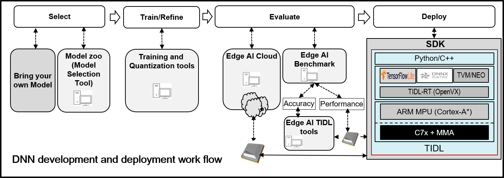

# EdgeAI TIDL Tools and Examples

This repository contains examples developed for Deep learning runtime (DLRT) offering provided by TI’s EdgeAI solutions. This repository also contains tools that can help in deploying AI applications on TI’s EdgeAI solutions quickly to achieve most optimal performance.



- [EdgeAI TIDL Tools and Examples](#edgeai-tidl-tools-and-examples)
  - [Introduction](#introduction)
  - [Setup](#setup)
    - [SOC Device Setup](#device-setup)
    - [AM62 AMRNN Setup](#am62-setup)
    - [Advanced Setup Options](#advanced-setup-options)
  - [Python Examples](#python-examples)
  - [CPP Examples](#cpp-examples)
  - [Validated Examples](#validated-examples)
  - [Jupyter Notebooks](#jupyter-notebooks)
  - [Advanced Setup Options](#advanced-setup-options)
  - [Versioning](#versioning)
  - [Notes](#notes)
  - [License](#license)

## Introduction
 The following sections describes the steps to install this repository, dependent components on supported devices and run the examples on the same. Most of the steps explained in this page are common for PC emulation and execution on target. If any of the steps is different between PC and target, then same is called out in this document.

 ## Supported Devices
- Following table shows the devices supported by this repository
- Device with hardware acceleration have TI-DSP and MMA(Matrix Multiplier Accelerator) for faster execution. 
  | SOC  | Hardware Acceleration |
    | ------- |:------:|
    |AM68PA |:heavy_check_mark:|
    |AM68A |:heavy_check_mark:|
    |AM69A |:heavy_check_mark:|
    |AM62A |:heavy_check_mark:|
    |AM62 |:x:|

## Setup
  - This repository is validated on Ubuntu 18.04 in PC emulation mode, AM62, AM68PA, AM62A, AM68A and AM69A using PSDK-RTOS releases
  - This repository works only with python 3.6 on PC (Which is default in Ubuntu 18.04)
  - We have also validated under docker container in PC. Refer [Dockerfile](./Dockerfile) for the list of dependencies installed on top of ubuntu 18.04 base line
    - Make sure you have all permission set for the current directory before proceeding 
  - Run the below script to install the dependent components on your machine and set all the required environments
 ```
 git clone https://github.com/TexasInstruments/edgeai-tidl-tools.git
 cd edgeai-tidl-tools
 export SOC=<Your SOC>
 source ./setup.sh
```
### SOC Device Setup (not AM62)
  - If you are planning to do inference in the SOC(not AM62) device refer [here](./examples/osrt_python/README.md#model-inference-on-evm) for setting up of device with required dependencies 
### AM62 Setup
  - If you are planning to do inference in the AM62 device with armnn delegate for tflite run below setup on AM62 device
  ```
  source ./setup.sh --load_armnn
  ```
### Advanced Setup Options
  - If you are planning to validate only  python examples and avoid running CPP examples, invoke the setup script with below option
   
```
 source ./setup.sh --skip_cpp_deps
```
- If you have already installed the python dependencies in [requirements_pc.txt](./requirements_pc.txt) and want to skip it, invoke the setup script with below option
   
```
 source ./setup.sh --skip_x86_python_install
```
  - If you have the ARM GCC tools chain already installed in your machine, invoke the setup script with below option and set "ARM64_GCC_PATH" environment variable
   
```
export ARM64_GCC_PATH=$(pwd)/gcc-arm-9.2-2019.12-x86_64-aarch64-none-linux-gnu
source ./setup.sh --skip_arm_gcc_download
```
  - If you are planning to do inference with armnn delegate for tflite run  setup with below option

```
source ./setup.sh --load_armnn
```

  - If you are building the PSDK-RTOS from source and updating any of the TIDL tools during the development, then set  "TIDL_TOOLS_PATH" environment variable before starting setup script
   
```
export TIDL_TOOLS_PATH=$PSDKR_INSTALL_PATH/tidl_j7_xx_xx_xx_xx/tidl_tools
source ./setup.sh
```
 

## Python Examples

  - Run below script to validate all the python examples available in the repository. This script would run both model-compilation and inference when executed on PC
   
```
./scripts/run_python_examples.sh
```

  - This script would run only inference of example models when executed on target device like J721E, AM62 EVM or SK. So this script must be first executed on PC to generate the artifacts needed for inference and then copy below folders from PC to target device before running this script on device
```
./model-artifacts
./models
```
  - Refer [Python Examples](examples/osrt_python/README.md) for details on the custom model compilation and inference python examples

## CPP Examples
   - CPP APIs of the DL runtime offered by solutions only supports the model inference. So the user is expected  to run the [Python Examples](#python-examples) on PC to generate the model artifacts.

- Refer [CPP Examples](examples/osrt_cpp/README.md) for detailed instructions on building and running the CPP examples

## Validated Examples
  - Following table summarizes the validated examples 

    | Example  | Interface |Example  location| AM62   | AM68PA  | AM68A  | AM69A  | AM62A  |
    | ------- |:------:|:------:|:------:|:-----:|:-----:|:-----:|:-----:|
    |tfl | Python | examples/osrt_python/tfl/ | :heavy_check_mark: |:heavy_check_mark:|:heavy_check_mark:|:heavy_check_mark:|:heavy_check_mark:|
    |ort | Python | examples/osrt_python/ort/ | :heavy_check_mark: |:heavy_check_mark:|:heavy_check_mark:|:heavy_check_mark:|:heavy_check_mark:|
    |dlr | Python | examples/osrt_python/dlr/ |  |:heavy_check_mark:|:heavy_check_mark:||:heavy_check_mark:|
    |tfl | cpp | examples/osrt_cpp/tfl/ | :heavy_check_mark: |:heavy_check_mark:|
    |ort | cpp | examples/osrt_cpp/ort/ | :heavy_check_mark: |:heavy_check_mark:|
    |dlr | cpp | examples/osrt_cpp/dlr/ |  |:heavy_check_mark:|
    |advanced tfl | cpp | examples/osrt_cpp/advanced_examples/tfl/ |  |:heavy_check_mark:|
    |advanced ort | cpp | examples/osrt_cpp/advanced_examples/ort/ |  |:heavy_check_mark:|
    |jupyter_notebooks| Python | examples/jupyter_notebooks |  |:heavy_check_mark:|
 

## Jupyter Notebook Examples

- All the notebooks can be executed in PC emulation mode, but only inference notebooks can be executed on target device.
- Run the below command to launch the Jupyter notebooks session

    ```
    cd examples/jupyter_notebooks
    source ./launch_notebook.sh
    ```
- Refer [Jupyter Notebook](examples/jupyter_notebooks/README.md) for details on using Jupyter Notebooks examples


## Advanced Setup Options
  - If you are planning to validate only  python examples and avoid running CPP examples, invoke the setup script with below option
   
```
 source ./setup.sh --skip_cpp_deps
```
  - If you have the ARM GCC tools chain already installed in your machine, invoke the setup script with below option and set "ARM64_GCC_PATH" environment variable
   
```
export ARM64_GCC_PATH=$(pwd)/gcc-arm-9.2-2019.12-x86_64-aarch64-none-linux-gnu
source ./setup.sh --skip_arm_gcc_download
```

  - If you are building the PSDK-RTOS from source and updating any of the TIDL tools during the development, then set  "TIDL_TOOLS_PATH" environment variable before starting setup script
   
```
export TIDL_TOOLS_PATH=$PSDKR_INSTALL_PATH/tidl_j7_xx_xx_xx_xx/tidl_tools
source ./setup.sh
```

## Versioning

- This repository would be tagged with same version as [PSDK-RTOS](https://www.ti.com/tool/download/PROCESSOR-SDK-RTOS-J721E) for every release. For example *08.00.00.12*.
- If there is any PC tools update/Bugfix which is compatible with a PSDK-RTOS version, then the same would be tagged with a additional version digits like *08.00.00.12.01*
- Always refer the [setup](./setup.sh) for current compatible PSDK-RTOS version
  
## Notes

-  These examples are only for basic functionally testing and performance benchmarking (latency and memory bandwidth). Accuracy of the models can be benchmarked using the python module released here [edgeai-benchmark](https://github.com/TexasInstruments/edgeai-benchmark)
- TIDL-RT supported layers can be found [here](https://software-dl.ti.com/jacinto7/esd/processor-sdk-rtos-jacinto7/08_02_00_05/exports/docs/tidl_j721e_08_02_00_11/ti_dl/docs/user_guide_html/md_tidl_layers_info.html)

## License
Please see the license under which this repository is made available: [LICENSE](./LICENSE)
