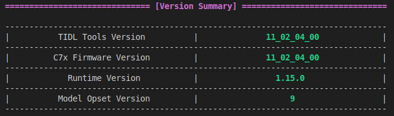
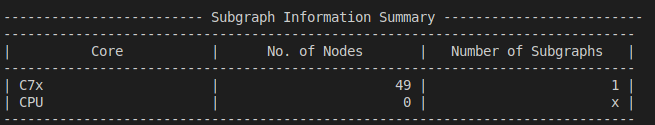
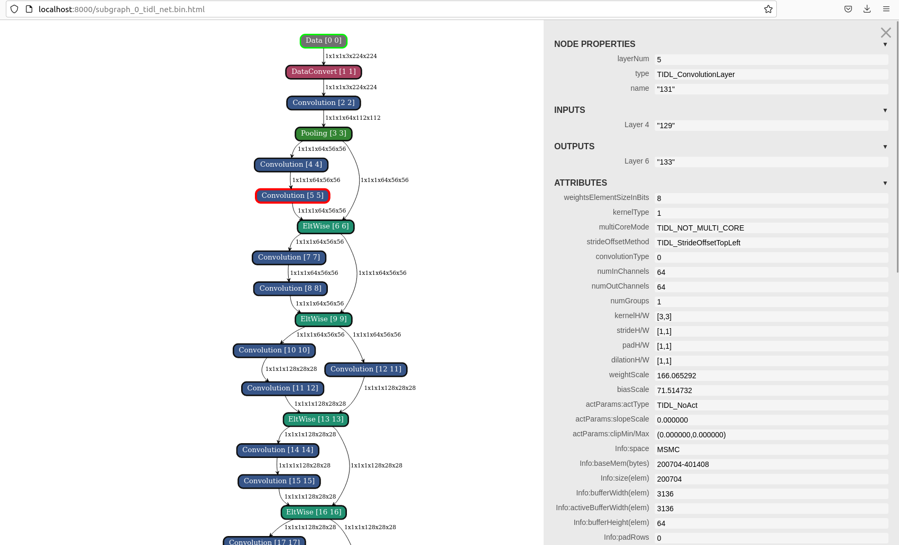
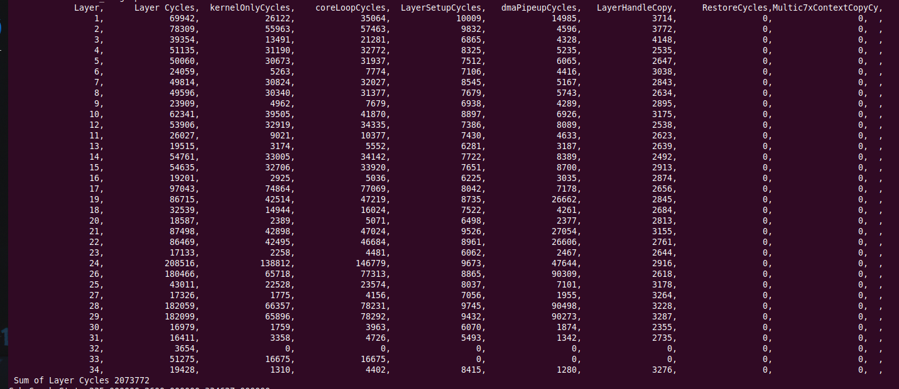

# Debugging

This document provides information about general error, trace logs, debugging during compilation and inference phases.

## Table of Contents

- [General Errors](#general-errors)
- [Visualizing Original Model](#visualizing-original-model)
- [Debug Trace Logs](#debug-trace-logs)
- [Debugging Model Compilation](#debugging-model-compilation)
  - [Version Summary](#version-summary)
  - [Parsing](#parsing)
  - [Optimization and Quantization](#optimization-and-quantization)
  - [Memory Planning](#memory-planning)
- [Debugging Model Inference](#debugging-model-inference)
  - [Model Artifacts Incompatibility](#model-artifacts-incompatibility)
  - [Inferencing Failures](#inferencing-failures)
  - [Incorrect Inference Results](#incorrect-inference-results)
  - [Inference Performance](#inference-performance)
- [Basic Root Causing](#basic-root-causing)
- [Additional Support](#additional-support)

## General Errors
While running model compilation or inference there are some general error that can be encountered and its solution:

1. **Environment Error**: This usually arises when you have improper environment setup or you have some missing dependencies like incorrect python wheels or c++ libraries. The top level [README.md](../README.md#setup-on-x86-pc) calls out the steps to setup the environment properly. As a part of this you are also required to run a `setup.sh` script which downloads all the necessary components. If anything fails during the invocation of setup script, it is clearly called out. Make sure to look for any anomalies while running the setup.

2. **Unset Environment Variables**: Some necessary environment variables like `SOC`, `TIDL_TOOLS_PATH` and `LD_LIBRARY_PATH` needs to be setup on x86 system during model compilation and inference. These are setup as a part of `setup_env.sh` script. If these variable are missing, you will encounter errors while invoking model compilation and inference. An examples of this errors is: `Error -   libtidl_onnxrt_EP.so: cannot open shared object file: No such file or directory`.

3. **Permission errors**: 
   - While running model compilation, generated artifacts are dumped in the location defined by `artifacts_folder` compilation option. Make sure you have read/write permission on the path specified.
   - While running model inference using `basic_examples`, the generated outputs are saved at the same location of the script/executable. Make sure you have write permissions for the same location.
   - **Cross-environment permission issues**: When switching between TI SOC and x86 PC environments, permission conflicts may occur. On TI SOC, operations are often performed as the root user, resulting in files and directories being created with root ownership. When returning to the x86 PC environment (where you typically operate as a non-root user), you may encounter "Permission denied" errors when attempting to access or modify these files. To resolve this:
     - For inference outputs: Manually remove the `outputs` directory created on the TI SOC before running inference on the x86 PC.
     - For C++ build artifacts: Use the `build_cpp.sh` script with sudo privileges to clean the build environment: `sudo ./scripts/build/build_cpp.sh --clean`

4. **C++ build errors**: Common reasons for C++ build errors are unset environment variables as mentioned in (2). Missing dependencies while building on x86. Dependencies for x86 can be found in `tools` folder which are downloaded as part of `setup.sh`. Make sure the tools folder has the following: `cnpy`, `osrt_deps/onnx_1.15.0_x86_u22`, `osrt_deps/tflite_2.12_x86_u22`, `osrt_deps/tvm_0.18.0_x86_u22`

5. **C++ run errors**: A common mistake that is observed is C++ binary incompatibility. Binaries compiled for x86 can only be used in x86 system while binaries compiled for aarch64 can only be used in aarch64 systems. For more details, see the [Build README](../scripts/build/README.md). If you are switching between TI device and x86 system, make sure to recompile C++ applications.

6. **Runtime Optimization errors**: Runtimes like onnxruntime has the capability to internally optimize the provided onnx model. This means the the model provided by the user might be optimized to some extend by onnxruntime before delegation to TIDL. This optimization is enabled by default in onnxruntime and subsequently in `basic_examples`. Enabling/Disabling of this optimization is something the user model depends on. We encourage you to experiment with this option in case you model is not fully offloaded. For `vision transformers` make sure the optimization is disabled. You can do this by uncommenting **session.disable_onnxruntime_optimization()" line in basic_examples. An important thing to note is, model compilation and model inference should not have varying onnxruntime internal optimization set. For example, if you are compiling with disabling optimization it is expected that the inference should also be with disable optimization because optimization effectively modifies the graph even before delegation to TIDL.

## Visualizing Original Model
[Netron](https://github.com/lutzroeder/netron) app can be used to visualize the original .onnx or .tflite model structure before compilation. This can be helpful for understanding the original model architecture and comparing it with the TIDL graph representation after compilation.

## Debug Trace Logs

TIDL provides mechanism to enable debug trace logs at various levels. These logs can be enabled as part of model compilation and model inference by using `debug_level` flag. Various debug levels are as follows:

  - 0 - No Debug Prints
  - 1 - Level-1 Debug Prints
  - 2 - Level-2 Debug Prints
  - 3 - Level-1 Debug Prints and dump fixed point layer traces in /tmp/
  - 4 - Level-1 Debug Prints and dump fixed and floating point layer traces in /tmp/
  - 5 - Level-2 Debug Prints and dump fixed point layer traces in /tmp/
  - 6 - Level-3 Debug Prints

> **NOTE**: To get error prints on TI Device, make sure to run **vx_remote_arm.out**. This can be done by sourcing **vision_apps_init.sh**.
> ```bash
> cd /opt/vision_apps && source ./vision_apps_init.sh
> ```

TIDL provides [critical error printing mechanism](./tidlrt.md#errors) during model inference on C7x.

These debug prints and traces can provide detailed information and allows to compare layer level outputs against reference which we will see in [Debugging Model Inference section](#debugging-model-inference).

## Debugging Model Compilation

1. **Version Summary**: During model compilation, a version summary table is printed which stated "TIDL Tools Version" and "C7x Firmware Version" and some other metadata.



2. **Parsing**: Model parsing is the first step of model compilation wherein model is parsed and the operator supported is decided based on what TIDL supports. Refer to [Supported Operators](./operators.md) for all operators that TIDL supports. This parsing table is only applicable while compiling via open source runtimes. A summary table is generated which states the number of node offloaded to C7x dsp through TIDL and the number of nodes which will run on CPU through native open source runtime execution.




3. **Optimization and Quantization** : After parsing, optimization and quantization kicks in which modifies the graph. Any error that occurs during this state is displayed as a warning or error message which can help with diagnosis.

4. **Memory Planning**: Memory planning is the last step. While compiling in 32-bit, memory planning does not happen, it is only applicable for 8-bit and 16-bit. If memory planning fails, the model is not expected to run on TI Device. This error is clearly called out at the end of compilation with appropriate error message.


As a part of model compilation, TIDL graph representation is generated as `artifacts/tempDir/*.html` which provides a detailed layer level information of the generated model artifacts after compilation. This can be investigated further to find discrepancies such as incorrect layer output dimension, incorrect layer properties etc. 

<div align="center">

</div>

Refer to [Model Compilation](./model_compilation.md) for more details on compilation process.

## Debugging Model Inference

### Model Artifacts Incompatibility

If the generated model artifacts are incompatible, the inferencing will fail. This incompatibility can be caused due to two main reasons:

1. **Different SoC**: Model compiled for one SoC cannot be used on another. For each SoC, the provided `tidl_tools` is unique. `versions.txt` inside the tidl_tools folder specifies the corresponding SoC the tools is meant for.
2. **Firmware Incompatible**: While running inference and version compatibility error might arise. "**Network version - \**version_1\**, Expected version - \*version_2\***". This means that tools used for model compilation is incompatible with the firmware present on the SoC. Either a compatible tools should be used to compile the model or firmware has to be updated on the SoC. Each version of the tools is compatible with only a particular firmware on the SoC. Check [SDK Version Compatibility](./sdk_version_compatibility_table.md) for more details.


### Inferencing Failures

When model inference fails, it can be due to various reasons. One common cause is errors during graph creation or processing. TIDL provides a comprehensive error reporting mechanism that can help diagnose these issues. Refer to [ERRORS](./tidlrt.md#errors) for more details.


### Incorrect Inference Results

When facing incorrect inference results, the debugging process typically involves these steps:

1. **Get Golden Outputs**: First, obtain the golden output by running the model via the native model runtime without TIDL-offload to get layer-level outputs. [Python Basic Examples](../runtimes/examples/python/basic_example/README.md) provides option to run with native runtime using `-d` option and the outputs are dumped in `outputs/*model-key*/no_offload/` folder

   - For ONNX models: When running via native ONNX Runtime, you need to modify the model to add outputs to each layer since ONNX Runtime does not provide an option to dump intermediate outputs. Refer to [osrt-model-tools](../osrt-model-tools/osrt_model_tools/onnx_tools/tidl_onnx_model_utils/README.md#add_intermediate_outputs) for a simple script to add intermediate outputs to an onnx model.

   - For TFLite models: TFLite provides built-in options to dump intermediate outputs.
    ``` python
      for t_detail in interpreter.get_tensor_details():
        tensor = interpreter.get_tensor(t_detail['index'])
        '''
        Since TIDL outputs are in NCHW format which TFlite traces are in NHWC format
        '''
        if (t_detail['shape'] == 3):
          tensor = numpy.transpose(tensor,[2,0,1]) 
        elif (t_detail['shape'] == 4)
          tensor = numpy.transpose(tensor,[0,3,1,2]) 
        tensor.tofile(FOLDER + f"out_{t['index']}.bin")
    ```

2. **Get TIDL Outputs**: Run the original model with `debug_level = 4` as specified in "Debug Trace Logs" section above. This will dump layer level outputs under /tmp folder. Make sure to clear the /tmp folder before running it to avoid debugging traces from older and unrelated inference runs. The dumped trace will follow the following naming <br><br>
"**tidl_trace_name_layernum_batch_dim1_dim2_channel_widthxheight**" <br><br>For example:<br>
tidl_trace_subgraph_0_0001_0001_0001_00004_00002_000128x00064_float.bin (Float trace)
<br> tidl_trace_subgraph_0_0001_0001_0001_00004_00002_000128x00064.y (Fixed trace) <br><br>graph_name: subgraph_0, layer_num: 0001, batch: 1, dim1: 1, dim2: 4, channel: 2, height: 64, width: 128<br><br>Indicating a output dimension for Layer 1 to be 1x1x4x2x64x128 <br><br>
Once the outputs are generated and dumped copy it over to an empty folder.
<br> <br> TIP: If you are using basic_examples, copy over the traces to `outputs/*model-key*/offload/` folder since the golden outputs as specified above are dumped in `outputs/*model-key*/no_offload/`. With this you will have consistency and easier time comparing the traces.

3. **Compare traces**: The float binary dumped by TIDL and the golden outputs can now be compared. Since TIDL modifies the model internally and introduce require optimizations, the compiled model artifacts will not be a perfect one-to-one match with the original model. <br>
To find which layer(s) in TIDL artifacts map to original model,  use `artifacts/tempDir/*.html` which provides layer number and layer name for each layer. Alternatively `artifacts/tempDir/*.layer_info.txt` can also be used which contains layer mapping in `SL No., Layer Num, Name` format. <br><br> Once the mapping is identified a simple plotting can be done to compare the two binaries. A debug utility script is provided in [Layer Trace Inspector](../scripts/debug/layer_trace_inspector/README.md) which can help vizualize the binaries.


### Inference Performance

Setting `debug_level=1` enables layer level performance printing. This is only applicable when running inference on TI Device and not x86.

<div align="center">

</div>

The **Sum of Layer Cycles** is the total cycles consumed to execute the network on C7x. This can be translated to time in milliseconds by dibision of C7x frequency in M cycles. For example, if C7x is running @ 1GHz , the time can be calculated by **Sum of Layer Cycles**/**10^6**

The layer cycles are printed in order of its execution. **Layer** in the diagram above indicates layer number while **Layer Cycles** indicate total cycle taken by the particular layer. This can be used to identify any outstanding layer which is taking more cycle and this layer can alternatively be replace in the model to improve performance. 

The other rows are meant for TI's internal team for debugging performance issues.

## Basic Root Causing
- When inference result is wrong, the first thing to suspect is the TIDL reference code for an operator. As a first step, compile the model in `32-bit` using `tensor_bits` option and run the inference. When compiling and running in 32-bit, quantization and memory planning modules are out of the picture. If the results with 32-bit is wrong, this indicates issue with TIDL internal optimization and/or reference code. Note: 32-bit artifacts cannot run on TI Device and can only be used in x86

- If `32-bit` results are correct, compile in `8-bit` or `16-bit`. This will do the full compilation along with quntization and memory planning. Run inference on x86. If the results are incorrect, this indicates that reference code, quantization and/or memory planning is the problem.

- If the results on `8-bit` is correct, run the compiled artifacts on TI Device and compare the results. If that is wrong, it indicates failure in dataflow and/or dsp code.

- If you suspect an issue in a specific part of the model, you can use the `extract_model` script to extract a subgraph from the model for focused debugging. This allows you to isolate and test just the problematic section. Refer to [osrt-model-tools](../osrt-model-tools/osrt_model_tools/onnx_tools/tidl_onnx_model_utils/README.md#extract_model) for a simple script to extract subsection of an onnx model.

## Additional Support

For any additional queries or support, please visit the [TI E2E Forum](https://e2e.ti.com/).
