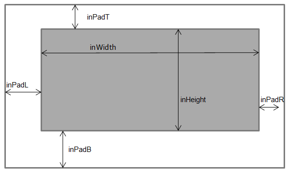

# TIDL IO Tensors

This document provides information about the Input/Output tensor formats in the TIDL framework, how to access this infomation in application, how to allocate and handle tensors, how they are handled internally while using TIDL directly or using Open Source Runtimes (OSRT). 

## Table of Contents

- [TIDL IO Buffer Descriptor](#tidl-io-buffer-descriptor)
  - [Overview](#overview)
  - [Constants and Enumerations](#constants-and-enumerations)
  - [sTIDL_IOBufDesc_t](#stidl_iobufdesc_t)
  - [Why do I see input/output buffer size requirement more than my model?](#why-do-i-see-inputoutput-buffer-size-requirement-more-than-my-model)
  - [Internal handling and data copy](#internal-handling-and-data-copy)
  - [Best Practices](#best-practices)
  - [Sample code example](#sample-code-example)
- [Input/Output tensor handling in OSRT](#inputoutput-tensor-handling-in-osrt)
  - [Memory Allocation Constraints](#memory-allocation-constraints)
  - [Unavoidable Buffer Copying](#unavoidable-buffer-copying)
  - [Performance Implications](#performance-implications)
  - [Example: ONNX Runtime with TIDL](#example-onnx-runtime-with-tidl)
  - [Choosing Between Direct TIDL and OSRT](#choosing-between-direct-tidl-and-osrt)

## TIDL IO Buffer Descriptor

### Overview

The TIDL IO buffer descriptor (`sTIDL_IOBufDesc_t`) is a binary structure that describes the properties of input and output tensors required by a compiled TIDL model. When a model is compiled for TIDL acceleration, an IO descriptor binary file, typically with a name containing `_io_` and ending with `_1.bin` (e.g., `model_name_io_1.bin`) is generated alongside the network binary file in the model-artifacts. These files are essential for running inference as it describes the expected input and output tensor format which is expected from the application.

### Constants and Enumerations

The following constants and enumerations are defined in `itidl_io.h` (present inside tidl_tools) and are used in the IO buffer descriptor:

#### Constants

| Constant | Value | Description |
|----------|-------|-------------|
| `TIDL_STRING_SIZE` | 512 | Maximum size of strings (e.g., tensor names) |
| `TIDL_MAX_ALG_IN_BUFS` | 32 | Maximum number of input buffers |
| `TIDL_MAX_ALG_OUT_BUFS` | 128 | Maximum number of output buffers |
| `TIDL_IO_MAX_NUM_CORES` | 4 | Maximum number of cores |

#### eTIDL_ElementType

| Type | Value | Description |
|------|-------|-------------|
| `TIDL_UnsignedChar` | 0 | Unsigned 8-bit integer |
| `TIDL_SignedChar` | 1 | Signed 8-bit integer |
| `TIDL_UnsignedShort` | 2 | Unsigned 16-bit integer |
| `TIDL_SignedShort` | 3 | Signed 16-bit integer |
| `TIDL_UnsignedWord` | 4 | Unsigned 32-bit integer |
| `TIDL_SignedWord` | 5 | Signed 32-bit integer |
| `TIDL_SinglePrecFloat` | 6 | 32-bit floating point |
| `TIDL_UnsignedDoubleWord` | 7 | Unsigned 64-bit integer |
| `TIDL_SignedDoubleWord` | 8 | Signed 64-bit integer |

#### eTIDL_TensorLayout

| Type | Value | Description |
|------|-------|-------------|
| `TIDL_LT_NCHW` | 0 | Channels first (Number_of_ROIs, Number_Of_Channels, Height, Width) |
| `TIDL_LT_NHWC` | 1 | Channels last (Number_of_ROIs, Height, Width, Number_Of_Channels) |

#### eTIDL_inDataFormat

| Format | Value | Description |
|--------|-------|-------------|
| `TIDL_inDataFormatBGRPlanar` | 0 | BGR planar format |
| `TIDL_inDataFormatRGBPlanar` | 1 | RGB planar format |


#### eTIDL_inferenceMode

| Mode | Value | Description |
|------|-------|-------------|
| `TIDL_inferenceModeDefault` | 0 | Inference using single C7x/MMA core |
| `TIDL_inferenceModeHighThroughput` | 1 | Batch processing mode - Multiple frames parallely infer on multiple cores |
| `TIDL_inferenceModeLowLatency` | 2 | Single batch inference using network split on multiple cores |

### sTIDL_IOBufDesc_t

The `sTIDL_IOBufDesc_t` structure is defined in `itidl_io.h` (present inside tidl_tools) and contains the following fields:

| Field | Type | Description |
|-------|------|-------------|
| `numInputBuf` | `int32_t` | Number of input buffers required by the Layer group |
| `numOutputBuf` | `int32_t` | Number of output buffers required by the Layer group |
| `numCores` | `int32_t` | Number of cores used for compute |
| `numVirtualCores` | `int32_t` | Number of virtual cores from application point of view for a given mode of implementation |
| `numSuperBatches` | `int32_t` | Number of times batch processing call needs to be invoked in multi core devices |
| `inferenceMode` | `int32_t` | TIDL inference implementation mode (ref: eTIDL_inferenceMode) |
| `inDataFormat` | `int32_t[TIDL_IO_MAX_NUM_CORES * TIDL_MAX_ALG_IN_BUFS]` | Input Tensor format (ref: eTIDL_inDataFormat) |
| `inResizeType` | `int32_t[TIDL_IO_MAX_NUM_CORES * TIDL_MAX_ALG_IN_BUFS]` | Used internally and not expected to be parsed by application |
| `resizeWidth` | `int32_t[TIDL_IO_MAX_NUM_CORES * TIDL_MAX_ALG_IN_BUFS]` | Used internally and not expected to be parsed by application |
| `resizeHeight` | `int32_t[TIDL_IO_MAX_NUM_CORES * TIDL_MAX_ALG_IN_BUFS]` | Used internally and not expected to be parsed by application |
| `inWidth` | `int32_t[TIDL_IO_MAX_NUM_CORES * TIDL_MAX_ALG_IN_BUFS]` | Width of each input buffer |
| `inHeight` | `int32_t[TIDL_IO_MAX_NUM_CORES * TIDL_MAX_ALG_IN_BUFS]` | Height of each input buffer |
| `inNumChannels` | `int32_t[TIDL_IO_MAX_NUM_CORES * TIDL_MAX_ALG_IN_BUFS]` | Number of channels in each input buffer |
| `inDIM2` | `int32_t[TIDL_IO_MAX_NUM_CORES * TIDL_MAX_ALG_IN_BUFS]` | DIM2 dimension of each input buffer |
| `inDIM1` | `int32_t[TIDL_IO_MAX_NUM_CORES * TIDL_MAX_ALG_IN_BUFS]` | DIM1 dimension of each input buffer |
| `inChannelPitch` | `int32_t[TIDL_IO_MAX_NUM_CORES * TIDL_MAX_ALG_IN_BUFS]` | Minimum Channel pitch for the input tensor |
| `inNumBatches` | `int32_t[TIDL_IO_MAX_NUM_CORES * TIDL_MAX_ALG_IN_BUFS]` | Number of Batches in each input buffer |
| `inPadL` | `int32_t[TIDL_IO_MAX_NUM_CORES * TIDL_MAX_ALG_IN_BUFS]` | Left zero padding required for each input buffer |
| `inPadT` | `int32_t[TIDL_IO_MAX_NUM_CORES * TIDL_MAX_ALG_IN_BUFS]` | Top zero padding required for each input buffer |
| `inPadR` | `int32_t[TIDL_IO_MAX_NUM_CORES * TIDL_MAX_ALG_IN_BUFS]` | Right zero padding required for each input buffer |
| `inPadB` | `int32_t[TIDL_IO_MAX_NUM_CORES * TIDL_MAX_ALG_IN_BUFS]` | Bottom zero padding required for each input buffer |
| `inPadCh` | `int32_t[TIDL_IO_MAX_NUM_CORES * TIDL_MAX_ALG_IN_BUFS]` | Number of extra channels required in each input buffer |
| `rawDataInElementType` | `int32_t[TIDL_IO_MAX_NUM_CORES * TIDL_MAX_ALG_IN_BUFS]` | Element type of each input data buffer (ref: eTIDL_ElementType) |
| `inElementType` | `int32_t[TIDL_IO_MAX_NUM_CORES * TIDL_MAX_ALG_IN_BUFS]` | Element type of each input buffer (ref: eTIDL_ElementType) |
| `inZeroPoint` | `int32_t[TIDL_IO_MAX_NUM_CORES * TIDL_MAX_ALG_IN_BUFS]` | Zero Point of each input data buffer |
| `inLayout` | `int32_t[TIDL_IO_MAX_NUM_CORES * TIDL_MAX_ALG_IN_BUFS]` | Data Layout of each input data buffer (ref: eTIDL_TensorLayout) |
| `inDataId` | `int32_t[TIDL_IO_MAX_NUM_CORES * TIDL_MAX_ALG_IN_BUFS]` | Data ID as per Net structure for each input buffer |
| `inTensorScale` | `float32_tidl[TIDL_IO_MAX_NUM_CORES * TIDL_MAX_ALG_IN_BUFS]` | Tensor scale for input data |
| `inDataName` | `int8_t[TIDL_IO_MAX_NUM_CORES * TIDL_MAX_ALG_IN_BUFS][TIDL_STRING_SIZE]` | In Tensor name in the original input networks |
| `inBufSize` | `int32_t[TIDL_IO_MAX_NUM_CORES * TIDL_MAX_ALG_IN_BUFS]` | Expected input buffer size (elements) of each input |
| `outWidth` | `int32_t[TIDL_IO_MAX_NUM_CORES * TIDL_MAX_ALG_OUT_BUFS]` | Width of each output buffer |
| `outHeight` | `int32_t[TIDL_IO_MAX_NUM_CORES * TIDL_MAX_ALG_OUT_BUFS]` | Height of each output buffer |
| `outDIM2` | `int32_t[TIDL_IO_MAX_NUM_CORES * TIDL_MAX_ALG_OUT_BUFS]` | DIM2 dimension of each output buffer |
| `outDIM1` | `int32_t[TIDL_IO_MAX_NUM_CORES * TIDL_MAX_ALG_OUT_BUFS]` | DIM1 dimension of each output buffer |
| `outNumChannels` | `int32_t[TIDL_IO_MAX_NUM_CORES * TIDL_MAX_ALG_OUT_BUFS]` | Number of channels in each output buffer |
| `outChannelPitch` | `int32_t[TIDL_IO_MAX_NUM_CORES * TIDL_MAX_ALG_OUT_BUFS]` | Channel pitch for the output tensor |
| `outNumBatches` | `int32_t[TIDL_IO_MAX_NUM_CORES * TIDL_MAX_ALG_OUT_BUFS]` | Number of Batches in each output buffer |
| `outPadL` | `int32_t[TIDL_IO_MAX_NUM_CORES * TIDL_MAX_ALG_OUT_BUFS]` | Left zero padding required for each output buffer |
| `outPadT` | `int32_t[TIDL_IO_MAX_NUM_CORES * TIDL_MAX_ALG_OUT_BUFS]` | Top zero padding required for each output buffer |
| `outPadR` | `int32_t[TIDL_IO_MAX_NUM_CORES * TIDL_MAX_ALG_OUT_BUFS]` | Right zero padding required for each output buffer |
| `outPadB` | `int32_t[TIDL_IO_MAX_NUM_CORES * TIDL_MAX_ALG_OUT_BUFS]` | Bottom zero padding required for each output buffer |
| `outPadCh` | `int32_t[TIDL_IO_MAX_NUM_CORES * TIDL_MAX_ALG_OUT_BUFS]` | Number of extra channels required in each output buffer |
| `outElementType` | `int32_t[TIDL_IO_MAX_NUM_CORES * TIDL_MAX_ALG_OUT_BUFS]` | Element type of each output buffer (ref: eTIDL_ElementType) |
| `outDataId` | `int32_t[TIDL_IO_MAX_NUM_CORES * TIDL_MAX_ALG_OUT_BUFS]` | Data ID as per Net structure for each output buffer |
| `outDataName` | `int8_t[TIDL_IO_MAX_NUM_CORES * TIDL_MAX_ALG_OUT_BUFS][TIDL_STRING_SIZE]` | Out Tensor name in the original input networks |
| `outTensorScale` | `float32_tidl[TIDL_IO_MAX_NUM_CORES * TIDL_MAX_ALG_OUT_BUFS]` | TensorScale of each input data buffer |
| `outZeroPoint` | `int32_t[TIDL_IO_MAX_NUM_CORES * TIDL_MAX_ALG_OUT_BUFS]` | Zero Point of each input data buffer |
| `outLayout` | `int32_t[TIDL_IO_MAX_NUM_CORES * TIDL_MAX_ALG_OUT_BUFS]` | Data Layout of each input data buffer (ref: eTIDL_TensorLayout) |
| `outBufSize` | `int32_t[TIDL_IO_MAX_NUM_CORES * TIDL_MAX_ALG_OUT_BUFS]` | Expected input buffer size (elements) of each output |
| `numValidTensorDims` | `int32_t[TIDL_IO_MAX_NUM_CORES * TIDL_MAX_ALG_OUT_BUFS]` | Number of valid dimensions in the output tensor (ONNX) |

### Why do I see input/output buffer size requirement more than my model?

A big question that frequently comes up is 'why do I see input/output buffer size requirement more than my model'?
There are two main reasons for this:

#### Necessary extra allocation by TIDL

Currently TIDL always required extra memory = (height x width) for internal optimization and dataflow.
Hence the input buffer size requirement is always more than the model.

> **Example**: For a tensor with dimensions [1, 3, 224, 224] and no padding:
> - Expected size calculation: 1 × 3 × 224 × 224 × elemSize = 150,528 bytes (for elemSize=1)
> - Actual allocation by TIDLRT (allocSize): 1 × 3 × 224 × 224 × elemSize + 224 × 224 × elemSize = 200,704 bytes

#### Padding

TIDL might require padding on input and output buffers which are defined in [sTIDL_IOBufDesc_t](#stidl_iobufdesc_t)
The application is required to respect this padding while filling up data for input tensors and parsing data from the output tensor.

<div align="center">
  
  <p><u>How input tensors are padded?</u></p>
</div>
<div align="center">
  
  <p><u>Contiguous stacking in memory for multiple channels?</u></p>
</div>

>[NOTE] The same applies for output tensors as well with output padding fields.

### Internal handling and data copy

TIDL handles memory allocation and data copying internally to ensure compatibility with the hardware requirements. Here are some important considerations:

#### Shared Memory Requirements

The C7x hardware accelerator requires memory to be allocated in shared memory for direct access. Applications have two options for memory allocation:

1. **Shared Memory Allocation**: Applications can allocate tensors directly in shared memory, which allows the TIDL to access the data without copying.
2. **CPU Memory Allocation**: Applications can allocate tensors in regular CPU memory, but this will require the TIDL to copy the data to shared memory before processing.

#### When Buffer Copying Occurs

Buffer copying happens in two specific cases:

1. **Memory Type Mismatch**: If the tensor data is not allocated in shared memory, TIDL will internally copy the data from CPU memory to shared memory before inference, and copy the results back afterward.

2. **Tensor Property Mismatch**: If the tensor properties (size, type, padding, layout, etc.) do not match what's described in the IO buffer descriptor, the TIDL runtime will create an internal buffer with the correct properties and copy the data.

#### Flexibility vs. Performance

It's important to note that applications are not strictly required to respect all tensor properties specified in the IO buffer descriptor. TIDL will handle any necessary conversions and copying. However, this flexibility comes with a performance cost:

- **With Property Matching**: When tensor properties match the IO descriptor requirements and data is in shared memory, no copying is needed, resulting in optimal performance.
- **Without Property Matching**: When properties don't match or data is in CPU memory, additional copying operations will occur, which can impact performance, especially for large tensors or real-time applications.

### Best Practices

1. Allocate memory based in `inBufSize` and `outBufSize` fields which spcifies exactly how many elements are required to be allocated respecting padding and and extra memory requirements.

2. Handle padding while filling the input buffer and parsing from the output buffer. If not this will lead to wrong results.

### Sample code example
```
For a tensor with dimensions [C, H, W] and padding:

rowStride = (W + padL + padR) * elemSize
channelStride = (H + padT + padB) * rowStride

To access element at position [c, h, w]:
1. Start at baseAddress
2. Add channel offset: c * channelStride
3. Skip top padding: padT * rowStride
4. Add row offset: h * rowStride
5. Skip left padding: padL * elemSize
6. Add column offset: w * elemSize

Final address = baseAddress + c * channelStride + (padT + h) * rowStride + (padL + w) * elemSize
```

For a working reference code refer to [../runtimes/tidl_wrapper/cpp/tidlrt/README.md](../runtimes/tidl_wrapper/cpp/tidlrt/README.md) and check the implementation in [../runtimes/tidl_wrapper/cpp/tidlrt/tidlrt_wrapper.cpp](../runtimes/tidl_wrapper/cpp/tidlrt/tidlrt_wrapper.cpp)

## Input/Output tensor handling in OSRT

When using Open Source Runtime (OSRT) frameworks like ONNX Runtime and TensorFlow Lite with TIDL acceleration, there are important memory management considerations that differ from direct TIDL usage.

### Memory Allocation Constraints

OSRT frameworks have their own memory management requirements that differ from TIDL's requirements:

1. **Strict Allocation Size**: OSRT frameworks strictly require respecting the actual allocation size defined in the model. They do not accommodate the extra memory that TIDL requires for internal processing.

2. **No Padding Support**: Unlike TIDL, OSRT frameworks do not have a concept of padding in their tensor representations. Tensors are expected to be contiguous blocks of memory without padding.

### Unavoidable Buffer Copying

Due to these fundamental differences in memory management between OSRT frameworks and TIDL, buffer copying is unavoidable:

1. **Memory Type Mismatch**: Since OSRT allocates in CPU memory but TIDL requires shared memory, data must be copied between these memory spaces.

2. **Tensor Property Mismatch**: The tensor properties (size, padding, layout) required by TIDL cannot be directly respected by OSRT frameworks due to their stricter requirements.

This means that when using ONNX Runtime or TensorFlow Lite with TIDL acceleration, there will always be at least one copy operation for inputs (from CPU memory to shared memory) and one for outputs (from shared memory back to CPU memory).

### Performance Implications

The unavoidable buffer copying has performance implications:

- **Additional Latency**: Each copy operation adds latency to the inference process.
- **Memory Bandwidth Usage**: Copying large tensors consumes memory bandwidth that could otherwise be used for computation.
- **CPU Overhead**: The copy operations require CPU resources.

### Example: ONNX Runtime with TIDL

```cpp
// ONNX Runtime allocates input/output tensors in CPU memory
// according to the model's requirements
OrtValue* input_tensor = /* ... */;
OrtValue* output_tensor = /* ... */;

// When TIDL acceleration is used, the following happens internally:
// 1. Data is copied from ONNX Runtime's CPU memory to TIDL's shared memory
// 2. TIDL performs inference using the copied data
// 3. Results are copied back from TIDL's shared memory to ONNX Runtime's CPU memory

// This copying happens automatically and cannot be avoided
session->Run(/* ... */);
```

### Choosing Between Direct TIDL and OSRT

When deciding between direct TIDL usage and OSRT frameworks with TIDL acceleration:

- **Use direct TIDL** when performance is critical and you can manage memory according to TIDL's requirements.
- **Use OSRT frameworks** when you need the flexibility and features of these frameworks, and can accept the performance impact of the additional copying.