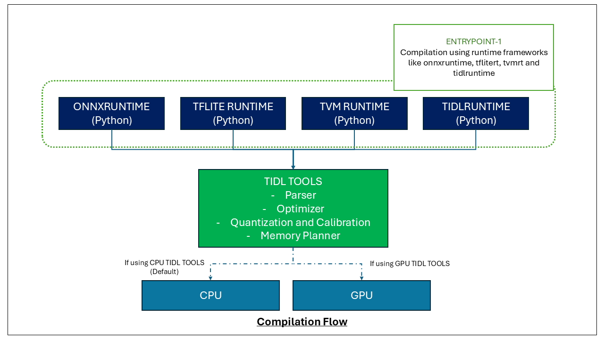

# Model Compilation for TIDL

This document provides information about model compilation for TIDL framework, including what compilation means, how compiled model artifacts are structured, and how to use them.

## Table of Contents

- [Python-Only Compilation Support](#python-only-compilation-support)
- [Introduction to Model Compilation](#introduction-to-model-compilation)
- [Compilation Flow](#compilation-flow)
- [Compiled Model Artifacts Directory](#compiled-model-artifacts-directory)
  - [Key Artifact Files](#key-artifact-files)
  - [Identifying Fully Offloaded Models](#identifying-fully-offloaded-models)
- [Compilation Options](#compilation-options)
  - [General Options](#general-options)
  - [Optimization Specific Options](#optimization-specific-options)
  - [Quantization Specific Options](#quantization-specific-options)
  - [Object Detection Specific Options](#object-detection-specific-options)
  - [Multi Subgraph Specific Options](#multi-subgraph-specific-options)
  - [Multi Core Specific Options](#multi-core-specific-options)
  - [Miscellaneous Options](#miscellaneous-options)
- [References](#references)

## Python-Only Compilation Support

Currently, TIDL model compilation is supported only through Python APIs. The C++ APIs are limited to inference only.

## Introduction to Model Compilation

Model compilation in TIDL is the process of converting and optimizing neural network models from frameworks like ONNX and TensorFlow Lite into a format that can be efficiently executed on TI's hardware accelerators (C7x DSP and MMA). This process involves several key steps:

1. **Parsing**: Analyzing the model structure to identify operations that can be offloaded on C7x DSP and MMA. See [Supported Operators](./operators.md) for more details on what is supported.
2. **Graph Optimization**: Internal optimizations applied by TIDL software to enable support and optimize performance 
3. **Quantization & Calibration**: Converting floating-point operations to fixed-point operations
4. **Memory Planning**: Optimizing memory usage and data layout for TI hardware

The compilation process transforms models into a hardware-optimized format that enables efficient inference on TI devices, significantly improving performance and power efficiency compared to running the original models on the CPU.

## Compilation Flow

The TIDL model compilation architecture consists of multiple layers that work together to transform models into an optimized format for hardware acceleration. The diagram below illustrates this architecture:

<div align="center">

</div>


1. **Runtime Frameworks**: High-level interfaces that initiate the compilation process. Currently limited to Python APIs only
2. **TIDL TOOLS**: Core components that perform the actual compilation. These "tools" are effectively static libraries, shared objects and .out files provided by TIDL and downloaded as a part of setup process. 
3. **Compilation Execution**: The **TIDL TOOLS** comes in two variants **CPU** and **GPU**. This dictates where the computational heavy part of model compilation i.e "Quantization and Calibration" will run. **CPU** tools are the default tools that are downloaded as part of setup.

## Compiled Model Artifacts Directory

When a model is compiled for TIDL acceleration, it generates a set of artifacts in a specified directory. The structure of this directory typically looks like:

```
artifacts/
    ├── subgraph_0_tidl_net.bin         # Compiled network binary file
    ├── subgraph_0_tidl_io_1.bin        # IO descriptor binary file
    ├── metadata_1.txt                  # Extra files in case of compilation from OSRT
    ├── metadata_1.txt                  # Extra files in case of compilation from OSRT
    └── tempDir/                        # Temporary directory with additional files
        ├── runtimes_visualization.svg              # Visual representation of the offload
        ├── subgraph_0_tidl_net.bin.html            # HTML viwer for compiled model details
        ├── subgraph_0_tidl_net.bin.layer_info.txt  # Layer mapping details
        └── ...                                     # Other temporary files
```

In case of multiple subgraphs due to unsupported layers, multiple files will be generated in the artifacts.

### Key Artifact Files

1. **Network Binary File** (`*_net.bin`):
   - Contains the compiled model weights and execution instructions
   - Used by the TIDL to execute the model on hardware accelerators
   - The binary format is optimized for direct loading into TI hardware

2. **IO Descriptor Binary File** (`*_io_1.bin`):
   - Describes the input and output tensor properties required by the compiled model
   - Contains information about tensor shapes, data types, memory layout, and padding requirements
   - Essential for correctly preparing input data and interpreting output results
   - For detailed information about the IO descriptor format, see [IO Tensors Documentation](./io_tensors.md)

3. **Runtime Visualization** (`tempDir/runtimes_visualization.svg`):
   - Visual representation of how the model is partitioned between hardware accelerators and CPU
   - Helps identify which parts of the model are offloaded to TIDL hardware
   - A fully offloaded model will have all nodes encapsulated under a single colored block

4. **Model Viewer** (`tempDir/*.html`):
   - Contains layer-level detailed information about the compile model
   - Provides an easy to traverse html based viewer with detailed individual layer information

5. **Layer Info** (`tempDir/*.layer_info.txt`):
   - Contains information about mapping of TIDL layer to actual model
   - Useful for debugging, see [Debugging](./debugging.md)

### Identifying Fully Offloaded Models

A model is considered "fully offloaded" when all of its operations can be executed on the TIDL hardware accelerators without requiring CPU involvement. Fully offloaded models:

- Have better performance and power efficiency
- Can be used with the TIDL runtime directly
- Will have a single network binary file and IO descriptor file
- Show all nodes encapsulated in a single block in the visualization SVG

## Compilation Options
When compiling models, you can configure various options to control the compilation process, including optimization, quantization etc.

### General Options

| Option Name | Description | Allowed Values | Default Value | Notes |
|------------|-------------|----------------|---------------|---------------------|
| `tidl_tools_path` | Path to TIDL TOOLS | Valid TIDL TOOLS path | None (Required) | Must point to a valid TIDL tools installation directory |
| `artifacts_folder` | Path to save the compiled model artifacts | Valid directory path | None (Required) | Directory must exist and be empty |
| `debug_level` | Level of debug information | 0 - No Debug Prints<br>>= 1 - Compilation debug prints | 0 | Higher values provide more detailed debug information |
| `tensor_bits` | Bit precision for tensor quantization | 8, 16, 32 | 8 | 32-bit is floating point and not supported for target execution |
| `advanced_options:add_data_convert_ops` | Control data conversion layer addition to input outputs | 0 - Do not add dataconvert layer<br>1 - Add data convert at inputs only<br>2 - Add data convert at outputs only<br>3 - Add dataconvert at both inputs and outputs | 0 |  |
| `ti_internal_nc_flag` | Internal use only | - | - | - |

### Optimization Specific Options
| Option Name | Description | Allowed Values | Default Value | Notes |
|------------|-------------|----------------|---------------|---------------------|
| `advanced_options:graph_optimization_level` | Controls the level of graph optimizations applied during compilation | 0 - TIDL_OPTIMIZE_LEVEL_BASIC (basic optimizations only)<br>1 - TIDL_OPTIMIZE_LEVEL_EXTENDED (basic + extended optimizations) | 0 | When set to TIDL_OPTIMIZE_LEVEL_EXTENDED, extended optimizations like shape-folding is enabled to enhance performance. Currently TIDL_OPTIMIZE_LEVEL_EXTENDED is an experimental feature and has gone through limited validation |
| `advanced_options:batch_mode` | Enable batch processing mode | 0 - 1 | 0 | If enabled, i.e set to 1, the outermost non-singleton dimension of certain layers will be stitched to width dimension for performance improvements|
| `advanced_options:partial_init_during_compile` | Enable partial initialization of handles during model compilation to reduce inference initialization time | 0-1 (Integer) | 0 | Inference on host-emulation will not work if model is compiled with this flag enabled. Enabling this flag reduces int initialization time during inference by performing some internal compuations during compile time which would otherwise be performed during inference initialization. 
| `advanced_options:packetize_mode` | Enable packetization mode for sparse weights in the model | 0-1 (Integer) | 0 | For optimizing memory access patterns |
| `advanced_options:high_resolution_optimization` | Enable high resolution optimization for improving performance on high resolution models | 0-1 (Integer) | 0 | This option enables "Super Tiling" wher-in feature-maps in layers are processed in chunks instead of complete data for better memory optimization  |
| `advanced_options:pre_batchnorm_fold` | Fuses BatchNorm present before a Convolution | 0-1 (Integer) | 1 | Improves performance by folding batch norm into convolution |
| `advanced_options:optimize_batchnorm_higherdims` | Fuses higher dimension for batchnorm to lower dimensions for performance improvements | 0-1 (Integer) | 0 | |

### Quantization Specific Options

For detailed explanation of quantization in TIDL, check out [Quantization](./quantization.md)

| Option Name | Description | Allowed Values | Default Value | Notes |
|------------|-------------|----------------|---------------|---------------------|
| `accuracy_level` | Level of accuracy optimization | 0, 1, 2, 9 (Integer) | 1 | Higher values prioritize accuracy over performance |
| `bias_calibration_factor` | Bias Calibration Factor | Float | 0.05 | Contribution used to update the bias in each iteration based on the difference of actual mean with respect to the mean after quantization |
| `advanced_options:calibration_frames` | Number of frames to use for calibration | Integer > 0 | 20 | More frames can improve accuracy but increase compilation time. This option is only applicable when `accuracy_level = 1` |
| `advanced_options:calibration_iterations` | Number of iterations for calibration | Integer > 0 | 50 | More iterations can improve accuracy but increase compilation time. This option is only applicable when `accuracy_level = 1` |
| `advanced_options:quantization_scale_type` | Type of quantization style to use | 0 - Non-Power of 2<br>1 - Power of 2<br>3 - TFLite Pre-Quantized Model<br>4 - Asymmetric Per-Channel Quantization | 0 | |
| `advanced_options:mixed_precision_factor` | Factor to enable automatic mixed precision quantization | Float | -1 (Disable) | Setting to to anything other that -1 will enable this feature. This is used to automatically decides which layers to set to 16bit for improving accuracy take a performance degradation hit. This parameter is defined as value = (Acceptable latency with mixed precision / Latency with 8 bit inference). Ex: If acceptable latency for accuracy improvement is 1.2 times the 8 bit inference latency, the automated mixed precision algorithm finds the most optimal layers to set to 16 bits to gain accuracy improvement while making sure performance constraint set is satisfied |
| `advanced_options:output_feature_16bit_names_list` | List of output names to use 16-bit precision | String | None | For mixed precision |
| `advanced_options:params_16bit_names_list` | List of output names whose weights to use 16-bit precision. | String | None | For mixed precision parameters |
| `advanced_options:activation_clipping` | Enable activation clipping | 0-1 (Integer) | 1 | Can reduce quantization error. This option is only applicable when `accuracy_level = 9`|
| `advanced_options:weight_clipping` | Enable weight clipping | 0-1 (Integer) | 1 | Can reduce quantization error. This option is only applicable when `accuracy_level = 9` |
| `advanced_options:bias_calibration` | Enable bias calibration | 0-1 (Integer) | 1 | Can reduce quantization error. This option is only applicable when `accuracy_level = 9` |
| `advanced_options:channel_wise_quantization` | Enable channel-wise quantization | 0-1 (Integer) | 0 | Can reduce quantization error. This option is only applicable when `accuracy_level = 9` |
| `advanced_options:quant_params_proto_path` | Path to quantization proto file | Valid file path | None | Allows to configure quantization scales manually by specifying min/max values of outputs. For more information, check out [Quantization Proto](./quantization_proto.md). |
| `advanced_options:prequantized_model` | Indicate if model is pre-quantized | 0-1 (Integer) | 0 | This enables reading of scales and zero-points from the QDQ models and bypass the need for calibration. Only applicable for ONNX QDQ models. For TFLite models quantization_scale_type = 3 has the same effect |
| `advanced_options:enable_tfr_optimization` | Enable Transformer optimization for calibration | 0 - Disable<br>1 - Preserve float range during calibration<br> 2 - Reserved | 0 | |

### Object Detection Specific Options

For detailed explanation of object detection meta architecture, check out [OD Meta Arch](./od_meta_arch.md).

| Option Name | Description | Allowed Values | Default Value | Notes |
|------------|-------------|----------------|---------------|---------------------|
| `model_type` | Explicitly define model type in case of Object Detection model | "OD" | None | Used to indicate the model is object detection model |
| `object_detection:meta_arch_type` | Architecture type for object detection models | Integer | None | Required for certain object detection models |
| `object_detection:meta_layers_names_list` | Path to prototxt file for object detection models | Valid file path | None | Required for certain object detection models |
| `object_detection:confidence_threshold` | User defined Confidence threshold | 0.0-1.0 | None | Overwrite the value of confidence_threshold defined in prototxt |
| `object_detection:nms_type` | User defined NMS Type | 0 - UPRIGHT_BOX_OVERLAP_NMS<br>1 - ROTATED_BOX_OVERLAP_NMS<br>2 - CIRCULAR_BOX_DIST_NMS | None | Overwrite the value of nms_type defined in prototxt |
| `object_detection:nms_threshold` | User defined NMS Threshold | 0.0-1.0 | None | Overwrite the value of nms_threshold defined in prototxt |
| `object_detection:top_k` | User defined flag to topk value | Valid Integer | None |  Overwrite the value of top_k defined in prototxt |
| `object_detection:keep_top_k` | User defined flag to keep topk | Valid Integer | None | Overwrite the value of keep_top_k defined in prototxt |

### Multi Subgraph Specific Options
| Option Name | Description | Allowed Values | Default Value | Notes |
|------------|-------------|----------------|---------------|---------------------|
| `max_num_subgraphs` | Maximum number of TIDL subgraphs | Integer > 0 | 1 | Cannot exceed system-defined maximum (16). Applicable for only ONNX Runtime and TFLite Runtime. |
| `deny_list:layer_type` | List of operators to deny for TIDL acceleration | Comma-separated string | None | Forces specified operators to run on CPU. Applicable for only ONNX Runtime and TFLite Runtime. |
| `deny_list:layer_name` | List of layer names to deny for TIDL acceleration | Comma-separated string | None | Forces specified layers to run on CPU. Applicable for only ONNX Runtime and TFLite Runtime. |
| `deny_list` | List of operators to deny for TIDL acceleration | Comma-separated string | None | Forces specified operators to run on CPU |
| `allow_list:layer_name` | List of layer names to allow for TIDL acceleration | Comma-separated string | None | Only specified layers are offloaded to DSP while others run on CPU. Applicable for only ONNX Runtime and TFLite Runtime.|
| `advanced_options:max_num_subgraph_nodes` | Maximum number of nodes per subgraph | Integer > 0 | System default (2048 for QDQ models, 846 for other) | Controls subgraph partitioning. Applicable for only ONNX Runtime.  |
| `advanced_options:enable_rt_multi_subgraph_support` | Combine multiple subgraphs into one if all nodes are offloaded. | 0-1 (Integer) | 0 | Applicable for only ONNX Runtime.. This feature combines multiple generated subgraphs into one network and io binary enabling inference support in TIDL runtime. |

> NOTE
> - allow_list and deny_list options cannot be enabled simultaneously
> - For Tflite, specify registration code as specified in [TFLite builtin ops](https://github.com/tensorflow/tensorflow/blob/r2.3/tensorflow/lite/builtin_ops.h) - EX: 'deny_list:layer_type':'1, 2' to deny offloading 'AveragePool2d' and 'Concatenation'.
> - For ONNX, specify names as specified in [ONNX Operators](https://onnx.ai/onnx/operators/)  - EX: 'deny_list:layer_type':'MaxPool, Add'.
> - For Layer Name, you can use tool like Netron to visualize and get the layer name of a layer. In models where layer name is not present, use the first output name.

### Multi-Core Specific Options

For detailed explanation of multi-core inference, check out [Multi C7x](./multi_c7x.md).

| Option Name | Description | Allowed Values | Default Value | Notes |
|------------|-------------|----------------|---------------|---------------------|
| `advanced_options:inference_mode` | Specifies how to compile the model for inference in different modes. | 0 - TIDL_inferenceModeDefault<br>1 - TIDL_inferenceModeHighThroughput<br>2 - TIDL_inferenceModeLowLatency  | 0 |  |
| `advanced_options:num_cores` | Number of cores to compile the model with for splitting inference on the set cores | Integer > 0 | 1 |  |
| `advanced_options:single_core_layers_names_list` | List of layer names to force on a single core even in multi-core mode  | String | None |  |
| `advanced_options:m_spatial_split_layers_names_list` | List of layers for names for spatial (height) splitting in TIDL_inferenceModeLowLatency mode  | String | None | |
| `advanced_options:m_channel_split_layers_names_list` | List of layers for names for channel splitting in TIDL_inferenceModeLowLatency mode | String | None | |

### Miscellaneous Options

| Option Name | Description | Allowed Values | Default Value | Notes |
|------------|-------------|----------------|---------------|---------------------|
| `advanced_options:network_name` | Prefix name for the compiled network and io binaries | String | "subgraph_" | This option is only applicable for ONNX runtime. Used for identification in logs and artifacts |
| `advanced_options:c7x_firmware_version` | Version of C7x firmware to use | String | 11_02_13_00 | For specific firmware compatibility |
| `advanced_options:log_file_name` | Name of log file | String | /tmp | For redirecting logs to a file |
| `advanced_options:temp_buffer_dir` | Directory for temporary openvx buffers | Valid directory path | "/dev/shm" | Must be a valid directory with write permissions. Path is limited to 64 characters |
| `advanced_options:nc_temp_info_dir` | Directory for temporary network compiler info | Valid directory path | "/tmp" | Must be a valid directory with write permissions |
| `advanced_options:net_inelement_type` | Forces input element type conversion to specified value | Comma-separated integers | None | By default, the input dataconvert converts based on the tensor_bit , i.e for 8 bit, it'll convert to int8 or unint8. This option overwrites this and forces to convert to a specific format bypassing the tensor_bits. Comma seperated string with integer is given for each input. Ex: '0, 1' means force input0 to uint8 and input1 to int8. Refer to [eTIDL_ElementType](./io_tensors.md#etidl_elementtype) for values. |
| `advanced_options:enable_custom_layers` | Enable custom layer implementation support | 0-1 (Integer) | 0 | |
| `advanced_options:custom_layers_names_list` | List of custom layer names | Comma-separated string | None | |

## References

For more information about model compilation and usage, refer to:

- [Python Wrapper APIs](../runtimes/tidl_wrapper/python/README.md)
- [Python Examples](../runtimes/examples/python/README.md)
