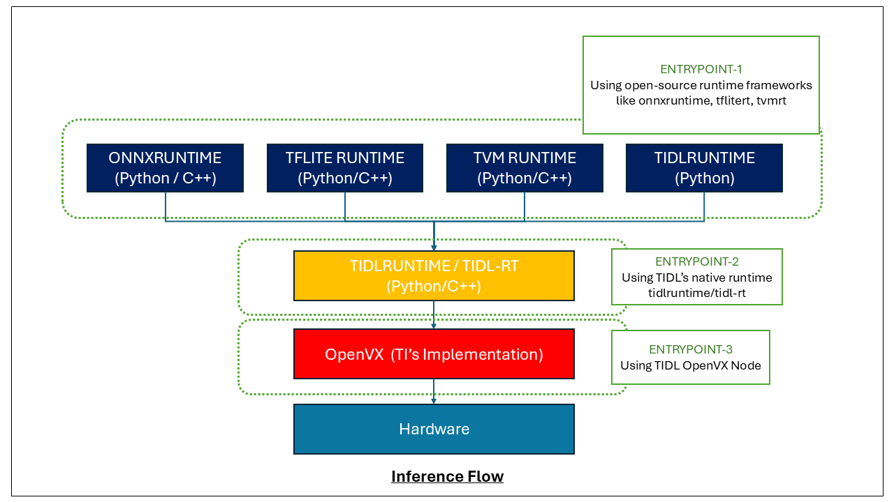

# Model Inference with TIDL

This document provides information about model inference with TIDL framework, including how to run inference on compiled models using both Python and C++ APIs.

## Table of Contents

- [Introduction to Model Inference](#introduction-to-model-inference)
- [Inference Flow](#inference-flow)
- [Inference Workflow](#inference-workflow)
- [Inference Options](#inference-options)
- [Input/Output Tensors Handling](#inputoutput-tensors-handling)
- [References](#references)

## Introduction to Model Inference

Model inference in TIDL is the process of executing a compiled neural network model on TI's hardware accelerators (C7x DSP and MMA) to generate predictions from input data. TIDL provides multiple deployment options with industry-defined inference engines as well as TIDL's own native inference engine.

The key benefits of TIDL inference include:

1. **Hardware Acceleration**: Significant performance improvements by offloading computations to specialized hardware
2. **Power Efficiency**: Lower power consumption compared to CPU-only execution
3. **Flexible Deployment**: Support for multiple runtime frameworks (ONNX Runtime, TFLite Runtime, TVM Runtime, TIDL Runtime)
4. **Cross-Language Support**: Both Python and C++ APIs for different deployment scenarios

## Inference Flow

The TIDL framework consists of multiple layers that work together to provide efficient model inference. The diagram below illustrates the architecture of TIDL and the various entry points for users:

1. **Hardware Layer**: The foundation of TIDL, consisting of the C7x/MMA to offload computations to
2. **OpenVX Layer**: Provides a standardized framework for interfacing to the hardware. Refer to [TIDL OpenVX Node](./tidlrt.md#tidl-openvx-node) for usage example.
3. **TIDL-RT**: Abstraction over TIDL OpenVX Node. Refer to [TIDL-RT](./tidlrt.md#tidl-rt-on-cortex-a) for usage example.
4. **Runtime Frameworks**: High-level interfaces for model inference that internally calls TIDL-RT APIs. Refer to [../runtimes](../runtimes/README.md) for usage example across various frameworks.

This layered architecture provides flexibility for different use cases while maintaining high performance through hardware acceleration.

## Inference Workflow

The general workflow for model inference with TIDL follows these steps:

1. **Load the compiled model artifacts** from the artifacts directory
2. **Create an inference session** with the appropriate runtime (ONNXRT, TFLiteRT, or TIDLRT)
3. **Prepare input data** according to the model's requirements
4. **Run inference** on the prepared inputs
5. **Process the outputs** for the application's needs

## Inference Options

When running inference with TIDL, you can configure various options to control the inference process. The table below lists the available inference options that can be used with the different runtime frameworks.

| Option Name | Description | Allowed Values | Default Value | Notes |
|------------|-------------|----------------|---------------|---------------------|
| `artifacts_folder` | Path to the folder containing compiled model artifacts | Valid directory path | None (Required) |  |
| `debug_level` | Level of debug information | 0 - No Debug Prints and Dumps 1 - Print network performance info and dumps under **tmp/tidl_trace_<subgraph_name>_perf.csv** 2 - Print network performance info and dumps under **tmp/tidl_trace_<subgraph_name>_perf.csv**. Also prints time taken at various stages of initialization, memory size requirements and layer level execution info.  3 - Dump fixed point layer traces under **/tmp/tidl_trace_<subgraph_name>_*.y**. Also print network performance info and dumps under **tmp/tidl_trace_<subgraph_name>_perf.csv** 4 - Dump fixed point layer traces under **/tmp/tidl_trace_<subgraph_name>_*.y**, float traces under **/tmp/tidl_trace_<subgraph_name>_*_float.bin**. Also print network performance info and dumps under **tmp/tidl_trace_<subgraph_name>_perf.csv**  5 -Dump fixed point layer traces under **/tmp/tidl_trace_<subgraph_name>_*.y**, float traces under **/tmp/tidl_trace_<subgraph_name>_*_float.bin**. Also print network performance info and dumps under **tmp/tidl_trace_<subgraph_name>_perf.csv**. Also prints time taken at various stages of initialization, memory size requirements and layer level execution info | 0 |  |
| `priority` | Execution priority for the inference task | 0(higher priority) - 7 | 0 | Refer to [Preemption](./preemption.md) for more details |
| `max_pre_empt_delay` | Maximum allowed delay to server higher priority execution | 0 - FLT_MAX | FLT_MAX | Refer to [Preemption](./preemption.md) for more details |
| `core_number` | Specify the C7x core to execute on  | 1 - \<Max core of C7x on device\> | 1 | Refer to [Multi C7x](./multi_c7x.md) for more details |
| `core_start_idx` | Specify the C7x core to start execution from in case of high throughput or low latency modes | 1 - \<Max core of C7x on device\> | 1 | Refer to [Multi C7x](./multi_c7x.md) for more details |
| `advanced_options:temp_buffer_dir` | Redirect temporary OpenVX Buffers in x86. Applicable only for x86 run | Valid directory path < 64 characters | /dev/shm | Path is limited to 64 characters |

## Input/Output Tensors Handling

For detailed information about input/output tensors, refer [IO Tensors Documentation](./io_tensors.md). 

## References

For more information about model inference and usage, refer to:

- [IO Tensors Documentation](./io_tensors.md)
- [Python Wrapper APIs](../runtimes/tidl_wrapper/python/README.md)
- [C++ Wrapper APIs](../runtimes/tidl_wrapper/cpp/README.md)
- [Python Examples](../runtimes/examples/python/README.md)
- [C++ Examples](../runtimes/examples/cpp/README.md)
