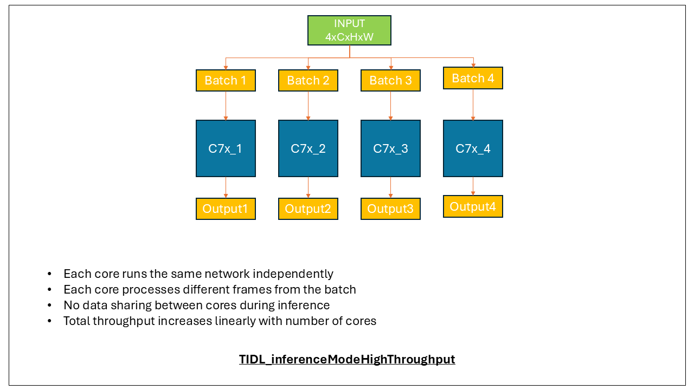
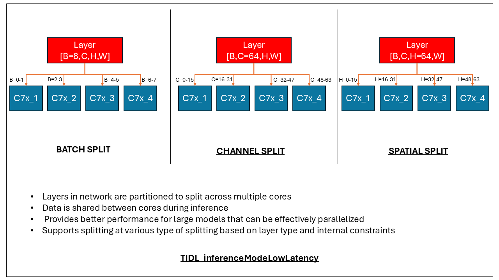

# Multi-Core Inference for Devices with Multiple DSP Cores

This document provides a comprehensive guide to utilizing multiple DSP cores for neural network inference in the TIDL framework, including configuration options, inference modes, and best practices.

## Table of Contents

- [Introduction](#introduction)
- [Inference Modes](#inference-modes)
  - [Default Mode (Single Core)](#default-mode-single-core)
  - [High Throughput Mode](#high-throughput-mode)
  - [Low Latency Mode](#low-latency-mode)
- [Known Limitations](#known-limitations)

## Introduction

Certain SoCs, such as J784S4 and J722S, feature multiple DSP cores coupled with Matrix Multiply Accelerators (MMA), which can be leveraged to achieve better performance in terms of throughput and latency. The TIDL framework provides flexible options to utilize these multiple cores effectively:

1. **Independent Networks**: Users can treat each DSP as an independent processing unit and schedule different networks on different cores.

2. **Single Network, Multiple Inputs**: Users can process multiple inputs (frames) in parallel using the same network across multiple cores.

3. **Single Network, Single Input**: Users can distribute the processing of a single input across multiple cores to reduce inference latency.

TIDL framework supports these usage patterns through different inference modes, which can be configured during model compilation and inference.

## Inference Modes

TIDL supports three inference modes, each optimized for different use cases:

### Default Mode (Single Core)

**Mode Value**: `TIDL_inferenceModeDefault` (0)

This is the default inference mode that enables inference on a single DSP core. In this mode:

- The model runs on a single core, regardless of how many cores are available
- The specific core to run inference on can be specified using the inference option `core_number`
- This mode is suitable for simple use cases or when multiple independent networks need to be run on different cores

### High Throughput Mode

**Mode Value**: `TIDL_inferenceModeHighThroughput` (1)

This mode is designed for parallel batch processing across multiple cores:

- It leverages `N` DSP cores to run inference on `N` frames in parallel
- Each core runs an independent instance of the same network
- This results in higher throughput (frames per second) for multi-batch processing
- Ideal for multi-camera systems or applications that need to process multiple inputs simultaneously
- During model compilation, `advanced_options:inference_mode` should be set to 1 and `advanced_options:num_cores` can be set according to core to be used. This options will compile the model in high throughput mode with specified number of cores.
- During model inference `core_start_idx` can be set to specify the starting core number.

Key characteristics:
- The number of batches must be a multiple of the number of cores used
- Each core processes a subset of the batches independently
- No data is shared between cores during processing

This mode should not be confused with batch processing on single core. Providing a multiple batch model to a single core using inference mode TIDL_inferenceModeDefault does internal optimizations to get better performance while still running inference on a single core, as opposed to parallelly inferring batches in TIDL_inferenceModeHighThroughput. This particular optimization is applicable only for very small resolutions and may not be enabled in cases where there is no significant performance benefit. While executing batch inference on multi-core device, it is recommended to use TIDL_inferenceModeHighThroughput.

 

### Low Latency Mode

**Mode Value**: `TIDL_inferenceModeLowLatency` (2)

This mode enables inferring a single frame using a single network instance distributed across multiple cores:

- The network is split across multiple cores, with each core handling a portion of the computation
- This results in lower latency for processing a single frame
- Enables higher utilization of the available compute resources (TOPS)
- Ideal for applications requiring fast response times for single-frame processing
- During model compilation, `advanced_options:inference_mode` should be set to 2 and `advanced_options:num_cores` can be set according to core to be used. This options will compile the model in low latency mode with specified number of cores.
- During model inference `core_start_idx` can be set to specify the starting core number.

Key characteristics:
- The network is automatically partitioned to distribute computation across cores
- Data is transferred between cores as needed during processing
- Provides better performance for large models that can be effectively parallelized

#### Splitting Types in Low Latency Mode

In Low Latency mode, TIDL can split layers across cores in three different ways:

1. **Batch Splitting**: Divides the batch dimension across cores. (highest priority)
2. **Channel Splitting**: Divides the channel dimension across cores
3. **Spatial Splitting**: Divides the spatial dimensions (height) across cores (lowest priority)

TIDL automatically determines the best splitting strategy for each layer based on its characteristics and the above priority order.

How specific layers are split can be controlled using the following compilation options:
- `advanced_options:m_spatial_split_layers_names_list`: Forces specified layers to use spatial splitting
- `advanced_options:m_channel_split_layers_names_list`: Forces specified layers to use channel splitting
- `advanced_options:single_core_layers_names_list`: Forces specified layers to run on a single core (no splitting)

 

## Known Limitations

1. **High Throughput Mode Constraints**:
   - The number of batches must be a multiple of the number of cores used for inference
   - Each batch must have the same input dimensions

2. **Low Latency Mode Limitations**:
   - Some layer types may not be optimally distributed across cores
   - Further performance optimizations are planned for future releases
