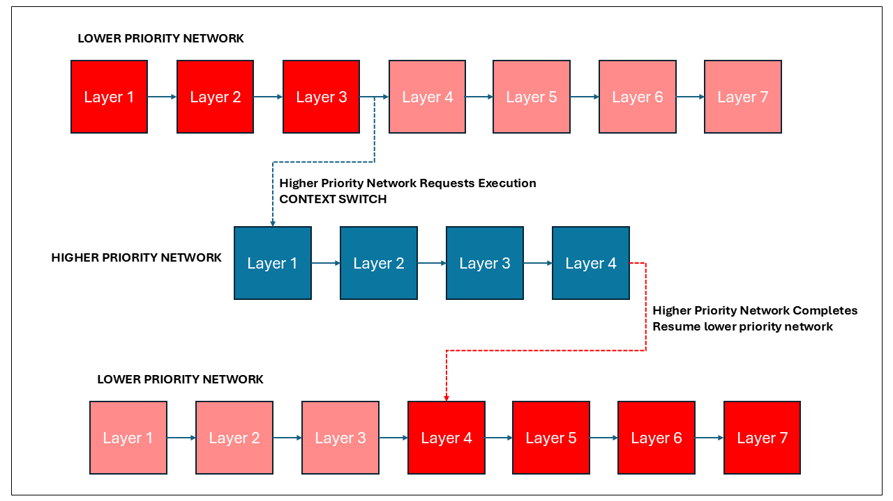
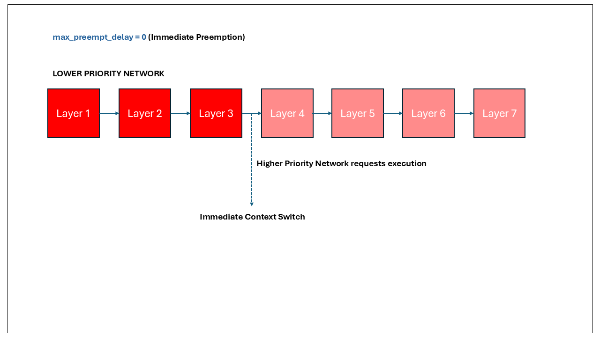
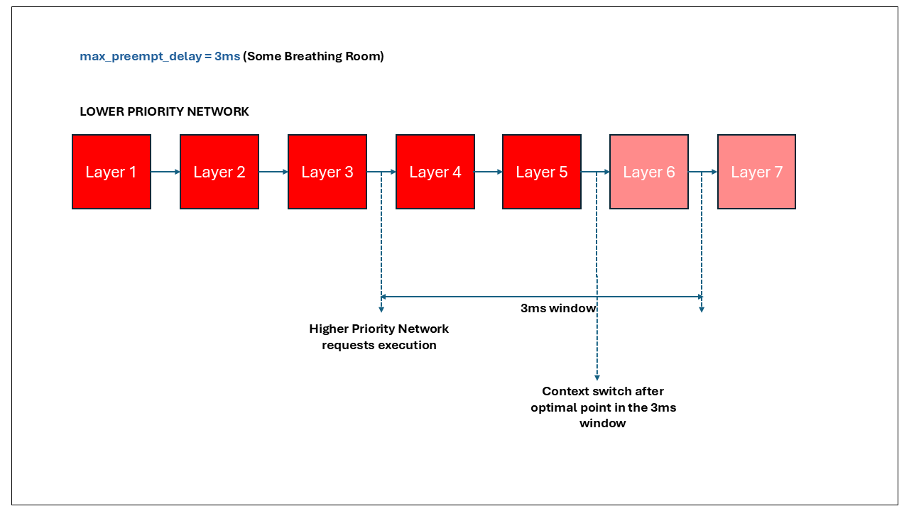

# Preemption in TIDL

## Overview

TIDL supports preemptive multitasking for network execution on DSP cores. This feature allows multiple neural networks to execute concurrently with different priority levels, enabling more efficient resource utilization and better responsiveness for high-priority tasks.

## Key Concepts

### Priority-Based Execution

When multiple networks are executing on the DSP, TIDL uses a priority-based scheduling mechanism:

- Each network can be assigned a priority value by setting `priority` property during inference.
- Lower numerical values indicate higher priority (e.g., 0 is higher priority than 1)
- Higher priority networks can preempt (interrupt) lower priority networks
- Networks with the same priority are executed sequentially in a round-robin fashion

### Context Switching

TIDL enables context switching after the processing of each layer in a neural network:

- After completing a layer, the system checks if a higher priority network is waiting to execute
- If a higher priority network is waiting, the current network may be preempted
- The context (execution state) of the preempted network is saved
- The higher priority network begins or resumes execution
- When the higher priority network completes or pauses, the preempted network can resume from where it left off

<u>PRIORITY SCHEDULING</u>

### Max Preempt Delay

The `max_preempt_delay` inference property controls when and how preemption occurs:

- This property is applicable only when a lower priority network is being preempted by a higher priority one
- It specifies a "breathing room" time window for the lower priority network
- The system determines the optimal point for context switching within this window

#### Behavior with Different Values

| `max_preempt_delay` Value | Behavior |
|---------------------------|----------|
| 0 | Immediate preemption after the current layer completes |
| Small value (e.g., 2ms) | The lower priority network has a short breathing room to find an optimal switching point |
| Large value | The lower priority network has more breathing room to complete operations before being preempted |
| FLT_MAX | The system will only preempt at the most optimal point in the entire network |

<u>Immediate Pre-emption</u>

 
 

<u>Pre-emption with breathing room</u>

## Example Scenarios

### Scenario 1: Same Priority Networks

When two networks have the same priority:
- They execute sequentially in round-robin order
- Network 1 completes its entire processing before Network 2 begins
- No preemption occurs between them

### Scenario 2: Different Priority Networks with Immediate Preemption

When Network A (priority 0) and Network B (priority 1) are running with `max_preempt_delay = 0`:
- If Network B is running and Network A becomes ready to execute
- Network B will be preempted immediately after its current layer completes
- Network A will run to completion (or until it voluntarily yields)
- Network B will resume from where it was preempted

### Scenario 3: Different Priority Networks with Breathing Room

When Network A (priority 0) and Network B (priority 1) are running with `max_preempt_delay = 3ms`:
- If Network B is running and Network A becomes ready to execute
- Network B has up to 3ms to find an optimal switching point
- The system determines how many layers can potentially be processed within 3ms
- It selects the best possible moment for context switching based on internal algorithm factors
- Network A then executes, and Network B resumes later

### Scenario 4: Different Priority Networks with Maximum Flexibility

When Network A (priority 0) and Network B (priority 1) are running with `max_preempt_delay = FLT_MAX`:
- Network B has a very large breathing room
- It will only be preempted at the most optimal point in the entire network
- This setting prioritizes efficiency of the lower priority network over responsiveness of the higher priority one

## Usage in Code

For a complete working example, see the [preemption example code](../runtimes/examples/cpp/preemption_example/README.md) which demonstrates multiple networks running with different priority levels and preemption settings.

## Best Practices

1. **Priority Assignment**:
   - Assign higher priorities (lower numbers) to time-sensitive networks
   - Use lower priorities for background or non-critical processing

2. **Max Preempt Delay Tuning**:
   - For real-time applications requiring immediate response, use smaller values
   - For maximizing throughput of lower priority networks, use larger values
   - Balance between responsiveness and efficiency based on your application needs

3. **Testing**:
   - Test different priority and max preempt delay combinations to find the optimal settings for your specific use case
   - Monitor performance metrics like latency and throughput to evaluate the impact of different settings

## Limitations

- Preemption occurs only at layer boundaries, not within the execution of a single layer
- The actual preemption point depends on the network architecture and the current execution state
- Very small networks with few layers may have limited preemption opportunities
