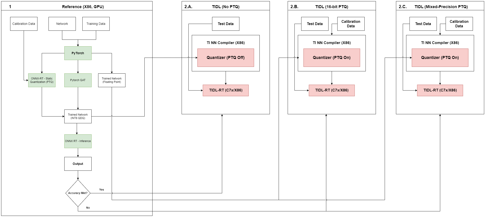

# Quantization in TIDL

This document provides an overview of quantization methods, techniques, and options available in TIDL (TI Deep Learning).

## Table of Contents

- [Introduction](#introduction)
- [Quantization Options](#quantization-options)
  - [Post Training Quantization (PTQ)](#post-training-quantization-ptq)
  - [Pre-quantized Models](#pre-quantized-models)
- [Calibration Options](#calibration-options)
  - [Simple Calibration](#simple-calibration)
  - [Advanced Calibration](#advanced-calibration)
    - [Advanced Bias Calibration](#advanced-bias-calibration)
    - [Histogram-based Activation Range Collection](#histogram-based-activation-range-collection)
- [Mixed Precision](#mixed-precision)
  - [Manual Mixed Precision](#manual-mixed-precision)
  - [Automated Mixed Precision](#automated-mixed-precision)
- [Quantization Aware Training (QAT)](#quantization-aware-training-qat-j721etda4vm-specific)
- [Guidelines for Best Accuracy](#guidelines-for-best-accuracy)

## Introduction

Deep Neural Network (DNN) inference with fixed-point operations (8/16-bit) provides significant advantages over floating-point operations:

- Better latency performance
- Lower memory bandwidth requirements
- Reduced power consumption
- Smaller memory footprint

While quantization introduces some accuracy loss compared to floating-point inference, TIDL provides state-of-the-art quantization and calibration algorithms to minimize this loss. TIDL supports:

- 8-bit inference (recommended for optimal performance)
- 16-bit inference (for cases requiring higher precision)
- Mixed precision (combining 8-bit and 16-bit for optimal accuracy-performance trade-off)

## Quantization Options

TIDL supports the following mechanisms to enable fixed-point inference:

### Post Training Quantization (PTQ)

Post-Training Quantization (PTQ) is the simplest quantization approach:

- Training-free Quantization - No need to retrain your model
- Converts floating-point models to fixed-point representation
- Requires representative calibration data to determine scales and zero points
- Supports both symmetric and asymmetric quantization (see [ONNX Runtime Quantization Overview](https://onnxruntime.ai/docs/performance/model-optimizations/quantization.html#quantization-overview) to understand the defenition of symmetric and assymetric quantization):
  - **Symmetric quantization**: Zero point is fixed at 0, simplifying calculations but potentially wasting dynamic range. This is supported by all SoCs.
  - **Asymmetric quantization**: Zero point can be non-zero, maximizing the dynamic range utilization. This is supported by all SoCs except **J721E | TDA4VM**
  - It is recommended to set `"advanced_options:quantization_scale_type"` to 4 (asymmetric quantization) for devices that support it
- Supports [Mixed Precison](#mixed-precision) to configure layers to be a mix of 8-bit/16-bit to provide a better balance between accuracy and performance.

Please refer to [Calibration Options](#calibration-options) for further information on additional options to tune the PTQ process 

### Pre-quantized Models

TIDL can also import already quantized models, bypassing its own quantization process:

1. **ONNX QDQ Models**: 
   - Models quantized using [ONNX quantization tools](https://onnxruntime.ai/docs/performance/model-optimizations/quantization.html#onnx-quantization-representation-format)
   - Enable with: `"advanced_options:prequantized_model": 1`

2. **TFLite Full-Integer Quantized Models**
   - Models quantized using [TensorFlow Lite's quantization](https://ai.google.dev/edge/litert/performance/post_training_quantization)
   - Enable with: `"advanced_options:quantization_scale_type": 3`

3. **Quantization Proto**
   - A protocol buffer-based mechanism to provide quantization parameters and bypass calibration
   - Useful for:
     - Using your own quantization algorithms
     - Expediting compilation by avoiding repeated calibration
   - See [Quantization Proto](./quantization_proto.md) for more details

## Calibration Options

Calibration is the process of determining the optimal scaling factors for quantization. It's a critical step that significantly impacts the accuracy of quantized models. This section is only applicable for Post Training Quantization with TIDL.

### Simple Calibration

Simple calibration can be enabled by setting `accuracy_level = 0` during model compilation:

- Uses min/max values from each layer to determine scaling factors
- Supports Power-of-2 and non-Power-of-2 scales for parameters (controlled via `advanced_options:quantization_scale_type`)
- Supports only Power-of-2 scales for feature maps
- Range for each feature maps are calibrated offline with sample inputs
- Calibrated range values are used for quantizing feature maps in real time during inference
- Generally results in less than 1% accuracy drop for many networks, particularly those without depthwise convolution layers (like ResNet, SqueezeNet, VGG)

### Advanced Calibration

TIDL provides some advanced calibration options for granular control:

#### Advanced Bias Calibration

Enable by setting `accuracy_level = 1`:

- Applies clipping to weights and updates biases to compensate for quantization errors
- Typically no other controlling parameter is required to be set because default parameters works for most of the cases.
- Typically improves accuracy compared to simple calibration
- User can also experiment with following parameters related to this option if required:
  - `advanced_options:calibration_frames`: Number of input frames to be used for bias calibration.
  - `advanced_options:calibration_iterations`: Number of iteration to be used for bias calibration.

   It is observed that using 50 or more number of images gives considerable accuracy boost.

#### Histogram-based Activation Range Collection

Enable by setting `accuracy_level = 9` and `advanced_options:activation_clipping = 1`:

- Uses histograms of feature map activations to identify and remove outliers
- Helps reduce quantization-induced accuracy loss in some networks
- Particularly helpful for networks with highly skewed activation distributions

## Mixed Precision

Mixed precision involves running parts of the network in higher precision (16-bit) while keeping the rest in lower precision (8-bit) to balance performance and accuracy. TIDL supports both manual and automatic mode for identifying and forcing a layers for 8-bit or 16 bit quantization

### Manual Mixed Precision

Users can manually specify which layers should run in higher precision (16-bit):

- **Parameter precision**: Set only weights/parameters to 16-bit via `advanced_options:params_16bit_names_list`
- **Activation precision**: Set layer (both activation and weigths/parameters) outputs to 16-bit via `advanced_options:output_feature_16bit_names_list`

- If a layer output is already a floating point output like Softmax, DetectionOutputLayer etc. then increasing activation precision has no impact.

- Only a certain set layers are allowerd to change its precision.
    - Layers which are allowed to change its precision can have input, output and parameters in different precision.
        - TIDL_ConvolutionLayer (except TIDL_BatchToSpaceLayer and TIDL_SpaceToBatchLayer)
        - TIDL_BatchNormLayer (only, Clip, Relu and No-Activation is supported)
        - TIDL_PoolingLayer (except Max pooling layer)
        - TIDL_EltWiseLayer

    - Layers which do not support change in precision will always have input, output and parameters in same precision. For such layers the input, output and parameter's precision will be automatically determined based on the producer or consumer of the layer. For example, for the concat layer, which doesn't support change in precision, if the output is in 16 bit because of its consumer layer or because the user requested for the same, then it will change all its input and parameters to be in 16 bits as well.

### Automated Mixed Precision

TIDL can automatically select which layers to run in higher precision (16-bit). This is an enhancement to the manual mixed precision feature and enables automatic selection of layers to be set to 16-bit for improved accuracy.

- Accuracy improvement with mixed precision comes with a performance cost. This feature accepts `advanced_options:mixed_precision_factor` option to specify the user-tolerable performance cost and accordingly sets the most impactful layers to 16-bit to meet the user specified performance constraint.
    - Let the latency for network executing entirely in 8-bit precision be T_8 and let the latency for network executing with mixed precision be T_MP
    - We define `advanced_options:mixed_precision_factor` = T_MP / T_8
    
    Example: If the latency for 8-bit inference of a network is 5 ms, and if tolerable latency with mixed precision is 6 ms, then set `advanced_options:mixed_precision_factor` = 6/5 = 1.2

- This method uses advanced bias calibration as part of the algorithm to do auto selection of layers. The algorithm uses *calibration_frames/4* frames and *calibration_iterations/4* iterations for auto selection of layers followed by bias calibration with *calibration_frames* frames and *calibration_iterations* iterations. It is recommended to set `accuracy_level = 1`, `calibration_frames = 50` and `calibration_iterations = 50` compilation options. 

> TIP: The compilation time for running automated mixed precision is high, so recommended to use utilities like [screen](https://www.gnu.org/software/screen/manual/screen.html) or [tmux](https://man7.org/linux/man-pages/man1/tmux.1.html) to run compilation without interruption

## Quantization Aware Training (QAT) [J721E|TDA4VM Specific]

This is only applicable for models being compiled for J721E|TDA4VM SoC.

Quantization Aware Training (QAT) takes a different approach to quantization compared to PTQ:

- Model parameters are trained with awareness of the 8-bit fixed point inference constraints
- This requires modifications to the training framework and workflow
- Once a model is trained with QAT, the feature map range values are embedded directly in the model
- There is no need to use advanced calibration features for QAT models

QAT operators typically include:
- CLIP
- Minimum
- PACT
- RelU6

The key advantage of QAT is that the accuracy drop compared to floating-point is typically very close to zero for most networks, as the model learns to accommodate the quantization constraints during training.

EdgeAI-TorchVision provides tools and examples for Quantization Aware Training. With the tools provided, one can incorporate Quantization Aware Training in the code base with minimal code change. For detailed documentation and code, please visit [edgeai-modeloptimization](https://github.com/TexasInstruments/edgeai-tensorlab/blob/main/edgeai-modeloptimization/torchmodelopt/README.md#quantization)

### TIDL Layer Quantization Restrictions

This sections outlines quantization restrictions for each layer present in TIDL. The tables below details the supported quantization options for activations (input/output), weights, and biases for each layer type.

| TIDL Operator | Activations | Weights | Biases | Requires QDQ Nodes | Notes |
|-----------------|----------------------------|---------|--------|-------------------|-----------------|
|**TIDL_ConvolutionLayer** | Asymmetric, Per-tensor | Symmetric, Per-channel | Symmetric, Per-channel | Yes | |
|**TIDL_PReLULayer** | Symmetric, Per-tensor | Symmetric, Per-tensor (for slopes) | N/A | Yes | |
|**TIDL_InnerProductLayer** | Asymmetric, Per-tensor | Symmetric, Per-column (initializer B input) | N/A | Yes | Asymmetric quantization is supported only when 'B' input is a constant initializer, per column symmetric quantization is used for the initializer |
|**TIDL_BatchNormLayer** | Symmetric, Per-tensor | Symmetric, Per-tensor | Symmetric, Per-tensor | Yes | |
|**TIDL_Deconv2DLayer** | Symmetric, Per-tensor | Symmetric, Per-tensor | Symmetric, Per-tensor | Yes | |
|**TIDL_DeformableConvLayer** | Symmetric, Per-tensor | Symmetric, Per-tensor | Symmetric, Per-tensor | Yes | |
|**TIDL_DataLayer** | Symmetric, Per-tensor | N/A | N/A | Yes | |
|**TIDL_PoolingLayer** | Symmetric, Per-tensor | N/A | N/A | Yes | |
|**TIDL_ReLULayer** | Symmetric, Per-tensor | N/A | N/A | Yes | |
|**TIDL_SoftMaxLayer** | Asymmetric, Per-tensor | N/A | N/A | Yes | |
|**TIDL_ConcatLayer** | Asymmetric, Per-tensor | N/A | N/A | Yes | |
|**TIDL_SplitLayer** | Symmetric, Per-tensor | N/A | N/A | No | |
|**TIDL_SliceLayer** | Symmetric, Per-tensor | N/A | N/A | No | |
|**TIDL_FlattenLayer** | Asymmetric, Per-tensor | N/A | N/A | No | Pass through layer, can pass zero point from input to output |
|**TIDL_DropOutLayer** | Symmetric, Per-tensor | N/A | N/A | Yes | |
|**TIDL_ArgMaxLayer** | Symmetric, Per-tensor | N/A | N/A | Yes | |
|**TIDL_ShuffleChannelLayer** | Symmetric, Per-tensor | N/A | N/A | Yes | |
|**TIDL_ResizeLayer** | Symmetric, Per-tensor | N/A | N/A | Yes | |
|**TIDL_RoiPoolingLayer** | Symmetric, Per-tensor | N/A | N/A | Yes | |
|**TIDL_DepthToSpaceLayer** | Symmetric, Per-tensor | N/A | N/A | Yes | |
|**TIDL_SigmoidLayer** | Symmetric, Per-tensor | N/A | N/A | Yes | |
|**TIDL_PadLayer** | Symmetric, Per-tensor | N/A | N/A | No | |
|**TIDL_ReduceLayer** | Symmetric, Per-tensor | N/A | N/A | Yes | |
|**TIDL_ScatterElementsLayer** | Symmetric, Per-tensor | N/A | N/A | Yes | |
|**TIDL_SqueezeLayer** | Symmetric, Per-tensor | N/A | N/A | No | |
|**TIDL_TanhLayer** | Symmetric, Per-tensor | N/A | N/A | Yes | |
|**TIDL_HardSigmoidLayer** | Symmetric, Per-tensor | N/A | N/A | Yes | |
|**TIDL_ELULayer** | Symmetric, Per-tensor | N/A | N/A | Yes | |
|**TIDL_ReshapeLayer** | Asymmetric, Per-tensor | N/A | N/A | No | Pass through layer, can pass zero point from input to output |
|**TIDL_GatherLayer** | Symmetric, Per-tensor | N/A | N/A | Yes | |
|**TIDL_TransposeLayer** | Asymmetric, Per-tensor | N/A | N/A | No | Pass through layer, can pass zero point from input to output |
|**TIDL_GridSampleLayer** | Symmetric, Per-tensor | N/A | N/A | Yes | |
|**TIDL_TopKLayer** | Symmetric, Per-tensor | N/A | N/A | Yes | |
|**TIDL_EltWiseLayer** | Asymmetric, Per-tensor | N/A | N/A | Yes | Asymmetric quantization is supported only for Add operation |
|**TIDL_LayerNormLayer** | Asymmetric, Per-tensor | N/A | N/A | Yes | |
| **TIDL_DataConvertLayer** | Symmetric, Per-tensor | N/A | N/A | Yes | |
| **TIDL_ConstDataLayer** | Symmetric, Per-tensor | N/A | N/A | Yes | |
| **TIDL_BiasLayer** | Symmetric, Per-tensor | N/A | Symmetric, Per-tensor | N/A | |
| **TIDL_ScaleLayer** | Symmetric, Per-tensor | Symmetric, Per-tensor | N/A | N/A | |
| **TIDL_CropLayer** | Symmetric, Per-tensor | N/A | N/A | N/A | |
| **TIDL_DetectionOutputLayer** | Symmetric, Per-tensor | N/A | N/A | N/A | |
| **TIDL_OdPostProcessingLayer** | Symmetric, Per-tensor | N/A | N/A | N/A | |
| **TIDL_ColorConversionLayer** | Symmetric, Per-tensor | N/A | N/A | N/A | |
| **TIDL_OdOutputReformatLayer** | Symmetric, Per-tensor | N/A | N/A | N/A | |
| **TIDL_CustomLayer** | Symmetric, Per-tensor | N/A | N/A | N/A | |
| **TIDL_BatchReshapeLayer** | Symmetric, Per-tensor | N/A | N/A | N/A | |

**Notes:**
- The input to the network should be quantized in Symmetric, Per-tensor fashion as the input data convert layer only supports symmetric quantization
- All of the information above is accurate for 8-bit
- "Requires QDQ Nodes" information above is valid when node is present in isolation. Few nodes may not require QDQ nodes when present in a pattern
    - Convolution, ConvTranspose, Add/Mul/Sub/Div, BatchNorm layers do not require QDQ layers if followed by a Relu layer that has QDQ nodes after it
    - Patterns like LayerNorm, GELU, SiLU only require QDQ nodes at the end
    - Convolution, ConvTranspose layers do not require QDQ layers when followed by a BatchNorm layer that has QDQ nodes
- Even though a layer (activation) can support Asymmetric, it may not be using zero point depending on the consumer capability to consume zero point.

## Guidelines for Best Accuracy

If TIDL's 8-bit PTQ doesn't provide satisfactory accuracy, follow this workflow:

**1**: Try pre-quantized models from other frameworks (e.g., PyTorch QAT exported as ONNX QDQ)

**2.A**: If pre-quantized models achieve good accuracy, use them directly

**2.B**: If 8-bit quantization doesn't work well, ensure your model follows quantization-friendly design principles mentioned in [Model Design Guidelines for Quantization-Friendly Networks](#model-design-guidelines-for-quantization-friendly-networks)

**2.C**: If **(2.B)** does not help, try 16-bit quantization to get desired accuracy.

**2.D**: Post **(2.C)**, experiment with mixed precision to optimize the accuracy-latency trade-off

 

<kbd>

</kbd>

 

### Model Design Guidelines for Quantization-Friendly Networks

1. **Apply proper regularization/weight decay during training**:
   - Regularization / Weight decay ensures that the weights, biases and other parameters (if any) are small and compact - which is good for quantization.
   - Use sufficient weight decay (recommended value: 1e-4). Using small values such as 1e-5 is not recommended.

2. **Use Batch Normalization effectively**:
   - Apply Batch Normalization after every Convolution layer which helps the feature map to be properly regularized/normalized
   - This is especially critical for Depthwise Convolution layers
   - Exception: The very last Convolution layer (e.g., prediction layer in segmentation/object detection network) may perform better without Batch Normalization

3. **Special handling for regression(continuous) outputs**:
   - Models with continuous outputs (e.g., object detection models, depth estimation models) often benefit from mixed precision i.e setting some selected layers to 16-bit.
   - Consider using 16-bit for the first and last convolution layers. This can be set by using `advanced_options:output_feature_16bit_names_list` compilation option.

By following these guidelines and leveraging TIDL's quantization options, you can achieve the best possible accuracy-performance trade-off for your deep learning applications.
