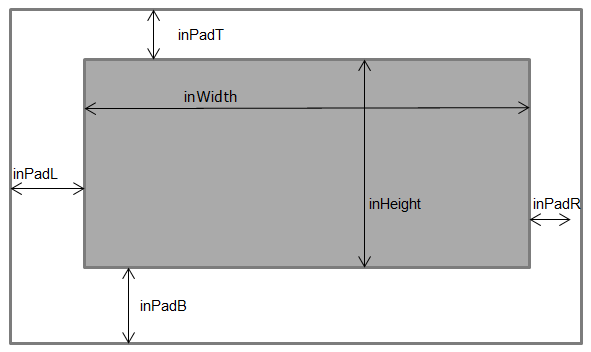
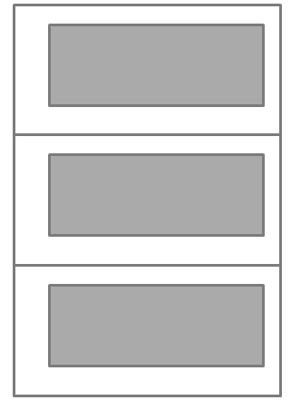

<!-- TOC -->
- [TIDL-RT: Input and Output Tensor Format](#tidl-rt-input-and-output-tensors-format)
- [Introduction](#introduction)
- [Input and Output Tensor Formats for TIDL-RT inference](#input-and-output-tensor-formats-for-tidl-rt-inference)
- [Points to be noted](#points-to-be-noted)
<!-- /TOC -->

---
# TIDL-RT: Input and Output Tensor Format
This page introduces Input and output tensor format for TIDL-RT inference. Note that this information is only useful if user is using TIDL-RT interface instead of Open Source Runtime (OSRT) interface

---
# Introduction

- TIDL-RT interface expects user to provide input and output buffers in specific format in terms of the arrangement of data in memory
- This section describes how user can provide the information in same format in which TIDL-RT expects

---
# Input and Output Tensor Formats for TIDL-RT inference

- The input and output tensor format of a network to perform inference are described by the [sTIDL_IOBufDesc_t](https://software-dl.ti.com/jacinto7/esd/processor-sdk-rtos-jacinto7/10_00_00_05/exports/docs/c7x-mma-tidl/ti_dl/docs/user_guide_html/structsTIDL__IOBufDesc__t.html).
- Information for the structure mentioned in above statement is generated as one of the output from model compilation. After model compilation a file will be generated as part of corresponding model artifacts with the file name ending with "io_1.bin" which contains this information.
- This information is expected to be used for the following purposes:
  - To allocate the input and output buffers supplied to TIDL-RT library from higher level application. Amount of memory which shall be allocated for input/output can be figured out using sTIDL_IOBufDesc_t.inBufSize/sTIDL_IOBufDesc_t.outBufSize variable respectively.
  - To identify the order in which user is expected to provide the input to TIDL-RT inference engine in cases where network has more than one input. sTIDL_IOBufDesc_t.inDataName parameter contains the tensor names as in the original network which shall be used to provide the input in right order. 
  - To read/de-quantize the final output of the network. A sample code is given as an example to understand how the final output can be read/de-quantize. In this sample code the data layout is assumed to be in NCHW format.
```
        /* Lets assume the outPtr is the output pointer for one of the output buffer whose index is outIdx for a given network. 
        OutElemTemplateType is the type of the output and it can be read from sTIDL_IOBufDesc_t.outElementType, e.g. uint8_t, int16_t etc.
        All parameter are for a given output and can be accessed by sTIDL_IOBufDesc_t.<parameter>[outIdx]
        Following example is for the output but same format is also applicable for input
        */

        OutElemTemplateType outPtrStart = &outPtr[outPadT[outIdx] + outPadL[outIdx]];
        int32_t outLinePitch = outWidth[outIdx] + outPadL[outIdx] + outPadR[outIdx];
        int32_t outDim2Pitch  = outChannelPitch[outIdx] * (outNumChannels[outIdx] + outPadCh[outIdx]);
        int32_t outDim1Pitch  = outDim2Pitch * outDIM2[outIdx];
        int32_t outBatchPitch = outDim1Pitch * outDIM1[outIdx];

        float32_tidl outputVal;
        
        for ( batchIdx = 0; batchIdx < outNumBatches[outIdx];batchIdx++)
        {
            for ( dim1Idx = 0; dim1Idx < outDIM1[outIdx];dim1Idx++)
            {
                for ( dim2Idx = 0; dim2Idx < outDIM2[outIdx];dim2Idx++)
                {
                    for ( channelIdx = 0; channelIdx < outNumChannels[outIdx];channelIdx++)
                    {
                        for ( heightIdx = 0; heightIdx < outHeight[outIdx];heightIdx++)
                        {
                            for ( widthIdx = 0; widthIdx < outWidth[outIdx];widthIdx++)
                            {
                                int32_t outIdx = widthIdx + 
                                                (heightIdx * outLinePitch) + 
                                                (channelIdx * outChannelPitch[outIdx]) +
                                                (dim2Idx * outDim2Pitch) +
                                                (dim1Idx * outDim1Pitch) +
                                                (batchIdx * outBatchPitch);
                                /* Note that this is the final de-quantized output */
                                outputVal = outPtrStart[outIdx] / outTensorScale[outIdx];
                                printf("Output Element %f \n", outputVal);
                            }
                        }
                    }
                }
            }
        }
    
```
- Below image describes properties of one channel in a tensor (This format is applicable for both input and output tensor of the network). 

<p align="center"> <kbd>  </kbd> </p>


- If the input/output has more than one channel then these channels are stacked continuously in the memory. 

<p align="center"> <kbd>  </kbd> </p>

- The Padded region in the input buffer has to be filled with zero by application. This can be done once by application during buffer allocation during system boot time.


---
# Points to be noted

- All the Input and output tensor follow the above described buffer format, including the SSD post processing layer. Additionally TIDL_ODLayerHeaderInfo and TIDL_ODLayerObjInfo can be used to access the detected objects. 
- User can avoid copy of input/output buffer from user space memory to shared memory between ARM core and c7x core during inference via TIDL-RT interface if following constraints are met :
  - Buffers are already allocated as part of DDR shared memory, this can be done if buffers are allocated using TIDLRT_allocSharedMem API of TIDL-RT interface
  - sTIDL_IOBufDesc_t.inBufSize/sTIDL_IOBufDesc_t.outBufSize is same as sTIDLRT_Tensor_t.bufferSize
  - Properties of input/output tensor as described by sTIDL_IOBufDesc_t matches with the same in sTIDLRT_Tensor_t
    