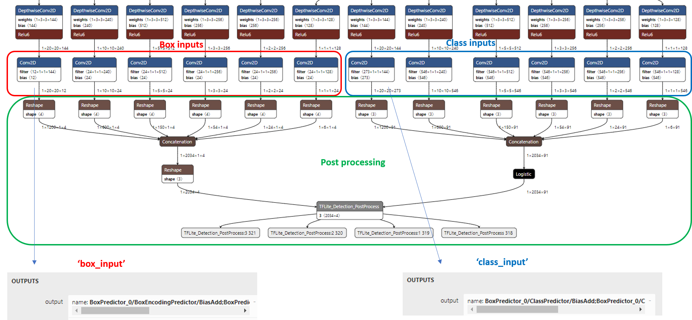
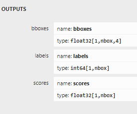
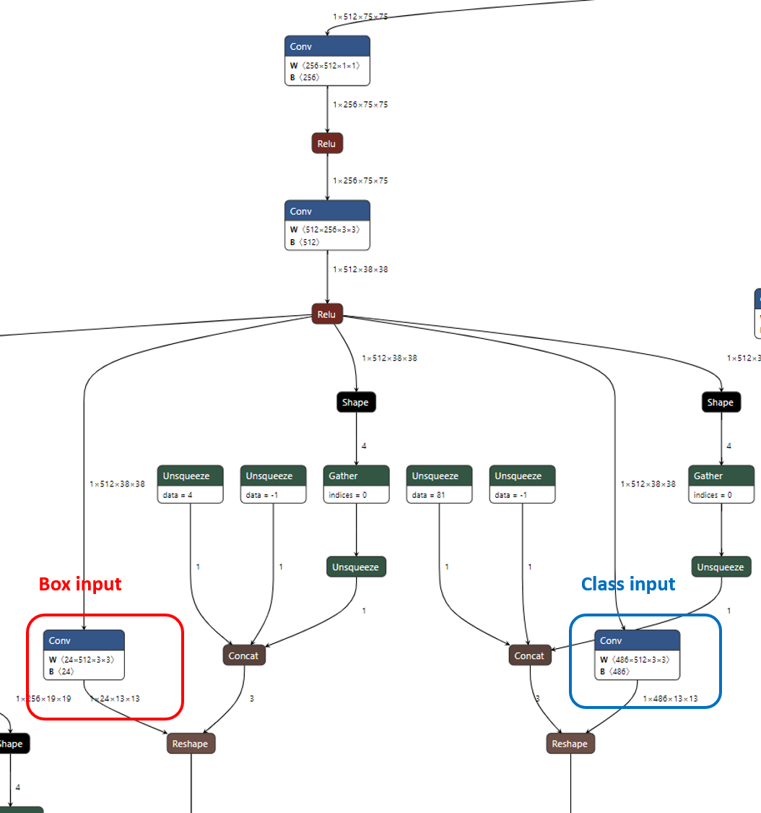

# Object detection meta architectures 

## Introduction

* TIDL offering supports optimized inference for various base feature extractors / back-bone networks like Resnets, MobileNets, EfficientNets, ShuffleNets, VGG, DenseNet etc. and also for various object detection (OD) post processing architectures
* The backbone networks have accelerated inference for layers supported on DSP with unsupported layers implemented using native runtimes
* As an enhancement to OD (Object Detection) post processing support by native runtimes, TIDL provides optimized and accelerated inference for certain types of post processing architectures
* This is enabled by defining meta architecture formats as provided by standard Tensorflow Object Detection API or TIDL defined protocol buffer format to convey post processing information to TIDL inference libraries
* TIDL provides optimized post processing support for following post processing architectures
  * Single Shot Detection (SSD)
  * You Only Look Once (YOLO) V3, V5, V7, V8, X
  * RetinaNet/Efficient det
  * PointPillars for 3D object detection using LIDAR data

**TI provides a wide variety of object detection models which are trained and adapted to suit TI SoC architecture as part of TI's [Model zoo](https://github.com/TexasInstruments/edgeai-tensorlab/tree/main/edgeai-modelzoo). Users are recommended to check if these meet use case requirements before moving to custom models**.

**NOTE : Post processing optimization is supported only for models exported using specific export frameworks. Refer "Usage" section below for more details on supported training frameworks**

## Usage

* 2 additional compilation options as explained in [od options](../examples/osrt_python/README.md#object-detection-model-specific-options) need to be specified in order to utilize this feature. <br>
* Following table depicts the meta architecture type corresponding to different OD post processing architectures along with links to some example models/meta architecture files available as part of TI's [Model zoo](https://github.com/TexasInstruments/edgeai-tensorlab/tree/main/edgeai-modelzoo).   


|  OD network archiecture | meta_arch_type  |  Example models/meta architecture files | Recommended training framework references
|:-------------------:|:-----------------:|:-----------------:|:-----------------:|
| TfLite SSD | 1 | [Model link](https://github.com/TexasInstruments/edgeai-tensorlab/blob/main/edgeai-modelzoo/models/vision/detection/coco/tf1-models/ssdlite_mobiledet_dsp_320x320_coco_20200519.tflite.link), [Pipeline config link](https://github.com/TexasInstruments/edgeai-tensorlab/blob/main/edgeai-modelzoo/models/vision/detection/coco/tf1-models/ssdlite_mobiledet_dsp_320x320_coco_20200519.prototxt.link)  | [Tf 1.0](https://github.com/TexasInstruments/edgeai-tensorlab/tree/main/edgeai-modelzoo/models/vision/detection#tensorflow-model-garden---object-detection-api-models-using-tensorflow-10), [Tf 2.0](https://github.com/TexasInstruments/edgeai-tensorlab/tree/main/edgeai-modelzoo/models/vision/detection#tensorflow-model-garden---object-detection-api-models-using-tensorflow-20)|
| ONNX SSD | 3 | [Model link](https://github.com/TexasInstruments/edgeai-tensorlab/blob/main/edgeai-modelzoo/models/vision/detection/coco/edgeai-mmdet/ssd_mobilenetv2_lite_512x512_20201214_model.onnx.link), [Prototxt link](https://github.com/TexasInstruments/edgeai-tensorlab/blob/main/edgeai-modelzoo/models/vision/detection/coco/edgeai-mmdet/ssd_mobilenetv2_lite_512x512_20201214_model.prototxt.link), [Prototxt](../examples/models/prototxt/mmdet) | [EdgeAI-MMDetection](https://github.com/TexasInstruments/edgeai-tensorlab/tree/main/edgeai-modelzoo/models/vision/detection#edgeai-mmdetection) |
| YOLO V3 | 4 | [Model link](https://github.com/TexasInstruments/edgeai-tensorlab/blob/main/edgeai-modelzoo/models/vision/detection/coco/edgeai-mmdet/yolov3_regnetx-1.6gf_bgr_lite_512x512_20210202_model.onnx.link), [Prototxt link](https://github.com/TexasInstruments/edgeai-tensorlab/blob/main/edgeai-modelzoo/models/vision/detection/coco/edgeai-mmdet/yolov3_regnetx-1.6gf_bgr_lite_512x512_20210202_model.prototxt.link) | [EdgeAI-MMDetection](https://github.com/TexasInstruments/edgeai-tensorlab/tree/main/edgeai-modelzoo/models/vision/detection#edgeai-mmdetection), [Open-MMlab/MMDetection](https://github.com/TexasInstruments/edgeai-tensorlab/tree/main/edgeai-modelzoo/models/vision/detection#open-mmlabmmdetection) |
| Retina net / Efficient det | 5 | [Model link](https://github.com/TexasInstruments/edgeai-tensorlab/blob/main/edgeai-modelzoo/models/vision/detection/coco/google-automl/efficientdet_lite1_relu.tflite.link), [Prototxt link](https://github.com/TexasInstruments/edgeai-tensorlab/blob/main/edgeai-modelzoo/models/vision/detection/coco/google-automl/efficientdet_lite1_relu.prototxt.link), [Prototxt](../examples/models/prototxt/mmdet) | [EdgeAI-MMDetection](https://github.com/TexasInstruments/edgeai-tensorlab/tree/main/edgeai-modelzoo/models/vision/detection#edgeai-mmdetection), [Open-MMlab/MMDetection](https://github.com/TexasInstruments/edgeai-tensorlab/tree/main/edgeai-modelzoo/models/vision/detection#open-mmlabmmdetection)|
| YOLO-X, YOLO-V5, YOLO-V7 | 6 | Refer to corresponding model/prototxt from  [YOLO-X Prototxt](../examples/models/prototxt/mmdet), [Yolo Prototxt](../examples/models/prototxt/yolo) | [EdgeAI-MMDetection](https://github.com/TexasInstruments/edgeai-tensorlab/tree/main/edgeai-modelzoo/models/vision/detection#edgeai-mmdetection), [MMYolo information](https://github.com/TexasInstruments/edgeai-tensorlab/issues/7) |
| Pointpillars 3D OD | 7 | [Model link](https://github.com/TexasInstruments/edgeai-tensorlab/blob/main/edgeai-modelzoo/models/vision/detection_3d/kitti/mmdet3d/lidar_point_pillars_10k_496x432.onnx.link), [Prototxt link](https://github.com/TexasInstruments/edgeai-tensorlab/blob/main/edgeai-modelzoo/models/vision/detection_3d/kitti/mmdet3d/lidar_point_pillars_10k_496x432.prototxt.link) | [EdgeAI-MMDetection3D](https://github.com/TexasInstruments/edgeai-tensorlab/tree/main/edgeai-mmdetection3d)|
| YOLO-V8 | 8 | Refer to corresponding model/prototxt from [Yolo Prototxt](../examples/models/prototxt/yolo) | [MMYolo information](https://github.com/TexasInstruments/edgeai-tensorlab/issues/7) |

## Meta architecture file details

### TfLite SSD

SSD - post processing is supported as defined in TensorFlow Object detection API.

**Note:** Only models generated using TensorFlow Object detection API are supported for TfLite SSD optimized post processing.

Below is a sample meta architecture/pipeline config file for tfLite SSD model:

```
model {
  ssd {
    num_classes: 90
    box_input: "BoxPredictor_0/BoxEncodingPredictor/BiasAdd;BoxPredictor_0/BoxEncodingPredictor/Conv2D;BoxPredictor_0/BoxEncodingPredictor/biases1"
    class_input: "BoxPredictor_0/ClassPredictor/BiasAdd;BoxPredictor_0/ClassPredictor/Conv2D;BoxPredictor_0/ClassPredictor/biases1"
    box_input: "BoxPredictor_1/BoxEncodingPredictor/BiasAdd;BoxPredictor_5/BoxEncodingPredictor/Conv2D;BoxPredictor_1/BoxEncodingPredictor/Conv2D;BoxPredictor_1/BoxEncodingPredictor/biases1"
    class_input: "BoxPredictor_1/ClassPredictor/BiasAdd;BoxPredictor_5/ClassPredictor/Conv2D;BoxPredictor_1/ClassPredictor/Conv2D;BoxPredictor_1/ClassPredictor/biases1"
    box_input: "BoxPredictor_2/BoxEncodingPredictor/BiasAdd;BoxPredictor_5/BoxEncodingPredictor/Conv2D;BoxPredictor_2/BoxEncodingPredictor/Conv2D;BoxPredictor_2/BoxEncodingPredictor/biases1"
    class_input: "BoxPredictor_2/ClassPredictor/BiasAdd;BoxPredictor_5/ClassPredictor/Conv2D;BoxPredictor_2/ClassPredictor/Conv2D;BoxPredictor_2/ClassPredictor/biases1"
    box_input: "BoxPredictor_3/BoxEncodingPredictor/BiasAdd;BoxPredictor_5/BoxEncodingPredictor/Conv2D;BoxPredictor_3/BoxEncodingPredictor/Conv2D;BoxPredictor_3/BoxEncodingPredictor/biases1"
    class_input: "BoxPredictor_3/ClassPredictor/BiasAdd;BoxPredictor_5/ClassPredictor/Conv2D;BoxPredictor_3/ClassPredictor/Conv2D;BoxPredictor_3/ClassPredictor/biases1"
    box_input: "BoxPredictor_4/BoxEncodingPredictor/BiasAdd;BoxPredictor_5/BoxEncodingPredictor/Conv2D;BoxPredictor_4/BoxEncodingPredictor/Conv2D;BoxPredictor_4/BoxEncodingPredictor/biases1"
    class_input: "BoxPredictor_4/ClassPredictor/BiasAdd;BoxPredictor_5/ClassPredictor/Conv2D;BoxPredictor_4/ClassPredictor/Conv2D;BoxPredictor_4/ClassPredictor/biases1"
    box_input: "BoxPredictor_5/BoxEncodingPredictor/BiasAdd;BoxPredictor_5/BoxEncodingPredictor/Conv2D;BoxPredictor_5/BoxEncodingPredictor/biases1"
    class_input: "BoxPredictor_5/ClassPredictor/BiasAdd;BoxPredictor_5/ClassPredictor/Conv2D;BoxPredictor_5/ClassPredictor/biases1"
    image_resizer {
      fixed_shape_resizer {
        height: 320
        width: 320
      }
    }
    box_coder {
      faster_rcnn_box_coder {
        y_scale: 10.0
        x_scale: 10.0
        height_scale: 5.0
        width_scale: 5.0
      }
    }
    anchor_generator {
      ssd_anchor_generator {
        num_layers: 6
        min_scale: 0.20000000298
        max_scale: 0.949999988079
        aspect_ratios: 1.0
        aspect_ratios: 2.0
        aspect_ratios: 0.5
        aspect_ratios: 3.0
        aspect_ratios: 0.333299994469
      }
    }
    post_processing {
      batch_non_max_suppression {
        score_threshold: 0.600000000
        iou_threshold: 0.45
        max_detections_per_class: 200
        max_total_detections: 100
      }
      score_converter: SIGMOID
    }
    encode_background_as_zeros: true
  }
}
```

TIDL meta archtitecture definition expects following additional parameters over those defined in TensorFlow Object detection API. 
  * 'box_input' is the output tensor name of convolution layer with box/loc prediction 
  * 'class_input' is the output tensor name of convolution layer with class scores/labels prediction.

#### Identification of box input and class input convolution layers 

Below image shows SSD post processing block including box_inputs and class_inputs:


* They lie at the boundary which separates backbone network from OD post processing
* Rule of thumb in order to differentiate box input from class input (may not always hold true)
  * Box input channel dimension = (number of anchor boxes * 4) e.g. 6 * 4 = 24 in this example
  * Class input channel dimension = (number of anchor boxes * number of classes) e.g. 6 * 91 = 546 in this example

'box_input' and 'class_input' are repeated fields in the pipeline config and refer to 'OUTPUTS' for each of the convolution heads as shown in the image.

#### Steps required to adapt to customer model:
* Open model visualization using Netron
* Locate the box and class convolution heads as explained [here](#identification-of-box-input-and-class-input-convolution-layers)
* Copy the Outputs of convolution heads to box_input and class_input in meta architecture file
* Modify the other fields in above example meta architecture file to suit required OD post processing


### ONNX SSD

TIDL defines a protocol buffer format which enables providing the SSD post processing information as defined by original SSD author to TIDL. Protocol buffer definition is available in the following file as part of RTOS SDK :
${PSDK_RTOS_PATH}/tidl***/ti_dl/utils/tidlMetaArch/tidl_meta_arch.proto

**NOTE : Models trained using [EdgeAI-MMDetection](https://github.com/TexasInstruments/edgeai-tensorlab/tree/main/edgeai-modelzoo/models/vision/detection#edgeai-mmdetection) automatically generate meta architecture files as required by TIDL which can be specified as part of compilation options without further modification**

Following section is applicable only if network is not exported using MM Detection.

#### Networks exported with frameworks other than MM Detection

In order to support optimization for ONNX SSD networks trained with frameworks other than MM Detection, TIDL has certain assumptions on output layout of these networks. Post processing optimization is supported only if the OD network has 3 outputs with following format:



1. Boxes - Depicting 4 co-ordinates corresponding to each detection (float32) 
2. Labels/Classes - Depicting label/class corresponding to each detections (int64)
3. Scores - Depicting the scores/probabilities corresponding to each detection (float32)

Post processing optimization is not supported if any of the above outputs  are clubbed/removed as part of the ONNX model.

Please refer to [Mlperf SSD resnet](https://github.com/TexasInstruments/edgeai-tensorlab/blob/main/edgeai-modelzoo/models/vision/detection/coco/mlperf/ssd_resnet34-ssd1200.onnx.link) model as an example in this category of models.

Below is a sample meta architecture file:
```
name: "ssd"
caffe_ssd {
  box_input: "Conv_338"
  box_input: "Conv_360"
  box_input: "Conv_382"
  box_input: "Conv_404"
  box_input: "Conv_426"
  box_input: "Conv_448"
  class_input: "Conv_349"
  class_input: "Conv_371"
  class_input: "Conv_393"
  class_input: "Conv_415"
  class_input: "Conv_437"
  class_input: "Conv_459"
  output: "bboxes"
  output: "labels"
  output: "scores"
  in_width: 1200
  in_height: 1200
  prior_box_param {
    min_size: 84.0
    max_size: 180.0
    aspect_ratio: 2.0
    flip: true
    clip: false
    variance: 0.1
    variance: 0.1
    variance: 0.2
    variance: 0.2
    step: 24.0
  }
  prior_box_param {
    min_size: 180.0
    max_size: 396.0
    aspect_ratio: 2.0
    aspect_ratio: 3.0
    flip: true
    clip: false
    variance: 0.1
    variance: 0.1
    variance: 0.2
    variance: 0.2
    step: 48.0
  }
  prior_box_param {
    min_size: 396.0
    max_size: 612.0
    aspect_ratio: 2.0
    aspect_ratio: 3.0
    flip: true
    clip: false
    variance: 0.1
    variance: 0.1
    variance: 0.2
    variance: 0.2
    step: 92.0
  }
  prior_box_param {
    min_size: 612.0
    max_size: 828.0
    aspect_ratio: 2.0
    aspect_ratio: 3.0
    flip: true
    clip: false
    variance: 0.1
    variance: 0.1
    variance: 0.2
    variance: 0.2
    step: 171.0
  }
  prior_box_param {
    min_size: 828.0
    max_size: 1044.0
    aspect_ratio: 2.0
    flip: true
    clip: false
    variance: 0.1
    variance: 0.1
    variance: 0.2
    variance: 0.2
    step: 400.0
  }
  prior_box_param {
    min_size: 1044.0
    max_size: 1260.0
    aspect_ratio: 2.0
    flip: true
    clip: false
    variance: 0.1
    variance: 0.1
    variance: 0.2
    variance: 0.2
    step: 400.0
  }
  detection_output_param {
    num_classes: 81
    share_location: true
    background_label_id: 0
    nms_param {
      nms_threshold: 0.5
      top_k: 200
    }
    code_type: CENTER_SIZE
    keep_top_k: 200
    confidence_threshold: 0.3
  }
  data_layout: INTERLEAVED
}
```
This meta architecture follows original caffe-SSD implementation.

#### Steps required to adapt to customer model:  
* Populate the repeated 'output' field with the ONNX model output names corresponding to boxes, labels and scores in that order (e.g. output: "bboxes", output: "labels", output: "scores" as in above example model)
* Identify convolution heads corresponding 'box_input' (box location prediction) and 'class_input' (class prediction) in a similar manner explained in [Tflite SSD](#tflite-ssd)
* Modify other parameters to suit desired post processing requirements

#### Identification of box input and class input convolution layers:
* They lie at the boundary which separates backbone network from OD post processing
* Rule of thumb in order to differentiate box input from class input (may not always hold true)
  * Box input channel dimension = (number of anchor boxes * 4) e.g. 6 * 4 = 24 in this example
  * Class input channel dimension = (number of anchor boxes * number of classes) e.g. 6 * 81 = 486 in this example

Example convolution layers corresponding to box input/class input for ONNX SSD model:



### YOLO

TIDL supports optimized post processing for YOLO architectures as mentioned in the table [here](#usage).

**NOTE : Only models trained using recommended training frameworks as outlined in [usage section](#usage) support post processing optimization by automatically generating meta architecture files as required by TIDL which can be specified as part of compilation options without further modification**

Below is a sample YOLO meta architecture file:

```
name: "yolo_v3"
tidl_yolo {
  name: "yolo_v3"
  in_width: 640
  in_height: 640
 yolo_param {
    input: "370"
    anchor_width: 9
    anchor_width: 21
    anchor_width: 17
    anchor_height: 11
    anchor_height: 19
    anchor_height: 41
  }
 yolo_param {
    input: "680"
    anchor_width: 43
    anchor_width: 39
    anchor_width: 86
    anchor_height: 32
    anchor_height: 70
    anchor_height: 64
  }
 yolo_param {
    input: "990"
    anchor_width: 65
    anchor_width: 134
    anchor_width: 120
    anchor_height: 131
    anchor_height: 130
    anchor_height: 265
  }
 yolo_param {
    input: "1300"
    anchor_width: 282
    anchor_width: 247
    anchor_width: 512
    anchor_height: 180
    anchor_height: 354
    anchor_height: 387
  }

  detection_output_param {
    num_classes: 80
    share_location: true
    background_label_id: -1
    nms_param {
      nms_threshold: 0.65
      top_k: 200
    }
    code_type: CODE_TYPE_YOLO_V5
    keep_top_k: 200
    confidence_threshold: 0.3
  }
  output: "detections"
}
```

### Pointpillars 3D OD

**NOTE : Only models trained using recommended training frameworks as outlined in [usage section](#usage) support post processing optimization by automatically generating meta architecture files as required by TIDL which can be specified as part of compilation options without further modification**

Below is a sample meta architecture file:
```
name: "3dod_ssd"
tidl_3dod {
  box_input: "393"
  class_input: "381"
  dir_input: "387"
  output: "396"
  name: "point_pillars"
  min_x: 0.0
  max_x: 69.12000274658203
  min_y: -39.68000030517578
  max_y: 39.68000030517578
  min_z: -3.0
  max_z: 1.0
  voxel_size_x: 0.1599999964237213
  voxel_size_y: 0.1599999964237213
  voxel_size_z: 4.0
  max_points_per_voxel: 32
  prior_box_3dod_param {
    anchor_width: 3.9000000953674316
    anchor_height: 1.600000023841858
    anchor_length: 1.559999942779541
    step_x: 0.3199999928474426
    step_y: 0.3199999928474426
    step_z: 1.0
    offset_x: 0.5
    offset_y: -123.5
    offset_z: -1.7799999713897705
    offset_dir: -1.5700000524520874
    rotation: 0.0
    rotation: 1.5700000524520874
  }
  detection_output_param {
    num_classes: 1
    share_location: true
    background_label_id: -1
    nms_param {
      nms_threshold: 0.009999999776482582
      top_k: 100
    }
    code_type: CODE_TYPE_3DOD
    keep_top_k: 50
    confidence_threshold: 0.10000000149011612
  }
}
```
* 393, 381, 387 are the box,class, location head convolution output for pointPillars network.
* 'voxel_size_x' and 'voxel_size_y' are voxel sizes in meters. 
* Valid area range is provided through min_x/y/z and max_x/y/z, and those values are in meters. Valid area is divided in multiple voxels each of size voxel_size_x/voxel_size_y as described in pointPillars original paper. 
* 'max_points_per_voxel' is the maximum number of points allowed inside in each voxel. If any voxel has 3d points more than max_points_per_voxel, then extra 3D points are discarded.
