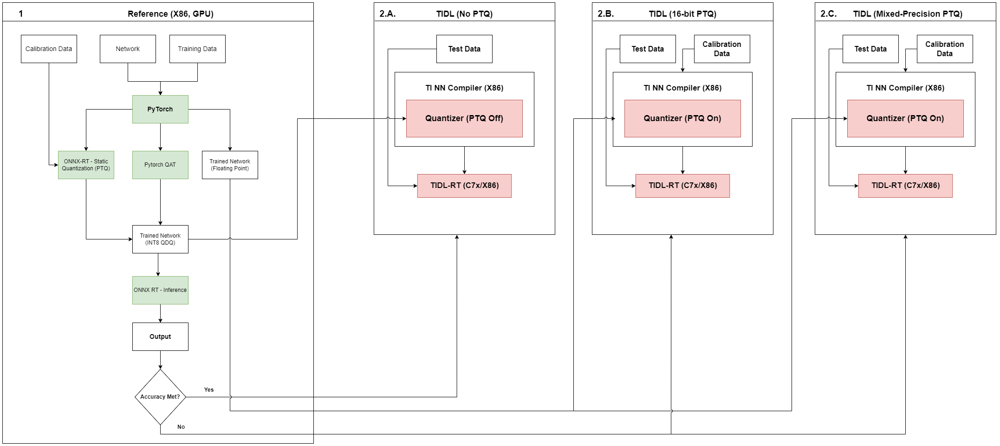

<!-- TOC -->
- [Quantization](#Quantization)
- [Introduction](#Introduction)
- [A. Quantization Options](#A.-Quantization-Options)
	- [A.1. Post Training Quantization (PTQ):](#A.1.-Post-Training-Quantization-(PTQ):)
	- [A.1. Simple Calibration](#A.2.-Prequantized-Models:)
- [B. Calibration Options](#B.-Calibration-Options)
	- [B.1. Simple Calibration](#B.1.-Simple-Calibration)
	- [B.2. Advanced Calibration](#B.2.-Advanced-Calibration)
		- [B.2.1. Advanced Bias calibration:](#B.2.1.-Advanced-Bias-calibration:)
		- [B.2.2. Histogram based activation range collection:](#B.2.2.-Histogram-based-activation-range-collection:)
- [C. Mixed Precision](#C.-Mixed-Precision)
	- [C.1. Manual Mixed Precision:](#C.1.-Manual-Mixed-Precision:)
	- [C.2. Automated Mixed Precision:](#C.2.-Automated-Mixed-Precision:)
- [Guidelines for Getting Best Accuracy](#Example-Workflow-for-Getting-Best-Accuracy)
<!-- /TOC -->

---
# Quantization
This page introduces various quantization options available as part of TI's Deep Learning solution

---
# Introduction
- DNN inference with fixed point operations (8/16-bit) provides much better latency & lower bandwidth requirements without a significant drop in accuracy compared to floating point accelerators
- TIDL-RT provides state-of-art Post Training Quantization (PTQ) and calibration algorithms to provide the best accuracy
- TIDL-RT supports 8-bit, 16-bit and mixed precision inference. It is recommended to use 8-bit inference mode for best execution time and use mixed-precision and/or 16-bit if you observe any accuracy gap with 8-bit inference

- Following sections describe various options available and recommendations:
	- A. Quantization Options
	- B. Calibration Options
	- C. Mixed Precision Options
	- D. Quantization Aware Training (QAT) [TDA4VM Specific]
	- E. Recommended options & Guidelines

---
# A. Quantization Options

TIDL-RT supports the following mechanisms to enable fixed point inference:
- A.1. Post Training Quantization (PTQ) : Floating point models, where TIDL's PTQ algorithm calibrates & quantizes the network
- A.2. Pre-quantized Models :  Fixed point models which bypass TIDL's calibration phase. [ONNX QDQ models](https://onnxruntime.ai/docs/performance/model-optimizations/quantization.html#onnx-quantization-representation-format) and [TFLite Pre-quantized models](https://www.tensorflow.org/lite/performance/post_training_quantization) are allowed for this mechanism  
## A.1. Post Training Quantization (PTQ):

- Training free Quantization – Simplest to use
- This method converts floating point models into fixed point. It requires representative calibration data to determine scales & zero points for fixed point inference
- It supports both symmetric & asymmetric quantization. Please refer [link](https://onnxruntime.ai/docs/performance/model-optimizations/quantization.html#quantization-overview) to understand definition of symmetric and asymmetric quantization. All devices support symmetric quantization, and asymmetric quantization is supported by all devices except TDA4VM/AM68PA
	- It is recommended to set "advanced_options:quantization_scale_type" to 4 (Asymmetric quantization) for devices which can support it
- Mixed precision - layers can be configured to be a mix of 8-bit/16-bit to provide better accuracy. Refer to [MixedPrecision][#Mixed Precision] for details on the options provided
- Please refer to the [Calibration][#Calibration] section for further information on additional options to tune the TIDL-RT's PTQ process
## A.2. Prequantized Models:

- TIDL can support import of pre quantized models: 
	- <a href="https://onnxruntime.ai/docs/performance/model-optimizations/quantization.html#onnx-quantization-representation-format">ONNX QDQ Models</a> : This requires "advanced_options:prequantized_model" to be set to 1
	- <a href="https://www.tensorflow.org/lite/performance/post_training_quantization">TF-Lite full-integer quantized models</a> : This requires "advanced_options:quantization_scale_type" to be set to 3
		- Note: Import of native TF-Lite full integer models is available on all devices except for TDA4VM
	- [Quantization Proto](tidl_quantParams.md) : A proto based mechanism to supply ranges to quantize the network & bypass calibration. It is useful in below scenario
		- User has own sophisticated quantization algorithm (with 8-bit, 16-bit or mixed precision) and want to use it. Please note that ONNX and TFLite pre-quantized model has limitation of supporting only 8-bit, but this method provides more flexibility by allowing different fixed point representation
		- User wants to expedite compilation time by avoiding to perform TIDL's PTQ every time. So one can perform PTQ once, save the quantization parameters and then for all successive iteration use  this method 

---

# B. Calibration Options
This section is only relevant in case user is doing [PTQ](#A.1.-Post-Training-Quantization-(PTQ):) with TI tool chain
## B.1. Simple Calibration
- This calibration can be enabled by setting accuracy_level = 0 during model compilation
	- Supports Power of 2 and Non Power of 2 scales for parameters, this can be controlled using advanced_options:quantization_scale_type parameter
	- Supports only power of 2 scales for feature maps
	- Scale selected based on min and max values in the given layer
	- Range for each feature maps are calibrated offline with few sample inputs
	- Calibrated range (Min and Mix) Values are used for Quantizing feature maps in target during inference (real time)
	- Observed accuracy drop less than 1% w.r.t floating point for many networks with 8-bits
		- For example models such as Resnets, SqueezeNet, VGG, etc ( especially models which don't use Depthwise convolution layers)

## B.2. Advanced Calibration
- TIDL product provides some advance options for calibration as listed below:

### B.2.1. Advanced Bias calibration:
- This feature can be enabled by user by setting accuracy_level = 1 which is one of the optional parameter for model compilation. Typically no other parameter is required to be set because default parameters works for most of the cases. It is observed that using 50 or more number of images gives considerable accuracy boost.
- This feature applies a clipping to the weights and update the bias to compensate the DC errors introduced because of quantization. To understand details of this feature please refer the following <a href="https://github.com/TexasInstruments/edgeai-torchvision/blob/master/docs/pixel2pixel/Calibration.md">Link</a>
- User can also experiment with following parameters related to this option if required:
	- advanced_options:calibration_iterations: Number of iteration to be used for bias calibration.
	- advanced_options:calibration_frames: Number of input frames to be used for bias calibration.
   
### B.2.2. Histogram based activation range collection:
- To enable this feature user needs to set accuracy_level = 9 and advanced_options:activation_clipping = 1/0 to enable/disable this feature.
- This feature uses the histogram of feature map activation ranges to remove outliers which can affect the overall range. This may help in reducing the accuracy loss due to quantization in some of the networks.

---

# C. Mixed Precision
## C.1. Manual Mixed Precision:
- This feature allows user to run only certain layers in higher precision ( i.e. in 16 bit) whereas rest of the network runs in 8 bit. As the precision keeps changing throughout the network this feature is called as Mixed Precision.
- User can use this feature using following ways :
	- Manually selecting layers for mixed precision :
		- User can manually specify the layers which they want to run in higher precision ( i.e. in 16 bits) using advanced_options:output_feature_16bit_names_list and advanced_options:params_16bit_names_list parameters for model compilation. User has option to either increase only parameters/weights precision to 16 bit or to have both activation and parameters of a particular layer in 16 bit.
		- TIDL allows change of precision for certain set of layers ( mentioned below ). For layers not mentioned in this list, you cannot change the precision. This means that the layers which support change in precision can have input, output and parameters in different precision. Whereas the layers which do not support change in precision will always have input, output and parameters in same precision. The impact of this is that for a particular layer which doesn't support change in precision, the input, output and parameter's precision will be automatically determined based on the producer or consumer of the layer. For example, for the concat layer, which doesn't support change in precision, if the output is in 16 bit because of its consumer layer or because the user requested for the same, then it will change all its input to be in 16 bits as well.
		- If for a given layer output is already a floating point output (e.g. Softmax, DetectionOutputLayer etc) then increasing activation precision has no impact.

- Few Points to Note:
	- Currently following layers support change in precision and all the other layers cannot have input and output in different precision i.e. their precision is determined by their producer/consumer and both input and output will be in the same precision :
		- TIDL_ConvolutionLayer ( Except TIDL_BatchToSpaceLayer and TIDL_SpaceToBatchLayer) 
		- TIDL_BatchNormLayer
		- TIDL_PoolingLayer ( Excluding Max pooling layer) 
		- TIDL_EltWiseLayer

## C.2. Automated Mixed Precision:
This section is only relevant in case user is doing [PTQ](#A.1.-Post-Training-Quantization-(PTQ):) with TI tool chain
- This is an enhancement to the mixed precision feature. It enables automatic selection of layers to be set to 16 bit for improved accuracy
- The accuracy improvement with mixed precision comes with a performance cost. This feature accepts a parameter to specify the user-tolerable performance cost and accordingly sets the most impactful layers to 16 bit to meet the user specified performance constraint
- User can use this feature by setting the parameter advanced_options:mixed_precision_factor which is one of optional parameter for model compilation
	- Let the latency for network executing entirely in 8 bit precision be T_8 and let the latency for network executing with mixed precision be T_MP
	- We define mixedPrecisionFactor = T_MP / T_8
	- As an example, if the latency for 8 bit inference of a network is 5 ms, and if tolerable latency with mixed precision is 6 ms, then set mixedPrecisionFactor = 6/5 = 1.2
	- If set value of mixedPrecisionFactor does not provide desired accuracy, consider increasing its value, e.g. in above example, set mixedPrecisionFactor = 1.4 instead of 1.2 
- This method uses advanced bias calibration as part of the algorithm to do auto selection of layers. Recommended values are
		- Set accuracy_level = 1, calibration_frames = 50 and calibration_iterations = 50 which are optional parameters for model compilation
		- The algorithm uses "calibration_frames/4" frames and "calibration_iterations/4" iterations for auto selection of layers followed by bias calibration with "calibration_frames" frames and "calibration_iterations" iterations
- Note : The compilation time for running automated mixed precision is high, so recommended to use utilities like <a href="https://www.gnu.org/software/screen/manual/screen.html">screen</a> to run compilation without interruption

---

# D. Quantization Aware Training (QAT) [TDA4VM Specific]

- Model parameters are trained to comprehend the 8-bit fixed point inference loss
- This would need support/change in the training framework 
- Once a model is trained with QAT, the feature map range values are inserted as part of the model. There is no need to use advanced calibration features for a QAT model.
Example – CLIP, Minimum, PACT, RelU6 operators.
- This option has resulted in accuracy drop to be very close to zero for most of the networks.
- EdgeAI-TorchVision provides tools and examples to do Quantization Aware Training. With the tools provided, you can incorporate Quantization Aware Training in your code base with just a few lines of code change. For detailed documentation and code, please visit <a href="https://github.com/TexasInstruments/edgeai-torchvision/blob/master/docs/pixel2pixel/Quantization.md">Link</a>

---

# E. Guidelines for Getting Best Accuracy
- In case TIDL's 8-bit PTQ scheme does not result in satisfactory accuracy, we recommend the workflow described below to ensure your model is quantization friendly:
	- (1). Generate pre-quantized models from other public frameworks (e.g. Pytorch QAT & exported as ONNX QDQ)
	- (2.A). If the above pre-quantized model gives you good accuracy, you can directly import the pre-quantized model
	- (2.B). If 8-bit doesn't work in public frameworks as mentioned in step (1), it is recommended to make sure that guidelines mentioned in section (3) is followed
	- (2.C). If step (2.B) doesn't help then try 16-bit and see if you get desired accuracy
	- (2.D). Post (2.C), it is recommended to try mixed precision to get to a more optimized configuration (Accuracy vs Latency tradeoffs)

 <kbd>  </kbd> 

 

- (3). For best accuracy it is recommended that 
	- (3.1) the training uses sufficient amount of regularization / weight decay. Regularization / weight decay ensures that the weights, biases and other parameters (if any) are small and compact - this is good for quantization. These features are supported in most of the popular training framework.
		- The weight decay factor should not be too small. We have used a weight decay factor of 1e-4 for training several networks and we highly recommend a similar value. Using small values such as 1e-5 is not recommended.
	- (3.2) We also highly recommend to use Batch Normalization immediately after every Convolution layer. This helps the feature map to be properly regularized/normalized. If this is not done, there can be accuracy degradation with quantization. This especially true for Depthwise Convolution layers. However applying Batch Normalization to the very last Convolution layer (for example, the prediction layer in segmentation/object detection network) may hurt accuracy and can be avoided.
	- (3.3) To summarize, if you are getting poor accuracy with quantization, please check the following:
		- (a) Weight decay is applied to all layers / parameters and that weight decay factor is good.
		- (b) Ensure that all the Depthwise Convolution layers in the network have Batch Normalization layers after that - there is strictly no exception for this rule. Other Convolution layers in the network should also have Batch Normalization layers after that - however the very last Convolution layer in the network need not have it (for example the prediction layer in a segmentation network or detection network).
 	- (3.4) Certain models such that has regression (continuous) outputs may need special handling to get the best accuracy with PTQ. Examples for such models are Object Detection models and Depth Estimation models. It is seen that mixed precision is a good way to improve the accuracy of such models. Mixed Precision here means using 16 bits for some selected layers. It is observed that it is beneficial to put the first and last convolution layers into 16 bits. 16bit layers can be easily specified by 'advanced_options:output_feature_16bit_names_list' in TIDL's compile options. Please see the examples [here](https://github.com/TexasInstruments/edgeai-modelzoo/blob/main/models/vision/depth_estimation/nyudepthv2/fast-depth/fast-depth_config.yaml) and [here](https://github.com/TexasInstruments/edgeai-modelzoo/blob/main/models/vision/detection/coco/edgeai-mmdet/yolox_nano_lite_416x416_20220214_model_config.yaml)
---
