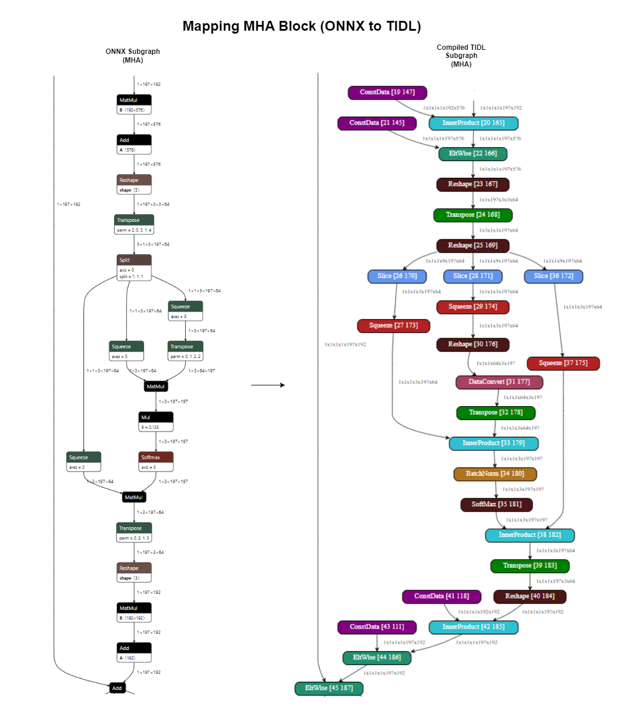
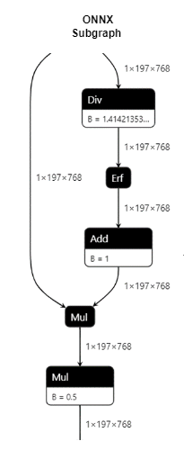
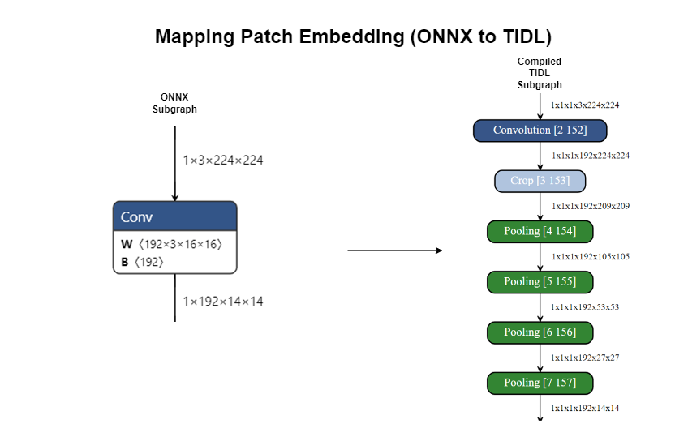
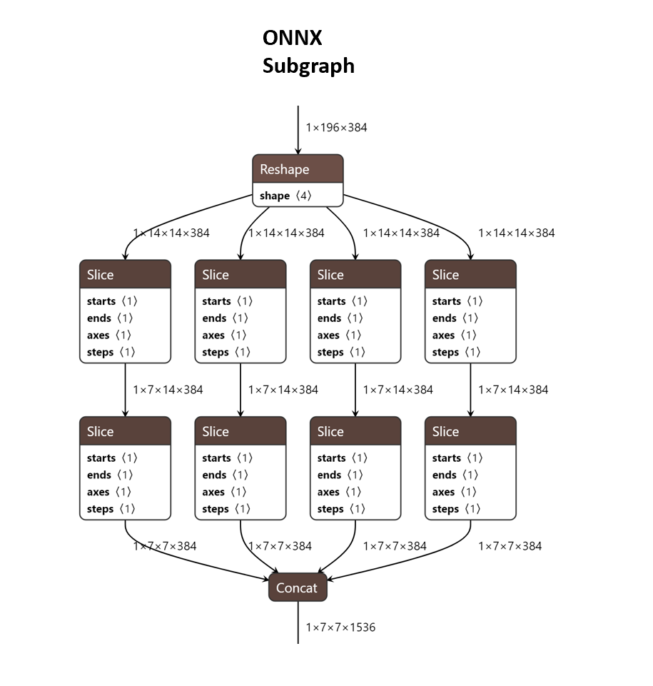

# Vision Transformers
Vision Transformers apply the transformer architecture (Consisting of Multi Headed Attention (MHA) and Feed Forward Network (FFN) blocks) to a wide variety of vision tasks such as classification, object detection, semantic segmentation, etc. This document explains how vision transformers are currently supported with edgeai-tidl-tools

# Support for Vision Transformer Operators
<ul>
<li>TIDL currently supports vision transformers via ONNX models only</li>
<li>TIDL has validated vision transformers from [timm](https://github.com/huggingface/pytorch-image-models/tree/main) exported to ONNX in the current release</li>
<li>ONNX-RT Optimization Level must be set to ORT_DISABLE_ALL while compiling models offloaded to C7x for vision transformers</li>
</ul>

## Multi Headed Attention
<ul>
<li>Both the Projection (1 const input) & Activation x Activation MatMuls get mapped to TIDL's InnerProduct layer</li>
<li>The following figure shows how Multi Headed Attention gets mapped to TIDL:</li>
</ul>

 <kbd>  </kbd> 

## Layernorm
<ul>
<li>The following sequence of ONNX operators are converted to a layernorm layer in TIDL</li>
<li>Note: The γ (Multiplication factor) and β (Addition Factor) are expressed outside TIDL's layernorm block as eltwise layers</li>
</ul>

 <kbd>  </kbd> 

## GELU
<ul>
<li>The following sequence of ONNX operators which represent the GELU activation are mapped to TIDL's Batchnorm layer</li>
<li>GELU can be identified by Batchnorm's activation parameters</li>
</ul>

 <kbd>  </kbd> 

## Patch Embedding
<ul>
<li>Patch embedding expressed as a NxN stride N convolution is mapped to a NxN stride 1 convolution followed by appropriate number of downsamples to implement the same</li>
</ul>

 <kbd>  </kbd> 

## Patch Merging
<ul>
<li>Patch merging expressed as 8x strided slices and concat is mapped as a sequence of reshape and transpose layers in  TIDL</li>
<li>Note: Patch merging is only supported when channels (i.e. depth) is in the lowest dimension</li>
</ul>

 <kbd>  </kbd> 

## Window Shifting
<ul>
<li>Window shifting is expressed the same way as the ONNX graph (Slice & Concat) in TIDL</li>
</ul>

# Known Operator Issues/Limitations

| No | Module                         | Functional Limitation                       | Performance Gap                                | Target Closure Timeline | Additional Notes |
|:--:|:-------------------------------|:--------------------------------------------|:-------------------------------------------|:------|:--------|
| 1  | Attention - MatMul             | <ul><li>Supports up to 3 dimension tensors only. Any higher dimension tensor shall have dimension value equal to 1 for fourth dimension onwards</li><li>Doesn’t support broadcast of 3rd dimension for variable inputs (k.QT, and attention x V)</li><li>For TDA4VM variable input case, doesn’t support unsigned input</li></ul>| ~5x away for variable input MatMuls|SDK 9.2 (except TDA4VM limitation removal)| Reshape can be used to flatten inputs and outputs to matmul if number of dimensions > 3 | 
| 2  | Attention - Softmax            | <ul><li>Quantization – incremental improvement is due</li><li>Data type – 8-bit only</li><li>Axis support – support along width (lowest axis)</li><li>Not supported for AM62A</li></ul>|  ~30x away |SDK 9.2|  | 
| 3  | Attention - Data reshape/movement |<ul><li> None </li></ul>||SDK 9.2| Ideally many of these operations should be NOP, but they run through actual operations currently|
| 4  | Layernorm |<ul><li>Data type - 8-bit signed only</li><li>Axis support - Width axis (Lowest axis)</li></ul>|~4x Away | SDK 9.2 (Excluding axis limitation)| Shall be expressed in the form of decomposed operators in the graph |
| 5  | Patch embedding | <ul><li>None</li></ul>|~30x away|SDK 9.2| |
| 6  | Window shifting | <ul><li>None</li></ul>|~2x away|SDK 9.2| SWIN Transformer Specific |
| 7  | Patch merging | <ul><li>Supported only when channels (depth) are in the lowest dimension</li></ul>| None | NA | SWIN Transformer Specific |
| 8  | GELU | <ul><li>Not supported for AM62A</li><li>Data type - 8-bit only</li></ul>| None | SDK 9.2 |  |

 
