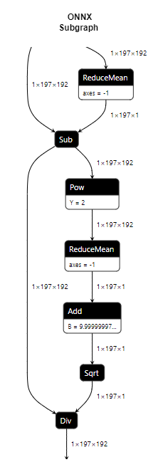

# Vision Transformers
Vision Transformers apply the transformer architecture (Consisting of Multi Headed Attention (MHA) and Feed Forward Network (FFN) blocks) to a wide variety of vision tasks such as classification, object detection, semantic segmentation, etc. This document explains how vision transformers are currently supported with TIDL

# Support for Vision Transformer Operators
The below table covers the current status of transformer operators:

| No | Module                         | Functional Limitation                       | Performance Gap                                | Target Closure Timeline | Additional Notes |
|:--:|:-------------------------------|:--------------------------------------------|:-------------------------------------------|:------|:--------|
| 1  | Attention - MatMul             | <ul><li>None</li></ul>| None| NA |  | 
| 2  | Attention - Softmax            | <ul><li>Axis support – support along width (lowest axis) & height axis</li></ul>| None | NA |  | 
| 3  | Attention - Data reshape/movement |<ul><li> None </li></ul>|None|NA| |
| 4  | Layernorm |<ul><li>Axis support - Width axis (Lowest axis)</li></ul>|None | NA |  |
| 5  | Patch embedding | <ul><li>None</li></ul>|None|NA| |
| 6  | Window shifting | <ul><li>None</li></ul>|None|NA| SWIN Transformer Specific |
| 7  | Patch merging | <ul><li>Supported only when channels (depth) are in the lowest dimension</li></ul>| None | NA | SWIN Transformer Specific |
| 8  | GELU | None| None | NA |  |

## Limitations

- TIDL currently supports vision transformers via ONNX models only
- TIDL has validated vision transformers from [**timm**](https://github.com/huggingface/pytorch-image-models/tree/main) exported to ONNX in the current release
- Accuracy with 8-bit quantization is not yet achieved with variety of models, for example SWIN architecture suffers accuracy loss with 8-bit quantization
- ONNX-RT Optimization Level must be set to ORT_DISABLE_ALL while compiling models offloaded to C7x for vision transformers

## Roadmap
We plan to support the following networks & features in our upcoming releases:

| SDK Version | Network/Features                                                                                                                                                                 | 
|----------------------|-------------------------------------------------------------------------------------------------------------------------------------------------------------------------|
| SDK 9.2  (This release) | Improved support for transformers (Latency & Accuracy)   Support for DETR, SWIN | 
| SDK 10.0 (July'2024) | Additional optimization (latency and accuracy) of transformer modules   Support for DETR-3D, Segformer   Support for low latency mode for multiple C7x(s) for transformer architectures | 
| SDK 10.1 (Nov'2024) | Support for BEVFormer (ECCV 2022), BEVFormer-V2, StreamPETR (ICCV 2023), Deformable DETR   Deformable attention   Temporal information fusion | 
| SDK 10.2 and beyond  | Other state of the art architectures   Deformable convolution | 

Above mentioned feature set for future releases are indicative and subject to change based upon industry needs and research in this field
 
 

# TIDL Layer Mapping of Transformer Operators

## Layernorm
<ul>
<li>The following sequence of ONNX operators are converted to a layernorm layer in TIDL</li>
<li>Note: Individual operators such as pow, sqrt, reducemean and div are not supported in isolation</li>
<li>Note: The γ (Multiplication factor) and β (Addition Factor) are expressed outside TIDL's layernorm block as eltwise layers</li>
</ul>

 <kbd>  </kbd> 

## GELU
<ul>
<li>The following sequence of ONNX operators which represent the GELU activation are mapped to TIDL's Batchnorm layer</li>
<li>Note: Individual operators such as Erf, Div are not supported in isolation</li>
<li>GELU can be identified by Batchnorm's activation parameters</li>
</ul>

 <kbd>  </kbd> 

## Patch Merging
<ul>
<li>Patch merging is expressed as 8x strided slices and a concat layer.</li>
<li>Note: Patch merging is only supported when channels (i.e. depth) is in the lowest dimension</li>
</ul>

 <kbd>  </kbd> 

# DeiT Transformer Example
<ul>
<li>DeiT model can be generated from timm using the following steps,</li>

- pip install timm onnx onnxsim 
- import timm
- import torch
- deit = timm.create_model('deit_tiny_patch16_224', pretrained=True)
- deit.eval()
- x = torch.randn(1, 3, 224, 224)
- deit(x).shape
- torch.onnx.export(deit,x, "deit_tiny.onnx",export_params=True,opset_version=14,do_constant_folding=True,input_names=['input'],output_names=['output'])
- !onnxsim deit_tiny.onnx deit_tiny_1.onnx

<li> The above commands can be run in a Google colab notebook, they have been validated using the same.</li>

<li>Sample model config for the model has been added to model_configs.py, place the model in 'model_base_path' and you can run the model using the standard steps.</li>

</ul>

 
