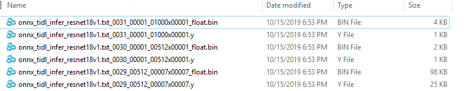
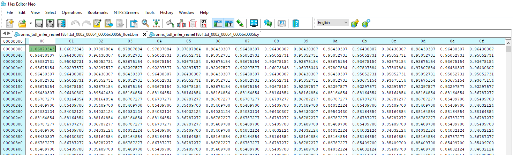
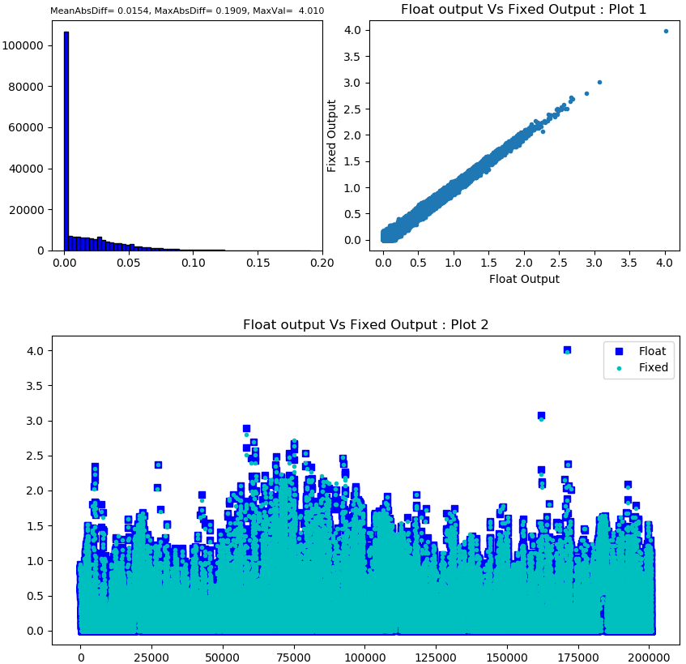
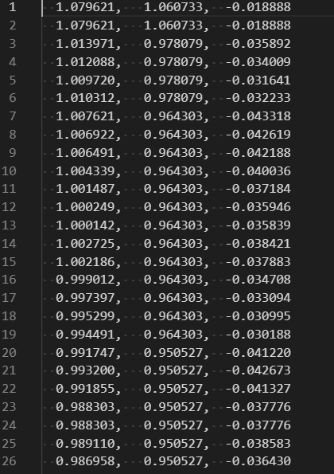
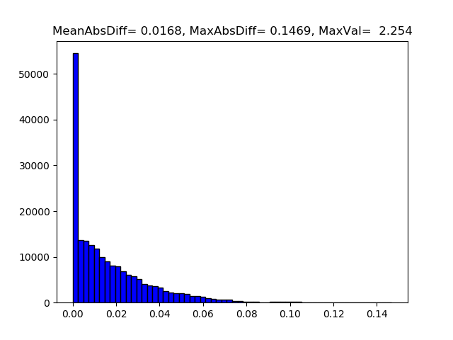

<!-- TOC -->

- [TIDL-RT: Troubleshooting Guide for Accuracy/Functional Issues](#tidl-rt-troubleshooting-guide-for-accuracyfunctional-issues)
- [Model compilation issues](#model-compilation-issues)
- [Steps to Debug Error Scenarios for target(EVM/device) execution](#steps-to-debug-error-scenarios-for-targetevmdevice-execution)
- [Steps to Debug Functional Mismatch in Host emulation](#steps-to-debug-functional-mismatch-in-host-emulation)
- [Feature Map Comparison with Reference](#feature-map-comparison-with-reference)
  - [Script 1 : Layer level activation comparisons :](#script-1--layer-level-activation-comparisons-)
  - [Script 2 : Floating point comparison for a specific list of layers](#script-2--floating-point-comparison-for-a-specific-list-of-layers)

<!-- /TOC -->


# TIDL-RT: Troubleshooting Guide for Accuracy/Functional Issues
This document lists troubleshooting steps for model compilation and model inference. This section is common across the all the OSRT (TFlite / ONNX runtime /TVM-DLR )

# Model compilation issues
Following are some of the options for troubleshooting model compilation related issues.
* Before trying any option user should make sure that their inference script is functional with ARM only mode. For out of box examples user can enable ARM only mode ( i.e. without c7x offload) by passing “-d” as an argument to the default model compilation script 
As an example for ONNX out of box example script user can run in ARM only mode as below
    ```
    python3 onnxrt_ep.py -d
    ```
    For user's custom model they can refer [here](../examples/osrt_python/README.md#example-apis-for-tidl-offload-or-delegation-in-osrts) to enable ARM only mode
* User can set debug_level = 1 or 2 to enable verbose debug log during model compilation and during model inference
* If model infernece works fine in ARM only mode but model compilation fails with C7x-MMA offload, then try dispatching some of the layers (less commonly used layer type) to ARM by using “deny_list” option.
   
# Steps to Debug Error Scenarios for target(EVM/device) execution 

- It is recommended to first test the inference of a given network in host/pc (x86_pc) emulation mode to make sure output is as per expectation.
- If execution on target(EVM) is not completing then user can enable more verbose logs by setting debug_level = 2, which is an optional parameter for both model compilation and inference. This option enables more detailed traces which will help in identifying the layer whose execution is not completing.
- If target (device/EVM) execution output for a given network is not matching the corresponding host/pc emulation output for the same, then user should follow the following steps to identify which layer causes the first mismatch:
  - Check if input to the network itself is mismatching then this indicates mismatch during pre-processing. Typically this can happen if pre-processing is involving floating point operations as floating point operation may differ slightly on x86 and on EVM, for example resize operation may not give bit exact output on EVM compared to x86. Final results shouldn't get impacted with this difference but layer level traces bit match cannot be done. In such scenario it is recommended to directly provide a raw binary input to the network and then compare rest of the layers.
  - Enable layer level fixed point traces in both host emulation and EVM execution. This can be done by setting debug_level = 3 parameter during inference. Layer level traces will be generated inside /tmp folder ( trace names will be like tidl_traceAAAA_BBBBB_CCCCC_DDDDDxEEEEE.y, AAAA is dataId, BBBBB is batch number, CCCCC is channel number, DDDDD is width and EEEEE is height). For example a trace name tidl_trace0072_00001_00256_00010x00014.y indicates the traces of layer with dataId = 72, batch = 1, channels = 256, height = 14 and width = 10. DataId is a unique number associated with each layer's output buffer to uniquely identify it. User can find the mapping of DataId to the layerId which is the order in which a particular layer is executed inside the artifacts directory under tempDir with file name ending with *.layer_info.txt. This file also contains the mapping of layerId/dataId to the name of the layer in original model. The first column in this file is the layerId and second is dataId and third is the name in original model.
  - Run the network on x86 using Host/PC emulation mode (on x86 PC this is already default behavior) with debug_level=3. All the traces will be generated in /tmp folder(if this folder is missing, please create the same). Copy all the layer level traces from /tmp to a folder lets call it traces_ref
  - Repeat the above step on target(EVM) execution. Copy the traces from /tmp folder to a folder, lets call it traces_target
  - Use any binary comparison tool (e.g. beyond compare, diff, cmp etc) to compare the traces_ref and traces_target folder
  - The outputs are expected to bit match and if any particular layer output is not matching in these two modes then the first layer where mismatch is observed is the layer which needs to be reported.

# Steps to Debug Functional Mismatch in Host emulation

- The following steps are suggested, when user finds functional issue or lower accuracy while running inference using TIDL with c7x offload to running the same model without c7x offload. All these steps needs to be performed in host emulation mode rather than on target(EVM) device for easier debugging. Once user achieves the acceptable accuracy with host emulation then host emulation and target execution on device can be bit-matched as described in [here](#steps-to-debug-error-scenarios-for-targetevmdevice-execution)
  - First step is to run the model in TIDL floating point mode and see if accuracy is same as what you get from Open Source Runtimes without c7x offload. To run the model with TIDL in floating point mode user will have to set tensor_bits = 32 during model compilation. (**Note that this flow is not optimized for our SOC's and is supported only in host emulation mode and it’s meant only for debug purpose**). 
  - If this accuracy matches then this indicates that model compilation was successful and without any quantization results are as per expectation.
  - Next step will be to check the accuracy with 8-bit quantization using default quantization options. If the accuracy is not as per expectation then this indicates that either 8-bit quantization is not enough or some layers are not behaving as per expectation with 8-bit quantization. We recommend to try 16-bit quantization for your network (Note that this option will results into more compute time for inference).
  - If 16 bit results are as per expectation then user can try mixed precision to manually/automatically increase the precision of activations/parameters of certain specific layers. The details of this option can be found in [here](./tidl_fsg_quantization.md##a31-manual-mixed-precision-), refer section on Mixed Precision. To choose which layers user will have to analyze the activation/parameters statistics. User can refer [here](#feature-map-comparison-with-reference) to view sample script given to generate such statistics or if required they can extend it to generate more statistics. User can also try automatic selection of mixed precision as described [here](./tidl_fsg_quantization.md#a32-automated-mixed-precision---automatic-selection-of-layers-), refer section on Automated Mixed Precision.


# Feature Map Comparison with Reference

- This section provides some steps to compare layer level feature maps generated from TIDL inference with the same being generated from OSRT without TIDL/c7x offload.
- Set debug_level = 4, this will result into generation of both fixed and floating point traces for each dataId. Note that data Id can be different from layer Id, there are two ways to find this mapping, first way is to read the mapping from the *layer_info.txt file (already described [here](#steps-to-debug-functional-mismatch-in-host-emulation)) . Second way is to read the output of model visualization tool (*.svg file, which also gets generated inside model artifacts folder under tempDir), this information can be read from each layer's box inside the square brackets as [layerIdx, dataIdx].
- Below figure shows a sample of both fixed point (*.y) and floating point (_float.bin) traces generated from TIDL :



- These dumps are raw binary dumps and can be viewed using generic binary file viewers


- User can generate these traces for floating/16-bit and 8-bit by setting tensor_bits during model inference and compare them. Some sample scripts/functions are listed below for reference :

## Script 1 : Layer level activation comparisons :
- User can generate following plots to compare floating point output generated from OSRT without TIDL/c7x offload and with TIDL/c7x offload.
	- Plot 1 : Histogram of absolute difference. Plot with most of values closer to zero indicates the two tensors are similar
	- Plot 2 : TIDL fixed point inference output plotted against TIDL Floating inference output. Plot with most points around a 45 degree line indicates two tensors are similar
	- Plot 3 : TIDL Floating inference output and TIDL fixed point inference output plotted in the same plot. 
- Typically no single plot is enough to conclude the difference and each gives certain way to compare the two outputs.

- A sample plot is as shown as below :


- Following functions can be used to generate the above mentioned plots :

```
	import numpy as np
	import argparse
	import matplotlib
	import matplotlib.pyplot as plt
	import os
	import sys
	import subprocess
	import shutil

	def save_error_plot(float_output, fixed_output, axes):
		mx = np.max(float_data)
		mn = np.min(float_data)
		org_diff = (fixed_data - float_data)
		combined = np.vstack((float_data, fixed_data, org_diff)).T
		# #np.savetxt("figs\\"+str(i).zfill(4)+"_float.txt", combined, fmt='%10.6f, %10.6f, %10.6f')
		abs_diff = abs(fixed_data - float_data)
		maxIndex = np.argmax(abs_diff)
		max_abs_diff = np.max(abs_diff)
		mean_abs_diff = np.mean(abs_diff)
		var_abs_diff = np.var(abs_diff)

		axes.hist(abs_diff, color='blue', edgecolor='black', bins=60)
		# image_txt = "mean = " + str(mean) +", Var = "+ str(var) +", MAx = "+ str(mx)
		image_txt = "MeanAbsDiff=%7.4f, MaxAbsDiff=%7.4f, MaxVal=%7.3f" % (mean_abs_diff, max_abs_diff, mx)
		#plt.title(image_txt)
		axes.set_title(image_txt, fontdict = {'fontsize' : 8})


	def save_pc_ref_plot(float_output, fixed_output, axes):
		axes.set_title("Float output Vs Fixed Output : Plot 1")
		axes.set_xlabel('Float Output')
		axes.set_ylabel('Fixed Output')
		axes.plot(float_output, fixed_output, '.')

	def save_pc_ref_plot2(float_output, fixed_output, axes):
		axes.set_title("Float output Vs Fixed Output : Plot 2")
		axes.plot(float_output, "bs", label = "Float")
		axes.plot(fixed_output, "c.", label = "Fixed")
		axes.legend(loc='upper right', frameon=True)

```
**Note : These functions are given only for reference and may not work in all kind of environment**

## Script 2 : Floating point comparison for a specific list of layers
- Below script can be used to compare any list of tensors.
```
    import numpy as np
    import argparse
    import matplotlib
    import matplotlib.pyplot as plt

    parser = argparse.ArgumentParser(description='My Arg Parser')
    parser.add_argument('-i', '--in_file_list',                       default='trcae_files_list.txt', help='test file containinglist of files to compare', required=False)
    args = vars(parser.parse_args())

    #dir *float* /o:d /s/b

    def save_error_plot(list,i, mean, var, mxd, mx):
        plt.hist(list, color = 'blue', edgecolor = 'black',bins=60)
        #image_txt = "mean = " + str(mean) +", Var = "+ str(var) +", MAx = "+ str(mx)
        image_txt = "MeanAbsDiff=%7.4f, MaxAbsDiff=%7.4f, MaxVal=%7.3f" %(mean, mxd, mx)
        plt.title(image_txt)
        plt.savefig("figs\\"+str(i).zfill(4)+"_abs_diff_hist.png")
        plt.clf()

    def main():
        with open(args['in_file_list']) as f:
            content = f.readlines()
            f.close()
        print("%5s, %12s, %12s, %12s, %12s %12s, %12s, %12s" %("Idx", "Min", "Max", "max_abs_diff", "max_diff_idx", "mean_abs_diff",  "var_abs_diff", "Scale"))
        for i, line in enumerate(content):
            values = line.split()

            fileHandle = open(values[0], 'rb')
            tidl_data = np.fromfile(fileHandle, dtype=np.float32)
            fileHandle.close()

            fileHandle = open(values[1], 'rb')
            ref_data = np.fromfile(fileHandle, dtype=np.float32)
            fileHandle.close()

            mx = np.max(ref_data)
            mn = np.min(ref_data)
            org_diff = (tidl_data - ref_data)
            combined = np.vstack((ref_data, tidl_data, org_diff)).T
            np.savetxt("figs\\"+str(i).zfill(4)+"_float.txt", combined, fmt='%10.6f, %10.6f, %10.6f')
            abs_diff = abs(tidl_data - ref_data)
            maxIndex      = np.argmax(abs_diff)
            max_abs_diff  = np.max(abs_diff)
            mean_abs_diff = np.mean(abs_diff)
            var_abs_diff  = np.var(abs_diff)
            save_error_plot(abs_diff, i,mean_abs_diff,var_abs_diff,max_abs_diff,mx)
            rng = max(np.abs(mx), np.abs(mn))
            if(mn < 0):
                scale = 127/rng if rng!=0 else 0
                tidl_data = np.round(tidl_data * scale)
                tidl_data = tidl_data.astype(np.int8)
            else:
                scale = 255/rng if rng!=0 else 0
                tidl_data = np.round(tidl_data * scale)
                tidl_data = tidl_data.astype(np.uint8)

            tidl_data = np.asarray(tidl_data, order="C")
            with open(values[0]+"viz.y",'wb') as file:
                file.write(tidl_data)
                file.close()


            print("%5s, %12.5f, %12.5f, %12.5f, %12d, %12.5f, %12.5f %12.5f" %(i, mn, mx, max_abs_diff, maxIndex, mean_abs_diff,  var_abs_diff, scale))


    if __name__ == "__main__":
        main()

```

The input list file shall contain the trace file names as below:

```
    D:\trace_8-bit\onnx_tidl_infer_resnet18v1.txt_0001_00064_00112x00112_float.bin D:\trace_16-bit\onnx_tidl_infer_resnet18v1.txt_0001_00064_00112x00112_float.bin
    D:\trace_8-bit\onnx_tidl_infer_resnet18v1.txt_0002_00064_00056x00056_float.bin D:\trace_16-bit\onnx_tidl_infer_resnet18v1.txt_0002_00064_00056x00056_float.bin
```


- If user passes the file paths to 8-bit and 16-bit traces , then this scripts would write the float values and differences to a text files like below



- This script also generates below histogram for each tensor. If the mean difference is close to maximum difference then we have, then this particular tensor has
  higher quantization loss.



**Note : These scripts are given only for reference and may not work in all kind of environtment. Validated with python 3.8**

