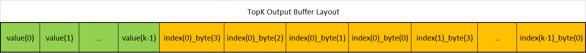

# TopK Operator Implementation in TIDL

The TopK operator in TIDL has a custom implementation where both outputs of the operator (i.e., **values** and **indices**) are combined into a single output buffer. Below are the key details of the implementation.

---

## Key Details

1. **Single Output Buffer**:
   - Both the **values** and **indices** are concatenated into a single output buffer. Refer to figure below for output layout.
   - Slice layers are added after the TopK operator to separate the **values** and **indices** buffers.

2. **Data Type Handling**:
   - The output buffer assumes the data type of the **values** (either `int8` or `int16`).
   - Internally, the buffer also contains the **indices**, which are stored as `int32`.

3. **Buffer Size**:
   - The size of the output buffer is larger because it contains both **values** and **indices**:
     - **8-bit network**: The buffer size is **5x** the size of the values buffer.
       - Breakdown: `values (8-bit)` + `indices (32-bit, which is 4x 8-bit)`.
     - **16-bit network**: The buffer size is **3x** the size of the values buffer.
     - **32-bit network**: The buffer size is **2x** the size of the values buffer.

4. **Increment Axis**:
   - The increment axis (the axis along which the concatenation is applied) is the **channel dimension** when the TopK axis is one of the **channel**, **height**, or **width** dimensions (for performance reasons). For any other axis, it is the first **non-singleton** dimension when moving from the **batch** to the **width** dimension.

5. **Re-interpret Operation**:
   - After the slice layer separates the **indices** buffer, a **re-interpret operation** is performed.
   - This operation changes the data type of the buffer from the **values** data type (`int8` or `int16`) to the **indices** data type (`int32`).

---

> **Note**: When two or more values are the same, TIDL does not guarantee any specific order in which the **indices** are dumped. This means the order of indices for identical values may vary between emulation and the device.

    

