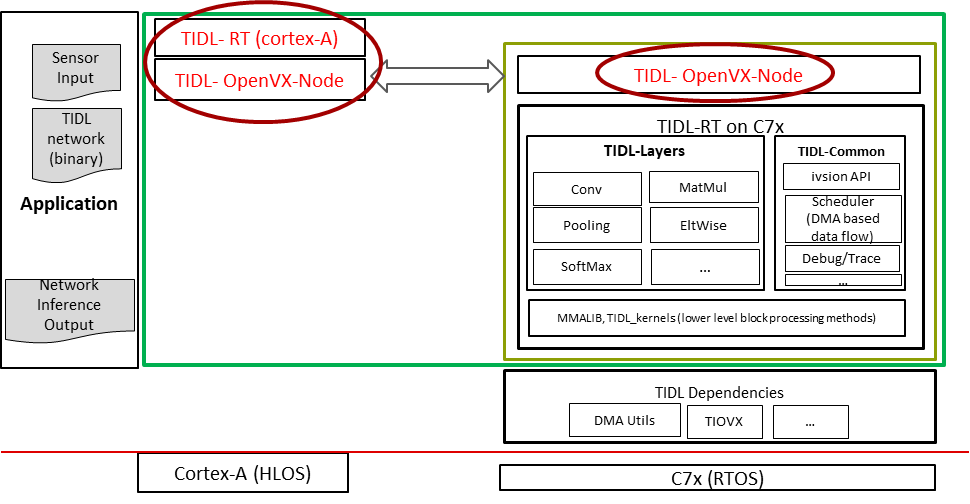

# TIDLRT

This document provides information about TIDL-RT and underlying OpenVX Node, how it interacts with OSRT (Open Source Runtimes) and different entry-point for the user application.

## Table of Contents

- [Model Compilation](#model-compilation)
- [Model Inference](#model-inference)
  - [Inference Flow](#inference-flow)
  - [Cortex-A <-> C7x flow](#cortex-a---c7x-flow)
  - [TIDL-RT](#tidl-rt-on-cortex-a)
    - [Main APIs of this module](#main-apis-of-this-module)
    - [Input/Output Buffer Management](#inputoutput-buffer-management)
    - [sTIDLRT_Params_t](#stidlrt_params_t)
    - [sTIDLRT_PerfStats_t](#stidlrt_perfstats_t)
    - [sTIDLRT_Tensor_t](#stidlrt_tensor_t)
    - [Sample Application Code](#sample-application-code)
  - [TIDL OpenVX Node](#tidl-openvx-node)
  - [ERRORS](#errors)

## Model Compilation
In simple terms, compilation of model basically means converting a model in standard format (onnx, tflite) into TIDL understandable format for inference. 

Before feeding to software on SoC, TIDL compiler does few operations and generates a sort of "blue print" for inference software on SOC.

Operations involved in compiler are:
   - Parsing of AI model
   - Quantization
   - Memory planning for the AI model
   - Generating the "blue print" for inference software in device


The compilation process is implemented and accessible through the Python interfaces of various runtimes including onnxruntime, tfliteruntime, tvm runtime, and tidlruntime, providing a unified approach to model optimization across different frameworks.

More information about compilation process and all the user mutable options can be found at [Model Compilation](./model_compilation.md)

## Model Inference

### Inference Flow

The TIDL framework consists of multiple layers that work together to provide efficient model inference. The diagram below illustrates the architecture of TIDL and the various entry points for users:

<div align="center">

</div>

1. **Hardware Layer**: The foundation of TIDL, consisting of the C7x/MMA to offload computations to
2. **OpenVX Layer**: Provides a standardized framework for interfacing to the hardware. Refer to [TIDL OpenVX Node](#tidl-openvx-node) for usage example.
3. **TIDL-RT**: Abstraction over TIDL OpenVX Node. Refer to [TIDL-RT](#tidl-rt-on-cortex-a) for usage example.
4. **Runtime Frameworks**: High-level interfaces for model inference that internally calls TIDL-RT APIs. Refer to [../runtimes](../runtimes/README.md) for usage example across various frameworks.

This layered architecture provides flexibility for different use cases while maintaining high performance through hardware acceleration.

### Cortex-A <-> C7x flow 

<div align="center">

</div>

### TIDL-RT on Cortex-A

This module is used as a bridge between the TIDL runtime firmware and the user applications. It provides APIs which can be called in ARM applications, which internally takes care of the delegation to C7x core for inference.
These are simple to use C APIs that can be used for user application for inference on TI vision processing SoCs.

These APIs can be directly used as shown in the examples under `runtimes/tidl_wrapper/cpp/tidlrt`, or alternatively, Open Source Runtimes (OSRT) can be used which internally call these functions via executioner provider or delegation mechanism. This provides flexibility in choosing the most appropriate interface for your application needs.


#### Main APIs of this module

```c
/**
 * @brief Creates a TIDL-RT handle for model inference
 *
 * This function creates a handle per model invocation which can be consumed by the 
 * corresponding invoke API. It initializes all required OpenVX objects including
 * context, kernel, node, and graph, and verifies the graph after creation.
 *
 * @param[in]  prms    Pointer to inference parameters structure
 * @param[out] handle  Pointer to store the created handle
 *
 * @return int32_t     0 on success, error code otherwise
 */
int32_t TIDLRT_create(sTIDLRT_Params_t *prms, void **handle);

/**
 * @brief Executes model inference using the provided handle and tensors
 *
 * This function runs the inference callback of the OpenVX DSP Kernel using the
 * provided handle and input/output tensors. The tensors must be allocated by the
 * user, and input tensors must be filled with appropriate data before calling.
 *
 * @param[in]  handle  Handle created by TIDLRT_create
 * @param[in]  in      Array of input tensors with data to process
 * @param[out] out     Array of output tensors to store results
 *
 * @return int32_t     0 on success, error code otherwise
 *
 * @note Input and output tensor details are present in sTIDL_IOBufDesc_t which is
 *       part of the compiled model artifact (*_io_*.bin file)
 */
int32_t TIDLRT_invoke(void *handle, sTIDLRT_Tensor_t *in[], sTIDLRT_Tensor_t *out[]);

/**
 * @brief Releases resources associated with a TIDL-RT handle
 *
 * This function releases all OpenVX objects (node, kernel, graph), user data objects,
 * tensors created during TIDLRT_create, and the OpenVX context for ARM TIDL-RT.
 *
 * @param[in] handle  Handle to release
 *
 * @return int32_t    0 on success, error code otherwise
 */
int32_t TIDLRT_delete(void *handle);

/**
 * @brief Initializes a parameters structure with default values
 *
 * @param[out] prms  Pointer to parameters structure to initialize
 *
 * @return int32_t   0 on success, error code otherwise
 */
int32_t TIDLRT_setParamsDefault(sTIDLRT_Params_t *prms);

/**
 * @brief Initializes a tensor structure with default values
 *
 * @param[out] tensor  Pointer to tensor structure to initialize
 *
 * @return int32_t     0 on success, error code otherwise
 */
int32_t TIDLRT_setTensorDefault(sTIDLRT_Tensor_t *tensor);

/**
 * @brief Allocates memory in DDR shared memory region
 *
 * @param[in] alignment  Memory alignment requirement in bytes
 * @param[in] size       Size of memory to allocate in bytes
 *
 * @return int32_t       Pointer to allocated memory, or NULL on failure
 */
int32_t TIDLRT_allocSharedMem(int32_t alignment, int32_t size);

/**
 * @brief Frees memory allocated in shared memory
 *
 * @param[in] ptr  Pointer to memory previously allocated with TIDLRT_allocSharedMem
 */
void TIDLRT_freeSharedMem(void *ptr);
```

#### Input/Output Buffer Management

As stated earlier, user application is expected to allocate appropriate input and output tensors and provide to invoke API in `sTIDLRT_Tensor_t` structure. The details of expected input and output tensor like number of Inputs and outputs, dimensions, datatypes, padding etc is present in  `sTIDL_IOBufDesc_t`. For more information about sTIDL_IOBufDesc_t and IO tensors, refer [IO Tensors](./io_tensors.md)


#### <u>sTIDLRT_Params_t</u>

The `sTIDLRT_Params_t` structure is defined in `itidl_rt.h` (present inside tidl_tools) and contains the following fields:

| Field | Type | Default | Description |
|-------|---------|-------------|-------------|
| `netPtr` | `void*` | `NULL` | Pointer to TIDL Network Structure binary found in compiled model-artifacts. This binary is essentially a representation of compiled model which is ready to be offloaded to the C7x dsp. |
| `ioBufDescPtr` | `void*` | `NULL` | Pointer to IO binary found in compiled model-artifacts. This binary provides information about the Input and Output tensors/buffers in  sTIDL_IOBufDesc_t structure that is expected to be provided by the application. |
| `net_capacity` | `int32_t` | `0` | Size of TIDL Network binary file |
| `io_capacity` | `int32_t` | `0` | Size of IO binary file |
| `traceLogLevel` | `int32_t` | `0` | Level for debug messages. <br> 0 - No debug print <br> >=1 - Print network performance info. Also dump under `{traceBaseName}/perf.csv`. <br> >=2 - Prints time taken at various stages of initialization, memory size requirements and layer level execution info. |
| `traceWriteLevel` | `int32_t` | `0` | Level for debug trace dumps of tensors and other data buffers. <br> 0 - No trace dump <br> 1 - Fixed point layer traces <br> 2 - Padded Fixed point layer traces. For internal use only. <br> 3 - Fixed and Floating point layer traces|
| `traceBaseName` | `char[]` | `/tmp/tidl_trace` | Prefix of intermediate traces file. Ex: /tmp/tidl_trace |
| `traceSubgraphName` | `char[]` | `''` | Name of the file to dump the traces. |
| `stats` | `sTIDLRT_PerfStats_t*` | `NULL` | Pointer to sTIDLRT_PerfStats_t which contains various time statistics for the run. Explained in the table below. The application is expected to allocate this structure in the application in case it needs performance timestamps. |
| `dumpNetInitBackupData` | `int32_t` | `0` | Enable dumping reordered params data computed during initialization time. |
| `releaseIOTensorsAtCreate` | `int32_t` | `0` | Flag to indicate early release of input-output tensors during TIDLRT_create(). If this flag is set then user MUST provide a buffer allocated in shared memory pool which can be swapped with OpenVX buffers. If the user sets this flag to 1 and provides a buffer allocated in a different pool, the program will return with an error as it will not have a buffer in shared memory to copy. By default this flag is set to 0 which indicates that the OpenVx buffer will be released during TIDLRT_invoke() if the user provided buffer meets the condition to be swapped. Otherwise it will copy the contents of the user buffer to OpenVx memory buffer. |
| `computeChecksum` | `int32_t` | `0` | Flag to indicate if config and network checksum should be calculated |
| `targetPriority` | `int` | `0` |  Control Variables to control multi network and preemption among them Recommended to use default. 0(highest prior)-7(lowest prior). <br><br> If the user wants multiple models in system with a capability of  allowing different priority level for each, then this feature can be used. User can preempt a model-1 execution by  scheduling another higher priority model-2. Another argument maxPreEmptDelay is provided to user to control the urgency of scheduling a higher priority network, higher the value of this means that ongoing lower priority network can still continue to execute for the stated time before giving importance to higher priority network</br></br> Example : <br>Network 1 - higher priority (targetPriority = 0, maxPreEmptDelay = 30), </br>Network 2 - lower priority (targetPriority = 1, maxPreEmptDelay = 1),</br> In above example Network 2 has a tolerance of 1 ms before getting preempted  from the time when a request of scheduling Network 1 appeared  |
| `maxPreEmptDelay` | `float` | `FLT_MAX` | Maximum tolerated delay for pre-emption in millisecond |
| `coreNum` | `uint32_t` | `1` | Total number of core for execution. Only applicable for multicore c7x devices |
| `coreStartIdx` | `int32_t` | `1` | Core number to start processing from. Only applicable for multicore c7x devices |
| `tempBufferDir` | `char[]` | `/tmp` | Directory to store temporary openvx buffers in host emulation mode only |

#### <u>sTIDLRT_PerfStats_t</u>

The `sTIDLRT_PerfStats_t` structure is defined in `itidl_rt.h` (present inside tidl_tools) and contains the following fields:

| Field | Type | Default | Description |
|-------|---------|-------------|-------------|
| `cpIn_time_start` | `uint64_t` | `0` | Input copy start timestamp in nanoseconds|
| `cpIn_time_end`   | `uint64_t` | `0` | Input copy end timestamp in nanoseconds|
| `proc_time_start` | `uint64_t` | `0` | Graph processing start timestamp in nanoseconds|
| `proc_time_end`   | `uint64_t` | `0` | Graph processing end timestamp in nanoseconds |
| `cpOut_time_start`| `uint64_t` | `0` | Output copy start timestamp in nanoseconds |
| `cpOut_time_end`  | `uint64_t` | `0` | Output copy end timestamp in nanoseconds |


#### <u>sTIDLRT_Tensor_t</u>

The `sTIDLRT_Tensor_t` structure is defined in `itidl_rt.h` (present inside tidl_tools) and contains the following fields:

| Field | Type | Default | Description |
|-------|---------|-------------|-------------|
| `ptr` | `void*` | `NULL` | Pointer to the allocated buffer base address |
| `bufferSize`   | `int32_t` | `0` | Actual size of buffer in elements |
| `memType` | `uint32_t` | `0` | Memory type – 0 - ARM Heap, 1 - DDR Shared Mem |
| `name`   | `int8_t[]` | `NULL` | Unique name of the buffer |
| `elementType`| `int32_t` | `0` | Element type of buffer - [eTIDL_ElementType](./io_tensors.md#etidl_elementtype) |
| `numDim`  | `int32_t` | `0` | Number of dimensions of the buffer |
| `dimValues`  | `int32_t[]` | `-1` | Array containing dimension of the buffer [Batch, DIM1, DIM2, CHANNEL, HEIGHT, WIDTH] |
| `pitch`  | `int32_t[]` | `-1` | Array containing pitches of the buffer [Batch Pitch (ROI Pitch), DIM1 Pitch, DIM2 Pitch, CHANNEL Pitch, HEIGHT Pitch (Line Pitch)] |
| `padValues`  | `int32_t[]` | `0` | Array containing pads of the buffer [Batch Pad, DIM1 Pad, DIM2 Pad, CHANNEL Pad, HEIGHT Pad, WIDTH Pad] |
| `dataOffset`  | `int32_t` | `0` | Actual tensor data start offset in elements from the base address – Excluding the padding |
| `layout`  | `uint32_t` | `0` | Layout of the data - [eTIDL_TensorLayout](./io_tensors.md#etidl_tensorlayout) |
| `zeroPoint`  | `int32_t` | `0` | Zero point for Asymmetric Fixed point Representation |
| `scale`  | `float` | `1.0` | Scale used for float to fixed point conversion |


#### Sample Application Code:

For a simple sample application code, refer to [../runtimes/tidl_wrapper/cpp/tidlrt](../runtimes/tidl_wrapper/cpp/tidlrt/tidlrt_wrapper.cpp)

### TIDL OpenVX Node

TIDL OpenVX Node is the underlying framework based on [TIOVX](https://software-dl.ti.com/jacinto7/esd/processor-sdk-rtos-jacinto7/latest/exports/docs/tiovx/docs/user_guide/index.html). OpenVX framework provides a mechanism to link applications and kernels across different hardware cores of an SoC. TIDL-RT as mentioned above is effectively a wrapper around TIDL OpenVX Node which provides easy to use APIs and abstracts the intricacies of OpenVX interface from the user. Users can choose to directly use OpenVX interface as well and create their own custom application. Some examples demonstrating direct usage of TIDL OpenVX Node are:
1. [arm-tidl](https://git.ti.com/cgit/processor-sdk-vision/arm-tidl/tree/rt/src/tidl_rt_ovx.c): This is the actual implementation of TIDL-RT which abstracts the OpenVX interface.
2. [conformance](https://git.ti.com/cgit/processor-sdk-vision/arm-tidl/tree/tiovx_kernels/tidl/test/test_tidl.c): As a part of SDK, TIDL provides some basics conformance test for conforming to OpenVX framework. This can also serve as a simple example of using TIDL OpenVX node.
3. [vision_apps](https://git.ti.com/cgit/processor-sdk/vision_apps/tree/modules/src/app_tidl_module.c?h=main): These are some out-of-box SDK applications which directly uses TIDL OpenVX Node.


### ERRORS

As a part of debugging mechanism, TIDL provides error reporting during creation and processing of the graph. These errors are printed as part of c7x remote core logs in the following format:

```
Error type *TYPE* in *GROUP* occurred. File: *FILENAME* Line: *LINE NO.*
```

> **NOTE**: To get error prints on TI Device, make sure to run **vx_remote_arm.out**. This can be done by sourcing **vision_apps_init.sh**.
> ```bash
> cd /opt/vision_apps && source ./vision_apps_init.sh
> ```


Different Error Groups and Types are listed below:

| ERROR GROUP | ERROR TYPES | REMARKS |
|-------|---------|-------------|
| TIDL_ERROR_GROUP_COMMON | TIDL_ERROR_COMMON_RSVD<br><br>TIDL_ERROR_COMMON_UNSUPPORTED_LAYER<br><br>TIDL_ERROR_COMMON_DATAFLOW_INFO_NULL<br><br>TIDL_ERROR_COMMON_INVALID_NET_VERSION<br><br>TIDL_ERROR_COMMON_INVALID_IO_LINE_PITCH<br><br>TIDL_ERROR_COMMON_INVALID_DDR_INFO_FROM_GC<br><br>TIDL_ERROR_COMMON_EXCEED_PARAMS_MEMTAB_REQUEST<br><br>TIDL_ERROR_COMMON_EXCEED_DATA_MEMTAB_REQUEST<br><br>TIDL_ERROR_COMMON_EXCEED_PRIORITY_LEVEL<br><br>TIDL_ERROR_COMMON_EXCEED_OBJECTS_PER_LEVEL<br><br>TIDL_ERROR_COMMON_EXCEED_OBJ_DET_MAX_HEADS<br><br>TIDL_ERROR_COMMON_DATA_TYPE_NOT_SUPPORTED<br><br>TIDL_ERROR_COMMON_UNSUPPORTED_AXIS | RESERVED<br><br>LAYER UNSUPPORTED<br><br>DATAFLOW INFO IS NULL<br><br>INVALID NETWORK VERSION<br><br>INVALID IO BUFFER LINE PITCH<br><br>INVALID DDR INFO<br><br>MEMORY USED FOR LAYER PARAMS IS GREATER THAN REQUESTED<br><br>MEMORY USED FOR LAYER SCRATCH DATA IS GREATER THAN REQUESTED<br><br>PRIORITY LEVEL EXCEEDS MAX PRIORITY LEVEL<br><br>OBJECTS EXCEEDS THE MAX LIMIT PER LEVEL OF PRIORITY<br><br>OBJECTS EXCEEDS THE MAX LIMIT OF OBJECT DETECTION HEADS<br><br>DATATYPE IS NOT SUPPORTED<br><br>AXIS IS NOT SUPPORTED |
| TIDL_ERROR_GROUP_IVISON | TIDL_ERROR_IVISION_ALG_RSVD<br><br>TIDL_ERROR_IVISION_ALG_ALLOC_FAIL<br><br>TIDL_ERROR_IVISION_ALG_CREATE_FAIL<br><br>TIDL_ERROR_IVISION_ALG_DELETE_FAIL<br><br>TIDL_ERROR_IVISION_ALG_INIT_FAIL<br><br>TIDL_ERROR_IVISION_ALG_DEINIT_FAIL<br><br>TIDL_ERROR_IVISION_ALG_PROCESS_FAIL | RESERVED<br><br>ALG ALLOC FAILED<br><br>ALG CREATE FAILED<br><br>ALG DELETE FAILED<br><br>ALG INIT FAILED<br><br>ALG DEINIT FAILED<br><br>ALG PROCESS FAILED |
| TIDL_ERROR_GROUP_WORKLOAD | TIDL_ERROR_WORKLOAD_RSVD<br><br>TIDL_ERROR_WORKLOAD_LNKSUBTYPE_INVALID<br><br>TIDL_ERROR_WORKLOAD_DIMNS_INVALID<br><br>TIDL_ERROR_WORKLOAD_PARENT_CHILD_MISMATCH<br><br>TIDL_ERROR_WORKLOAD_DIMNS_ERROR<br><br>TIDL_ERROR_WORKLOAD_MEMSIZE_ERROR<br><br>TIDL_ERROR_WORKLOAD_LNKSUBTYPE_ERROR | RESERVED<br><br>INTERNAL ERROR RESERVED FOR FUTURE USE<br><br>INTERNAL ERROR RESERVED FOR FUTURE USE<br><br>INTERNAL ERROR RESERVED FOR FUTURE USE<br><br>INTERNAL ERROR RESERVED FOR FUTURE USE<br><br>INTERNAL ERROR RESERVED FOR FUTURE USE<br><br>INTERNAL ERROR RESERVED FOR FUTURE USE |
| TIDL_ERROR_GROUP_QUANTIZATION | TIDL_ERROR_QUANTIZATION_RSVD<br><br>TIDL_ERROR_QUANTIZATION_STATS_NOT_AVAILABLE<br><br>TIDL_ERROR_QUANTIZATION_INVALID_ASYM | RESERVED<br><br>QUANTIZATION STATS IS NOT AVAILABLE<br><br>ASYMMETRIC QUANTIZATION IS NOT VALID |
| TIDL_ERROR_GROUP_PADDING | TIDL_ERROR_PADDING_RSVD<br><br>TIDL_ERROR_PADDING_INPUT_BUF_NOT_SUPPORTED<br><br>TIDL_ERROR_PADDING_INVALID_OTF | RESERVED<br><br>PADDING OF INPUT BUFFER IS NOT SUPPORTED<br><br>ON THE FLY PADDING ERROR |
| TIDL_ERROR_GROUP_DEBUG_TRACE | TIDL_ERROR_DEBUG_TRACE_RSVD<br><br>TIDL_ERROR_DEBUG_TRACE_INVALID_PARAM | RESERVED<br><br>INVALID DEBUG TRACE PARAMS |
| TIDL_ERROR_GROUP_ALG_UTILS | TIDL_ERROR_ALGUTILS_RSVD<br><br>TIDL_ERROR_ALGUTILS_INVALID_GRPID_ERROR<br><br>TIDL_ERROR_ALGUTILS_FAIL_ACTIVATE_ERROR<br><br>TIDL_ERROR_ALGUTILS_INVALID_LNKTYPE_ERROR | RESERVED<br><br>INVALID ALGHANDLE GROUP ID<br><br>HANDLE ACTIVATE FAILED<br><br>INVALID LINK TYPE |
| TIDL_ERROR_GROUP_COMMON_UTILS | TIDL_ERROR_COMMNUTILS_RSVD<br><br>TIDL_ERROR_COMMNUTILS_FAIL_DMACONFIG_ERROR<br><br>TIDL_ERROR_COMMNUTILS_FAIL_DMADECONFIG_ERROR<br><br>TIDL_ERROR_COMMNUTILS_FAIL_DMAPREPTR_ERROR<br><br>TIDL_ERROR_COMMNUTILS_FAIL_DMAVRPHYADD_ERROR | RESERVED<br><br>DMA CONFIGURATION FAILED<br><br>DMA DECONFIGURATION FAILED<br><br>DMA PREPARE TRANSFER RECORD FAILED<br><br>DMA CONVERT VIRTUAL TO PHYSICAL ADDRESS FAILED |
| TIDL_ERROR_GROUP_XFR_LINK | TIDL_ERROR_XFR_LINK_RSVD<br><br>TIDL_ERROR_XFR_LINK_INVALID_WLCALCPTR_ERROR | RESERVED<br><br>INTERNAL ERROR INDICATING CORRUPTED OR INCORRECT COMPILED ARTIFACTS |
| TIDL_ERROR_GROUP_ALG_COMMON | TIDL_ERROR_ALG_COMMON_RSVD<br><br>TIDL_ERROR_ALG_COMMON_NULL_ALGHNDLE_ERROR<br><br>TIDL_ERROR_ALG_COMMON_ZERO_NETBCK_ERROR<br><br>TIDL_ERROR_ALG_COMMON_NULL_DMAUTILSCTNTX_ERROR<br><br>TIDL_ERROR_ALG_COMMON_NULL_ZEROVEC1K_ERROR<br><br>TIDL_ERROR_ALG_COMMON_NULL_MEMCPYTR_ERROR<br><br>TIDL_ERROR_ALG_COMMON_NULL_PRMTHNDLE_ERROR<br><br>TIDL_ERROR_ALG_COMMON_MAX_PARAMBUFMEMREC_ERROR<br><br>TIDL_ERROR_ALG_COMMON_MAX_SCRDATABUFMEMREC_ERROR | RESERVED<br><br>ALG HANDLE IS NULL<br><br>INTERNAL ERROR RESERVED FOR FUTURE USE<br><br>ALG HANDLE DMA UTILS CONTEXT IS NULL<br><br>UNABLE TO ALLOCATE 0 VECTOR IN L2 MEMORY<br><br>UNABLE TO ALLOCATE MEMCPY TRANSFER IN L2 MEMORY<br><br>UNABLE TO ALLOCATE PREEMPTION HANDLE<br><br>INTERNAL ERROR RESERVED FOR FUTURE USE<br><br>INTERNAL ERROR RESERVED FOR FUTURE USE |
| TIDL_ERROR_GROUP_DATA | NA | No error codes defined in this group |
| TIDL_ERROR_GROUP_CONV | TIDL_ERROR_CONV_RSVD<br><br>TIDL_ERROR_CONV_INVALID_INPUT_WIDTH<br><br>TIDL_ERROR_CONV_INVALID_INPUT_HEIGHT<br><br>TIDL_ERROR_CONV_INVALID_OUTPUT_WIDTH<br><br>TIDL_ERROR_CONV_INVALID_OUTPUT_HEIGHT<br><br>TIDL_ERROR_CONV_INVALID_NUM_IN_CHANNELS<br><br>TIDL_ERROR_CONV_INVALID_NUM_OUT_CHANNELS<br><br>TIDL_ERROR_CONV_INVALID_KERNEL_WIDTH<br><br>TIDL_ERROR_CONV_INVALID_KERNEL_HEIGHT<br><br>TIDL_ERROR_CONV_INVALID_KERNEL_TYPE<br><br>TIDL_ERROR_CONV_INVALID_STRIDE_WIDTH<br><br>TIDL_ERROR_CONV_INVALID_STRIDE_HEIGHT<br><br>TIDL_ERROR_CONV_NEGATIVE_OUTPUT_SHIFT<br><br>TIDL_ERROR_CONV_UNSUPPORTED_DATA_TYPE | RESERVED<br><br>INVALID INPUT WIDTH FOR CONVOLUTION<br><br>INVALID INPUT HEIGHT FOR CONVOLUTION<br><br>INVALID OUTPUT WIDTH FOR CONVOLUTION<br><br>INVALID OUTPUT HEIGHT FOR CONVOLUTION<br><br>INVALID INPUT CHANNELS FOR CONVOLUTION<br><br>INVALID OUTPUT CHANNELS FOR CONVOLUTION<br><br>INVALID KERNEL WIDTH FOR CONVOLUTION<br><br>INVALID KERNEL HEIGHT FOR CONVOLUTION<br><br>INVALID KERNEL TYPE FOR CONVOLUTION<br><br>INVALID STRIDE WIDTH FOR CONVOLUTION<br><br>INVALID STRIDE HEIGHT FOR CONVOLUTION<br><br>NEGATIVE OUTPUT SHIFT VALUE<br><br>UNSUPPORTED DATA TYPE FOR CONVOLUTION |
| TIDL_ERROR_GROUP_POOL | TIDL_ERROR_POOL_RSVD<br><br>TIDL_ERROR_POOL_INVALID_INPUT_WIDTH<br><br>TIDL_ERROR_POOL_INVALID_INPUT_HEIGHT<br><br>TIDL_ERROR_POOL_INVALID_OUTPUT_WIDTH<br><br>TIDL_ERROR_POOL_INVALID_OUTPUT_HEIGHT<br><br>TIDL_ERROR_POOL_INVALID_POOL_TYPE<br><br>TIDL_ERROR_POOL_INVALID_NUM_CHANNELS<br><br>TIDL_ERROR_POOL_INVALID_KERNEL_WIDTH<br><br>TIDL_ERROR_POOL_INVALID_KERNEL_HEIGHT<br><br>TIDL_ERROR_POOL_INVALID_STRIDE_WIDTH<br><br>TIDL_ERROR_POOL_INVALID_STRIDE_HEIGHT<br><br>TIDL_ERROR_POOL_GLOBALAVG_NOT_IMPLEMENTED | RESERVED<br><br>INVALID INPUT WIDTH FOR POOLING<br><br>INVALID INPUT HEIGHT FOR POOLING<br><br>INVALID OUTPUT WIDTH FOR POOLING<br><br>INVALID OUTPUT HEIGHT FOR POOLING<br><br>INVALID POOLING TYPE<br><br>INVALID CHANNELS FOR POOLING<br><br>INVALID KERNEL WIDTH FOR POOLING<br><br>INVALID KERNEL HEIGHT FOR POOLING<br><br>INVALID STRIDE WIDTH FOR CONVOLUTION<br><br>INVALID STRIDE HEIGHT FOR CONVOLUTION<br><br>GLOBAL AVERAGE POOLING NOT IMPLEMENTED FOR GIVEN DATATYPE |
| TIDL_ERROR_GROUP_RELU | NA | No error codes defined in this group |
| TIDL_ERROR_GROUP_PRELU | NA | No error codes defined in this group |
| TIDL_ERROR_GROUP_ELTWISE | TIDL_ERROR_ELTWISE_RSVD<br><br>TIDL_ERROR_ELTWISE_INVALID_INPUT_WIDTH<br><br>TIDL_ERROR_ELTWISE_INVALID_INPUT_HEIGHT<br><br>TIDL_ERROR_ELTWISE_INVALID_OUTPUT_WIDTH<br><br>TIDL_ERROR_ELTWISE_INVALID_OUTPUT_HEIGHT<br><br>TIDL_ERROR_ELTWISE_INVALID_ELTWISE_TYPE<br><br>TIDL_ERROR_ELTWISE_INVALID_NUM_CHANNELS<br><br>TIDL_ERROR_ELTWISE_NOT_IMPLEMENTED | RESERVED<br><br>INVALID INPUT WIDTH FOR ELTWISE<br><br>INVALID INPUT HEIGHT FOR ELTWISE<br><br>INVALID OUTPUT WIDTH FOR ELTWISE<br><br>INVALID OUTPUT HEIGHT FOR ELTWISE<br><br>INVALID DATATYPE FOR ELTWISE<br><br>INVALID CHANNELS FOR ELTWISE<br><br>ELTWISE NOT IMPLEMENTED FOR PARTICULAR CONFIGURATION |
| TIDL_ERROR_GROUP_INNERPROD | TIDL_ERROR_INNERPROD_RSVD<br><br>TIDL_ERROR_INNERPROD_UNSUPPORTED_DATA_TYPE<br><br>TIDL_ERROR_INNERPROD_INVALID_NUM_IN_NODES<br><br>TIDL_ERROR_INNERPROD_INVALID_NUM_OUT_NODES<br><br>TIDL_ERROR_INNERPROD_NEGATIVE_OUTPUT_SHIFT<br><br>TIDL_ERROR_INNERPROD_INSUFFICIENT_MEM_BIAS<br><br>TIDL_ERROR_INNERPROD_INPTR_NULL | RESERVED<br><br>INVALID DATATYPE FOR INNERPROD<br><br>INVALID NUMBER OF INPUTS FOR INNERPROD<br><br>INVALID NUMBER OF OUTPUTS FOR INNERPROD<br><br>NEGATIVE OUTPUT SHIFT VALUE<br><br>INSUFFICIENT MEMORY FOR BIAS<br><br>INPUT IS NULL |
| TIDL_ERROR_GROUP_SOFTMAX | TIDL_ERROR_SOFTMAX_RSVD<br><br>TIDL_ERROR_SOFTMAX_INVALID_NUM_CHANNELS<br><br>TIDL_ERROR_SOFTMAX_NOT_IMPLEMENTED | RESERVED<br><br>INVALID CHANNELS FOR SOFTMAX<br><br>SOFTMAX NOT IMPLEMENTED FOR PARTICULAR DATATYPE |
| TIDL_ERROR_GROUP_BATCHNORM | TIDL_ERROR_BATCHNORM_RSVD<br><br>TIDL_ERROR_BATCHNORM_INVALID_INPUT_WIDTH<br><br>TIDL_ERROR_BATCHNORM_INVALID_INPUT_HEIGHT<br><br>TIDL_ERROR_BATCHNORM_INVALID_OUTPUT_WIDTH<br><br>TIDL_ERROR_BATCHNORM_INVALID_OUTPUT_HEIGHT<br><br>TIDL_ERROR_BATCHNORM_INVALID_NUM_CHANNELS<br><br>TIDL_ERROR_BATCHNORM_INVALID_ENABLE_RELU<br><br>TIDL_ERROR_BATCHNORM_NEGATIVE_OUTPUT_SHIFT | RESERVED<br><br>INVALID INPUT WIDTH FOR BATCHNORM<br><br>INVALID INPUT HEIGHT FOR BATCHNORM<br><br>INVALID OUTPUT WIDTH FOR BATCHNORM<br><br>INVALID OUTPUT HEIGHT FOR BATCHNORM<br><br>INVALID CHANNELS FOR BATCHNORM<br><br>INTERNAL ERROR RESERVED FOR FUTURE USE<br><br>NEGATIVE OUTPUT SHIFT VALUE |
| TIDL_ERROR_GROUP_BIAS | NA | No error codes defined in this group |
| TIDL_ERROR_GROUP_SCALE | NA | No error codes defined in this group |
| TIDL_ERROR_GROUP_DECONV2D | NA | No error codes defined in this group |
| TIDL_ERROR_GROUP_CONCAT | TIDL_ERROR_CONCAT_RSVD<br><br>TIDL_ERROR_CONCAT_NOT_IMPLEMENTED | RESERVED<br><br>CONCAT NOT IMPLEMENTED FOR PARTICULAR DATATYPE |
| TIDL_ERROR_GROUP_SPLIT | NA | No error codes defined in this group |
| TIDL_ERROR_GROUP_SLICE | NA | No error codes defined in this group |
| TIDL_ERROR_GROUP_CROP | TIDL_ERROR_CROP_RSVD<br><br>TIDL_ERROR_CROP_INVALID_INPUT_WIDTH<br><br>TIDL_ERROR_CROP_INVALID_INPUT_HEIGHT<br><br>TIDL_ERROR_CROP_INVALID_OUTPUT_WIDTH<br><br>TIDL_ERROR_CROP_INVALID_OUTPUT_HEIGHT<br><br>TIDL_ERROR_CROP_INVALID_NUM_CHANNELS<br><br>TIDL_ERROR_CROP_INVALID_OFFSET_WIDTH<br><br>TIDL_ERROR_CROP_INVALID_OFFSET_HEIGHT | RESERVED<br><br>INVALID INPUT WIDTH FOR CROP<br><br>INVALID INPUT HEIGHT FOR CROP<br><br>INVALID OUTPUT WIDTH FOR CROP<br><br>INVALID OUTPUT HEIGHT FOR CROP<br><br>INVALID CHANNELS FOR CROP<br><br>INVALID OFFSET WIDTH FOR CROP<br><br>INVALID OFFSET HEIGHT FOR CROP |
| TIDL_ERROR_GROUP_FLATTEN | TIDL_ERROR_FLATTEN_RSVD<br><br>TIDL_ERROR_FLATTEN_INVALID_INPUT_WIDTH<br><br>TIDL_ERROR_FLATTEN_INVALID_INPUT_HEIGHT<br><br>TIDL_ERROR_FLATTEN_INVALID_OUTPUT_WIDTH<br><br>TIDL_ERROR_FLATTEN_INVALID_OUTPUT_HEIGHT | RESERVED<br><br>INVALID INPUT WIDTH FOR FLATTEN<br><br>INVALID INPUT HEIGHT FOR FLATTEN<br><br>INVALID OUTPUT WIDTH FOR FLATTEN<br><br>INVALID OUTPUT HEIGHT FOR FLATTEN |
| TIDL_ERROR_GROUP_DROPOUT | NA | No error codes defined in this group |
| TIDL_ERROR_GROUP_ARGMAX | TIDL_ERROR_ARGMAX_RSVD<br><br>TIDL_ERROR_ARGMAX_INVALID_NUM_CHANNELS<br><br>TIDL_ERROR_ARGMAX_NOT_IMPLEMENTED | RESERVED<br><br>INVALID CHANNELS FOR ARGMAX<br><br>ARGMAX NOT IMPLEMENTED FOR PARTICULAR DATATYPE |
| TIDL_ERROR_GROUP_DETECTION | NA | No error codes defined in this group |
| TIDL_ERROR_GROUP_SHUFFLE | TIDL_ERROR_SHUFFLE_RSVD<br><br>TIDL_ERROR_SHUFFLE_INVALID_INPUT_WIDTH<br><br>TIDL_ERROR_SHUFFLE_INVALID_INPUT_HEIGHT<br><br>TIDL_ERROR_SHUFFLE_INVALID_OUTPUT_WIDTH<br><br>TIDL_ERROR_SHUFFLE_INVALID_OUTPUT_HEIGHT<br><br>TIDL_ERROR_SHUFFLE_INVALID_NUM_GROUPS | RESERVED<br><br>INVALID INPUT WIDTH FOR SHUFFLE<br><br>INVALID INPUT HEIGHT FOR SHUFFLE<br><br>INVALID OUTPUT WIDTH FOR SHUFFLE<br><br>INVALID OUTPUT HEIGHT FOR SHUFFLE<br><br>INVALID NUMBER OF GROUPS FOR SHUFFLE |
| TIDL_ERROR_GROUP_RESIZE | TIDL_ERROR_RESIZE_RSVD<br><br>TIDL_ERROR_RESIZE_UNSUPPORTED_ELEM_TYPE<br><br>TIDL_ERROR_RESIZE_NOT_IMPLEMENTED | RESERVED<br><br>INVALID DATATYPE FOR RESIZE<br><br>RESIZE NOT IMPLEMENTED FOR PARTICULAR CONFIGURATION |
| TIDL_ERROR_GROUP_ROIPOOL | NA | No error codes defined in this group |
| TIDL_ERROR_GROUP_ODPOSTPROC | TIDL_ERROR_ODPOSTPROC_RSVD<br><br>TIDL_ERROR_ODPOSTPROC_FIND_LOC_SCORE_NOT_IMPLEMENTED | RESERVED<br><br>ODPOSTPROC NOT IMPLEMENTED FOR PARTICULAR CONFIGURATION |
| TIDL_ERROR_GROUP_DEPTHTOSPACE | NA | No error codes defined in this group |
| TIDL_ERROR_GROUP_SIGMOID | NA | No error codes defined in this group |
| TIDL_ERROR_GROUP_PAD | NA | No error codes defined in this group |
| TIDL_ERROR_GROUP_COLORCONV | TIDL_ERROR_COLORCONV_RSVD<br><br>TIDL_ERROR_COLORCONV_NOT_IMPLEMENTED | RESERVED<br><br>COLORCONVERT NOT IMPLEMENTED FOR PARTICULAR CONFIGURATION |
| TIDL_ERROR_GROUP_ODOUTPUTREFORMAT | NA | No error codes defined in this group |
| TIDL_ERROR_GROUP_DATACONVERT | NA | No error codes defined in this group |
| TIDL_ERROR_GROUP_CUSTOM | NA | No error codes defined in this group |
| TIDL_ERROR_GROUP_BATCHRESHAPE | TIDL_ERROR_BATCHRESHAPE_RSVD<br><br>TIDL_ERROR_BATCHRESHAPE_NOT_IMPLEMENTED<br><br>TIDL_ERROR_BATCHRESHAPE_UNSUPPORTED_DATA_TYPE | RESERVED<br><br>BATCH RESHAPE NOT IMPLEMENTED FOR PARTICULAR CONFIGURATION<br><br>INVALID DATATYPE FOR BATCH RESHAPE |
| TIDL_ERROR_GROUP_REDUCE | TIDL_ERROR_REDUCE_RSVD<br><br>TIDL_ERROR_REDUCE_NOT_IMPLEMENTED<br><br>TIDL_ERROR_REDUCE_UNSUPPORTED_AXIS | RESERVED<br><br>REDUCE NOT IMPLEMENTED FOR PARTICULAR CONFIGURATION<br><br>UNSUPPORTED REDUCE AXIS |
| TIDL_ERROR_GROUP_SCATTERELEMENTS | NA | No error codes defined in this group |
| TIDL_ERROR_GROUP_SQUEEZE | NA | No error codes defined in this group |
| TIDL_ERROR_GROUP_TANH | NA | No error codes defined in this group |
| TIDL_ERROR_GROUP_HARDSIGMOID | NA | No error codes defined in this group |
| TIDL_ERROR_GROUP_ELU | NA | No error codes defined in this group |
| TIDL_ERROR_GROUP_RESHAPE | NA | No error codes defined in this group |
| TIDL_ERROR_GROUP_CONSTDATA | NA | No error codes defined in this group |
| TIDL_ERROR_GROUP_GATHER | NA | No error codes defined in this group |
| TIDL_ERROR_GROUP_TRANSPOSE | TIDL_ERROR_TRANSPOSE_RSVD<br><br>TIDL_ERROR_TRANSPOSE_NOT_IMPLEMENTED | RESERVED<br><br>TRANSPOSE NOT IMPLEMENTED FOR PARTICULAR CONFIGURATION |
| TIDL_ERROR_GROUP_LAYERNORM | TIDL_ERROR_LAYERNORM_RSVD<br><br>TIDL_ERROR_LAYERNORM_INSUFFICIENT_REF_SCRATCH<br><br>TIDL_ERROR_LAYERNORM_UNSUPPORTED_AXIS<br><br>TIDL_ERROR_LAYERNORM_NOT_IMPLEMENTED | RESERVED<br><br>INSUFFICIENT SCRATCH MEMORY SIZE FOR LAYERNORM<br><br>UNSUPPORTED AXIS FOR LAYERNORM<br><br>LAYERNORM NOT IMPLEMENTED FOR PARTICULAR CONFIGURATION |
| TIDL_ERROR_GROUP_GRIDSAMPLE | TIDL_ERROR_GRIDSAMPLE_RSVD<br><br>TIDL_ERROR_GRIDSAMPLE_UNSUPPORTED_ELEM_TYPE<br><br>TIDL_ERROR_GRIDSAMPLE_NOT_IMPLEMENTED<br><br>TIDL_ERROR_GRIDSAMPLE_KERNEL_ERROR | RESERVED<br><br>UNSUPPORTED INPUT ELEMENT TYPE FOR GRID SAMPLE<br><br>GRID SAMPLE NOT IMPLEMENTED FOR PARTICULAR CONFIGURATION<br><br>GRID SAMPLE KERNEL PROCESSING ERROR |
| TIDL_ERROR_GROUP_TOPK | TIDL_ERROR_TOPK_RSVD<br><br>TIDL_ERROR_TOPK_NOT_IMPLEMENTED | RESERVED<br><br>TOPK NOT IMPLEMENTED FOR PARTICULAR CONFIGURATION |
| TIDL_ERROR_GROUP_DEFORMCONV | TIDL_ERROR_DEFORMCONV_RSVD<br><br>TIDL_ERROR_DEFORMCONV_NOT_IMPLEMENTED | RESERVED<br><br>DEFORMABLE CONVOLUTION NOT IMPLEMENTED FOR PARTICULAR CONFIGURATION |