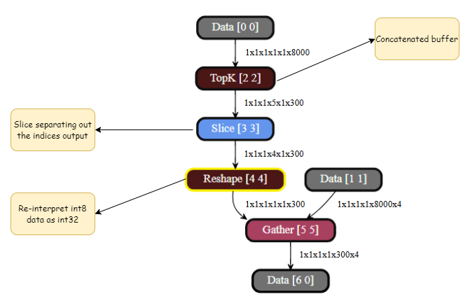

# TopK Operator

The TopK operator in TIDL (TIDL_TopKLayer) has a custom implementation where both outputs of the operator i.e. `values` and `indices` are combined into a single output buffer. 

Here are the key details of this custom implementation:
1. **Handling indices order in case of duplicate values**
    - TopK indices order for same values might differ from ONNX specified order for performance optimization.

2. **Single Output Buffer**:
   - Both the `values` and `indices` are concatenated into a single output buffer.
   - Slice layers are added after the TopK operator to separate the `values` and `indices` buffers.

3. **Data Type Handling**:
   - The output buffer assumes the data type of the `values` (either `int8` or `int16`).
   - Internally, the buffer also contains the `indices`, which are stored as `int32`.

4. **Output Buffer Size**:
   - The size of the output buffer is larger because it contains both `values` and `indices`:
     - **8-bit network**: The buffer size is **5x** the size of the values buffer.
       - Breakdown: `values (8-bit)` + `indices (32-bit, which is 4x 8-bit)`.
     - **16-bit network**: The buffer size is **3x** the size of the values buffer.
     - **32-bit network**: The buffer size is **2x** the size of the values buffer.

5. **Increment Axis**:
   - The increment axis (the axis along which the concatenation is applied) is the **channel dimension** when the TopK axis is one of the **channel**, **height**, or **width** dimensions (for performance reasons). For any other axis, it is the first **non-singleton** dimension when moving from the **batch** to the **width** dimension.

6. **Re-interpret Operation**:
   - After the slice layer separates the `indices` buffer, a re-interpret operation is performed.
   - This operation changes the data type of the buffer from the `values` data type (`int8` or `int16`) to the `indices` data type (`int32`).

 
 

<u>Output buffer layout of TopK</u>

 
 

<u>How output of TopK is processed</u>

