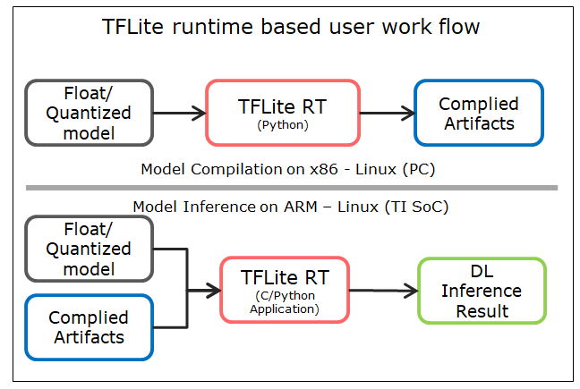
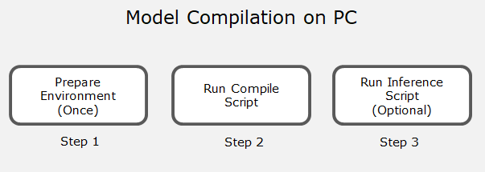
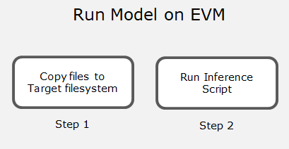

# Python Examples
<!-- TOC -->

- [Python Examples](#python-examples)
  - [Introduction](#introduction)
  - [OSRT based user work flow](#osrt-based-user-work-flow)
  - [Model Compilation](#model-compilation)
  - [Model Inference on PC (optional)](#model-inference-on-pc-optional)
  - [Model Inference on Device](#model-inference-on-device)
  - [User options for TIDL Acceleration](#user-options-for-tidl-acceleration)
    - [Required options](#required-options)
    - [Optional options](#optional-options)
      - [Basic options:](#basic-options)
      - [Options to enable control on layer level delegation to TI DSP/ARM](#options-to-enable-control-on-layer-level-delegation-to-ti-dsparm)
      - [Advanced options for accuracy enhancement](#advanced-options-for-accuracy-enhancement)
      - [Advanced miscellaneous options](#advanced-miscellaneous-options)
  - [Trouble Shooting](#trouble-shooting)

<!-- /TOC -->

## Introduction 

TIDL provides multiple deployment options with industry defined inference engines as listed below. These inference engines are being referred as Open Source Run Times  in this document.
* **TFLite Runtime**: [TensorFlow Lite](https://www.tensorflow.org/lite/guide/inference) based inference with heterogeneous execution on cortex-A** + C7x-MMA, using TFlite Delegates [TFLite Delgate](https://www.tensorflow.org/lite/performance/delegates) API
* **ONNX RunTime**: [ONNX Runtime]( https://www.onnxruntime.ai/) based inference with heterogeneous execution on cortex-A** + C7x-MMA.
* **TVM/Neo-AI RunTime**: [TVM]( https://tvm.apache.org)/[Neo-AI-DLR]( https://github.com/neo-ai/neo-ai-dlr) based inference with heterogeneous execution on cortex-A** + C7x-MMA


>** *Please refer to the device TRM to know which cortex-A MPU* the device of interest contains

This heterogeneous execution enables:
1. OSRT as the top level inference API for user applications
2. Offloading subgraphs to C7x/MMA for accelerated execution with TIDL
3. Runs optimized code on ARM core for layers that are not supported by TIDL

OSRT offering also supports general purpose ARM-only OSRT inference capability for low-end TI devices with no C7x/MMA

## OSRT based user work flow 

The diagram below illustrates the TFLite based work flow as an example. ONNX RunTime and TVM/Neo-AI DLR RunTime also follow similar work flow. The user needs to run the model compilation (sub-graph(s) creation and quantization) on PC and the generated artifacts can be used for inference on the device.  
Note : Currently, pre-quantized models support is available only for tflite models.



## Model Compilation



Model compilation is supported only on PC. Follow the below outlined steps to perform model compilation:

1. Prepare the Environment for the Model compilation by following the setup section [here](../../README.md#setup)

2. Run for model compilation in the corresponding runtimes examples folder (examples/osrt_python/{runtime}) – This step generates artifacts needed for inference in the \<repo base>\/model-artifacts folder. Each subgraph is identified in the artifacts using the tensor index/name of its output in the model
```
cd examples/osrt_python/tfl
python3 tflrt_delegate.py -c
```

## Model Inference on PC (optional)

1.	Run Inference on PC using TIDL artifacts generated during compilation	- User can test the inference in host emulation mode and check the output; the output images will be saved in the \<repo base>\/output_images folder
```
python3 tflrt_delegate.py
```
2. Run Inference on PC without TIDL offload -  User can test the inference in host emulation mode without using any delegation to TI Delegate
```
python3 tflrt_delegate.py -d
```

## Model Inference on Device

The artifacts generated by python scripts in the above section can be used for inference using either python or C/C++ APIs. The following steps are for running inference using python API



1. Clone the repo on Device
2. Copy below folders from PC to device where this repo is cloned

```
./model-artifacts
./models
```

3. Run inference script in the corresponding examples folder on the device and check the results, performance etc.
```
cd examples/osrt_python/tfl
python3 tflrt_delegate.py
```

Note : These scripts are only for basic functionally testing and performance check. Accuracy of the models can be benchmarked using the python module released here [edgeai-benchmark](https://github.com/TexasInstruments/edgeai-benchmark)


## User options for TIDL Acceleration

- **'options'** in the tfLite interpreter/ONNX inference session/TVM compiler call as outlined in [OSRT APIs for TIDL Acceleration](../../docs/custom_model_evaluation.md#osrt-apis-for-tidl-acceleration) are described below.   
- Options are common across runtimes. Any runtime specific requirements/constraints in terms of options are called out in below documentation. 
- Please see compilation examples (examples/osrt_python) for how to use these options.

### Required options

The following options must be specified by user while creating inference sessions for respective runtimes.

|       Name         | Description                          |   Default Values  |   Option Type  |  Additional details  |
|:-------------------|:---------------------------------------------------:|:-----------------:|:--------------:|:------------------------:| 
| tidl_tools_path    | This option indicates the path to TIDL tools to be used for model-compilation. On successful completion of setup script, the required TIDL tools are available in tidl_tools folder. As part of demo examples this option is populated using ${TIDL_TOOLS_PATH} environment variable set by user | No default value, must be specified by user | Model compilation |   |
| artifacts_folder   | TIDL model compilation generates artifacts which are used for model inference. This option specifies the path to folder where model artifacts are saved/to be saved  | No default value, must be specified by user |  Model compilation / Model inference |   |

TVM specific required options in addition to above:

|       Name         |                      Description                        |  Supported values/range  |       Default values      |  Option Type  |  Additional details  
|:-------------------|:--------------------------------------------------------|:--------------|:------------:|:--------------:|:------------------------| 
| platform       | This option specifies the platform used for inference | "J7", "AM62A" | "J7" | Model compilation   |  |                                             |

### Optional options

The following options are set to default values, to be specified if modification needed by user.

#### Basic options:

|       Name         |                      Description                        |  Supported values/range  |       Default values      |  Option Type  |  Additional details  
|:-------------------|:--------------------------------------------------------|:--------------|:------------:|:--------------:|:------------------------| 
| tensor_bits        | This option specifies number of bits for TIDL tensor and weights  |   8,16 (32 - only for PC inference, not device)   | 8                          | Model Compilation |  |
| debug_level        | This options enables increasing levels of debug prints and TIDL layer traces | 0 - no debug, <br> 1 - Level 1 debug prints, <br> 2 - Level 2 debug prints, <br> 3 - Level 1 debug prints, fixed point layer traces, <br> 4 (experimental) - Level 1 debug prints, Fixed point and floating point traces, <br> 5 (experimental) - Level 2 debug prints, Fixed point and floating point traces  <br> 6 - Level 3 debug prints | 0           | Model compilation / Model inference | |
| max_num_subgraphs  | This option specifies maximum number of subgraphs to be offloaded to TIDL for acceleration, rest to be delegated to ARM    | <= 16 | 16      | Model Compilation | |                  
| accuracy_level    | This option specifies level of accuracy desired - specifying higher accuracy_level gives improved accuracy, but may take more time for model compilation | 0 - basic calibration, <br> 1 - higher accuracy (advanced bias calibration), <br> 9 - user defined | 1 | Model compilation |Refer advanced options below for more granular control on accuracy knobs using accuracy_level = 9. Refer [] for more details on model quantization and accuracy |

#### Options to enable control on layer level delegation to TI DSP/ARM
Following options force offload of a particular layer to TIDL DSP/ARM. These can be exercised either for debug purpose, or performance improvement by creating optimal cluster in case desired

|       Name      |                      Description                        |  Supported values/range  |       Default values      |  Option Type  |  Additional details  
|:-------------------|:--------------------------------------------------------|:--------------|:------------:|:--------------:|:------------------------| 
| deny_list:layer_type | This option forcefully disables offload of a particular operator to TIDL DSP using layer type | Comma separated string | "" | Model Compilation | Refer [^1] for details on usage. This option is not available currently for TVM, please refer deny_list option. |
| deny_list:layer_name | This option forcefully disables offload of a particular operator to TIDL DSP using layer name | Comma separated string | ""  | Model Compilation | Refer [^2]. This option is not available currently for TVM, please refer deny_list option |
| deny_list | This option offers same functionality as deny_list:layer_type| Comma separated string | ""  | Model Compilation | Maintained for backward compatibility, not recommended for Tflite/ONNX runtime |
| allow_list:layer_name | This option forcefully enables offload of a particular operator to TIDL DSP using layer name | Comma separated string | ""  - Empty list | Model Compilation | Only the layer/layers specified are accelerated, others are delegated to ARM. Experimental for Tflite/ONNX runtime and currently not applicable for TVM. Refer [^2] |

Note : Allow_list and deny_list options cannot be enabled simultaneously

#### Advanced options for accuracy enhancement

Following options must be accessed as "advanced_options:Name" where Name is as specified in table below. For TVM, this shall be passed as additional dictionary. Refer out-of-box example for usage.

|       Name      |                      Description                        |  Supported values/range  |       Default values      |  Option Type  |  Additional details  
|:-------------------|:--------------------------------------------------------|:--------------|:------------:|:--------------:|:------------------------|
| calibration_frames              | This option specifies number of frames to be used for calibration - min 10 frames recommended | Any - min 10 frames recommended      | 20 | Model compilation | Applicable only for accuracy_level=1, Refer [] for more details|
| calibration_iterations          | This option specifies number of bias calibration iterations  | Any - min 10 recommeded    | 50             | Model compilation | Applicable only for accuracy_level=1, Refer [] for more details|
| output_feature_16bit_names_list | This option specifies list of names of the layers as in the original model whose feature/activation output user wants to be in 16 bit | Comma separated string | ""    | Model compilation | Refer [] for more details |
| params_16bit_names_list         | This option specifies list of names of the output layers as in the original model whose parameters user wants to be in 16 bit | Comma separated string | ""     | Model compilation | Refer [] for more details |
| mixed_precision_factor          | This option is used to enable the automated mixed precision feature - automatically decide which layers to set to 16 bit for improving accuracy based on acceptable performance degradation. This parameter is defined as mixed_precision_factor = (Acceptable latency with mixed precision / Latency with 8 bit inference), e.g. if acceptable latency for accuracy improvement is 1.2 times the 8 bit inference latency, the automated mixed precision algorithm finds the most optimal layers to set to 16 bits to gain accuracy improvement while making sure performance constraint set by mixedPrecisionFactor is satisfied| Any float value > 1 |   | -1 (No automated mixed precision) | Model compilation | Refer [] for more details |


Below options will be overwritten only if accuracy_level = 9, else will be discarded. For accuracy level 9, specified options will be overwritten, rest will be set to default values. For accuracy_level = 0/1, these are preset internally to default values.
Please refer [] for more details on individual options.

|                    Name                    |                      Description                        |        Default values      |
|:-------------------------------------------|:--------------------------------------------------------|:--------------------------:|
|advanced_options:activation_clipping        | 0 for disable, 1 for enable                       | 1                          |
|advanced_options:weight_clipping            | 0 for disable, 1 for enable                       | 1                          |
|advanced_options:bias_calibration           | 0 for disable, 1 for enable                       | 1                          |
|advanced_options:channel_wise_quantization  | 0 for disable, 1 for enable                       | 0                          |

#### Advanced miscellaneous options

|       Name      |                      Description                        |  Supported values/range  |       Default values      |  Option Type  |  Additional details  
|:-------------------|:--------------------------------------------------------|:--------------|:------------:|:--------------:|:------------------------|
| advanced_options:quantization_scale_type   | This option specifies type of quantization style to be used for model quantization | 0 - non-power-of-2,<br> 1 - power-of-2 <br> 3 - asymmetric quantization (applicabe only for pre-quantized tflite models on all SOCs except AM68PA)      | 0    | Model compilation | Refer [] for more details |
| advanced_options:high_resolution_optimization    | This option enables performance optimization for high resolution models  | 0 - disable, <br> 1 enable    | 0       | Model compilation | |
| advanced_options:add_data_convert_ops   | This option embeds input and output format conversions (layout, data type, etc.) as part of model and performs the same in DSP instead of ARM    | 0 - disable, <br> 1 - Input format conversion <br> 2 - output format conversion <br> 3 - Input and output format conversion |    0      | Model compilation | This is currently an experimental feature |
| model_type                   | This option is meant to communicate to TIDL import library that specified model is object detection model | "OD" |  ""    | Model compilation | This option is required to be set to "OD" only if model is object detection, and compilation throws warning asking to explicitly specify this option as "OD", else this option can be ignored |
| c7x_codegen        | This option is used to enable running TIDL-unsupported layers on DSP using TVM auto code generation feature | 0 - Run TIDL-unsupported layers on ARM, <br> 1 - Run TIDL-unsupported layers on DSP | 0 | Model compilation | This is a TVM specific feature, has undergone limited validation [^3]|
| ti_internal_nc_flag   | internal use only     | -   | - | - | -|


- [^1]: Specifying layer_type as part of deny_list option :   
 Tflite runtime : Specify registration code as specified in tflite builtin ops - Please refer [Tflite builtin ops](https://github.com/tensorflow/tensorflow/blob/r2.3/tensorflow/lite/builtin_ops.h)  , e.g. "1, 2" to deny offloading 'AveragePool2d' and 'Concatenation' operators to TIDL.  
 ONNX runtime : Specify the ONNX operator name e.g. "MaxPool" to deny offloading Max pooling operator to TIDL
 TVM runtime : Specify TVM relay operator name e.g. "nn.conv2d" to deny offloading convolution operator to TIDL
- [^2]: ONNX runtime - In case layer name is not present as part of layer in model, output name corresponding to output(0) for the particular layer can be specified
- [^3]: Running TIDL-unsupported layers on DSP with parameter "c7x_codegen=1", requires Processor SDK 8.2 or newer. This feature has only been validated with selected models in TI's Edgeai-benchmark that are using the TVM flow.  We will continue to work on this feature
to improve the operator coverage and generate more performant DSP code.  If your model encounters problem with this feature, please set "c7x_codegen=0" and run the TIDL-unsupported layers on ARM.


## Trouble Shooting
Refer this [Troubleshooting](../../docs/tidl_osr_debug.md) section if any issues observed during compilation of custom models.
