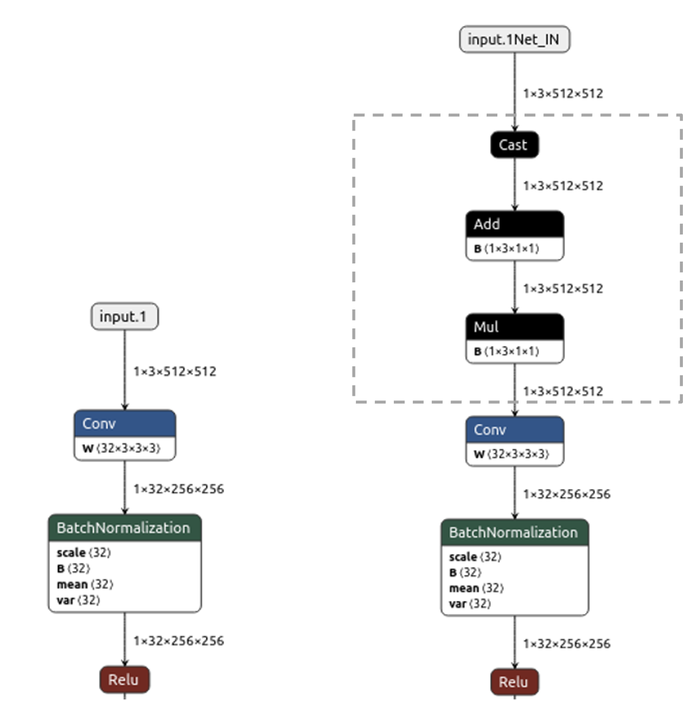

- [Scripts for Model Optimization and Validation](#scripts-for-model-optimization-and-validation)
  - [Model Optimization](#model-optimization)
- [Scripts for RGB to YUV Model conversion](#scripts-for-rgb-to-yuv-model-conversion)
  - [RGB_YUV_model_converter](#rgb-to-yuv-model-converter) 

# Scripts for Model Optimization and Validation

## Model Optimization

During vision-based DL model training the input image is normalized and resultant float input tensor is used as input for model. The float tensor would need 4 bytes (32-bit) for each element compared to 1 byte of the element from camera sensor output which is unsigned 8-bit integer.  We propose to update model offline to change this input to 8-bit integer and push the required normalization parameters as part of the model. This figure 6 shows the example of such original model with float input and an updated model with 8-bit integer. The operators inside the dotted box are additional operators. This model is functionally exactly same as original but would require less memory bandwidth compared original. The additional operators also would be merged into the following convolution layer to reduce overall DL inference latency.  

This optimization is included by default in the Model compilation script in this repository. This is done during model download step.

# Scripts for RGB to YUV Model conversion

## RGB to YUV model converter

Sometimes a model which is trained over RGB data need to be run with YUV data. During these scenarios we propose to update model offline to change its input from RGB to YUV. 
edgeai-tidl-tools provide scripts to do this. Script to convert TFlite model can be found [here](osrt_model_tools/tflite_tools/RGB_YUV_model_converter.py) and for onnx model can be found [here](osrt_model_tools/onnx_tools/RGB_YUV_model_converter.py) This below figure shows the example of such original model with RGB converted to a model which takes YUV input. The operators inside the box are additional operators added to perform this task. 

 One can use [examples](../examples/osrt_cpp/advanced_examples) as a reference to convert a RGB model to YUV model.

 

