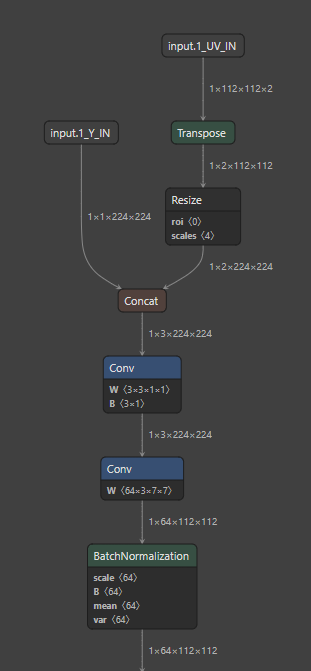

- [Scripts for Model Optimization and Validation](#scripts-for-model-optimization-and-validation)
  - [Model Optimization](#model-optimization)
- [Scripts for RGB to YUV Model conversion](#scripts-for-rgb-to-yuv-model-conversion)
  - [RGB_YUV_model_converter](#rgb-to-yuv-model-converter) 
  - [Extending Support for other Colorspaces](#extending-support-for-other-colorspaces)

# Scripts for Model Optimization and Validation

## Model Optimization

During vision-based DL model training the input image is normalized and resultant float input tensor is used as input for model. The float tensor would need 4 bytes (32-bit) for each element compared to 1 byte of the element from camera sensor output which is unsigned 8-bit integer.  We propose to update the model offline to change this input to 8-bit integer and push the required normalization parameters as part of the model. Below figure shows the conversion of original model with float input and an updated model with 8-bit integer. The operators inside the dotted box are additional operators. This model is functionally the same as the original model, but  requires lesser memory bandwidth compared original. This enables DL library to add additional optimizations during the compilation leading to reduction the overall latency. 

This optimization is included by default in the Model compilation script in this repository. This is done during model download step.


# Scripts for RGB to YUV Model conversion

## RGB to YUV model converter

Sometimes a model which is trained with RGB data needs to be run with YUV data. During these scenarios we propose to update model offline to change its input from RGB to YUV. we provide scripts to do this. Script to convert TFlite model can be found [here](osrt_model_tools/tflite_tools/RGB_YUV_model_converter.py) and for onnx model can be found [here](osrt_model_tools/onnx_tools/tidl_onnx_model_utils/RGB_YUV_model_converter.py). Below figure shows the conversion of original model with RGB converted to a model which takes YUV input. The operators inside the box are additional operators added to perform this task. 

 


## Extending support for other colorspaces

The convolution layer with name **Conv_YUV_RGB_\*** handles the computation of converting the YUV to RGB. If your input is in different colorspace, you can update the weights of the convolution layer in [RGB_YUV_model_converter.py](../scripts/osrt_model_tools/onnx_tools/tidl_onnx_model_utils/RGB_YUV_model_converter.py) for onnx model or [ RGB_YUV_model_converter.py](../scripts/osrt_model_tools/tflite_tools/RGB_YUV_model_converter.py) for tflite model accordingly.

```python
# for onnx model
def addYUVConv(in_model_path, out_model_path, args):
    ...
    # adding conv to convert YUV to RGB
    weights = [1.164, 0.0, 1.596,
                1.164, -0.391, -0.813,
                1.164, 2.018, 0.0 ]
    bias= [-222.912, 135.488, -276.928]
    ...
```

```python
# for tflite model
def getWightsAndBiasData(): 
  weights = [1.164, 0.0, 1.596,
             1.164, -0.391, -0.813,
             1.164, 2.018, 0.0]
  bias= [-222.912,135.488,-276.928]
  return weights, bias
```
One can use [examples](../examples/osrt_cpp/advanced_examples) as a reference to convert a RGB model to YUV model.