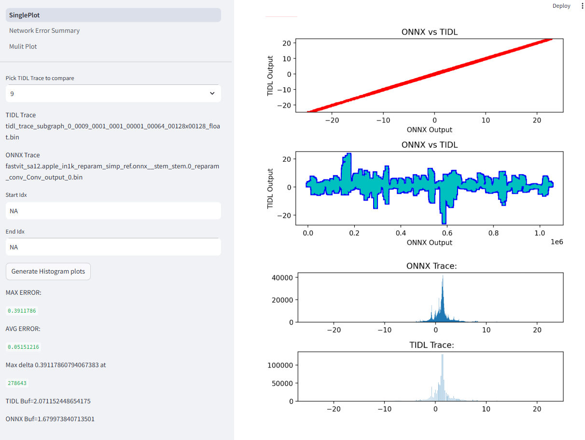
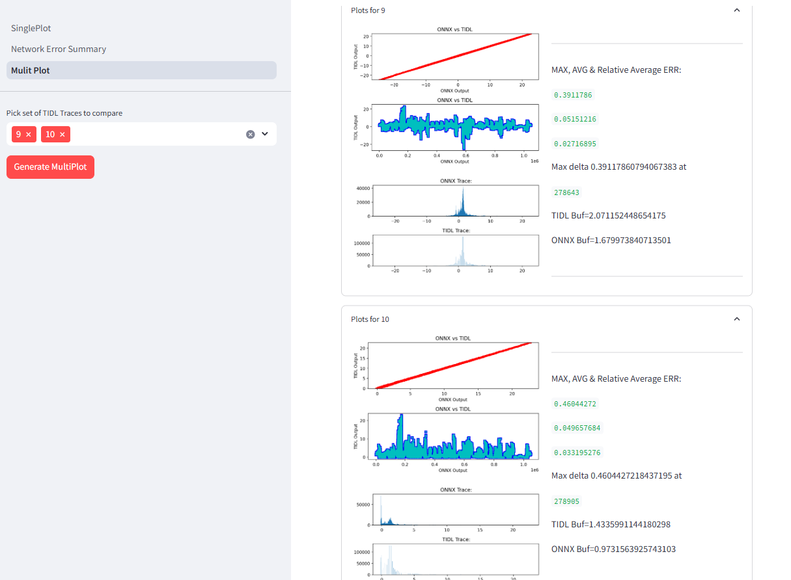
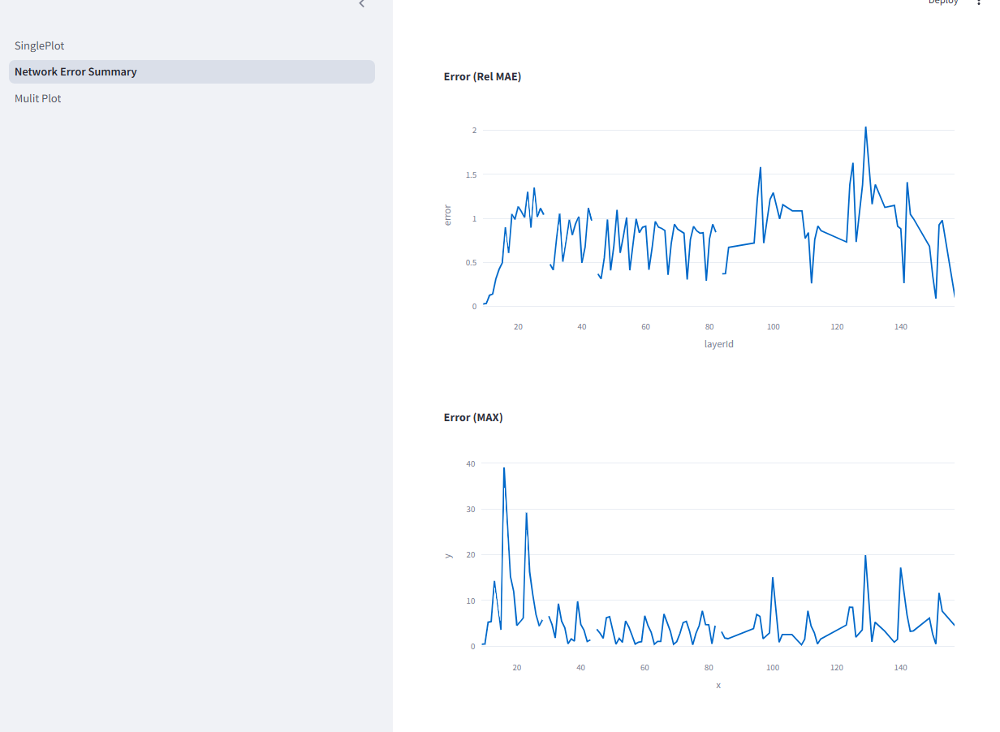

- [Scripts for Model Optimization and Validation](#scripts-for-model-optimization-and-validation)
  - [Model Optimization](#model-optimization)
- [Scripts for RGB to YUV Model conversion](#scripts-for-rgb-to-yuv-model-conversion)
  - [RGB_YUV_model_converter](#rgb-to-yuv-model-converter) 
  - [Extending Support for other Colorspaces](#extending-support-for-other-colorspaces)
- [Inspecting intermediate layer traces](#inspecting-intermediate-layer-traces)
  - [Extending for custom use case](#extending-for-custom-use-case)

# Scripts for Model Optimization and Validation

## Model Optimization

During vision-based DL model training the input image is normalized and resultant float input tensor is used as input for model. The float tensor would need 4 bytes (32-bit) for each element compared to 1 byte which is typical for camera sensor (unsigned 8-bit integer).  We propose to update the model offline to accept 8-bit integer inputs and push the required normalization parameters as part of the model. Below figure shows the conversion of original model with float input and an updated model with 8-bit integer input. The operators inside the dotted box are additional operators. This model is functionally the same as the original model, but requires lesser memory bandwidth compared original.

This optimization is included by default in the model compilation examples in this repository. This is done during model download step.


# Scripts for RGB to YUV Model conversion

## RGB to YUV model converter

Sometimes a model which is trained with RGB data needs to be run with YUV data. During these scenarios we propose to update model offline to change its input from RGB to YUV. The script to convert TFlite models can be found [here](osrt-model-tools/osrt_model_tools/tflite_tools/RGB_YUV_model_converter.py) and for ONNX model can be found [here](osrt-model-tools/osrt_model_tools/onnx_tools/tidl_onnx_model_utils/RGB_YUV_model_converter.py). The figure below shows the conversion of original model with RGB converted to a model which takes YUV input. The operators inside the box are additional operators added to perform this task. 

 


## Extending support for other colorspaces

The convolution layer with name **Conv_YUV_RGB_\*** handles the computation of converting the YUV to RGB. If your input is in a different colorspace, you can update the weights of the convolution layer in [RGB_YUV_model_converter.py](../osrt-model-tools/osrt_model_tools/onnx_tools/tidl_onnx_model_utils/RGB_YUV_model_converter.py) for onnx model or [ RGB_YUV_model_converter.py](../osrt-model-tools/osrt_model_tools/tflite_tools/RGB_YUV_model_converter.py) for tflite model accordingly.

```python
# for onnx model
def addYUVConv(in_model_path, out_model_path, args):
    ...
    # adding conv to convert YUV to RGB
    weights = [1.164, 0.0, 1.596,
                1.164, -0.391, -0.813,
                1.164, 2.018, 0.0 ]
    bias= [-222.912, 135.488, -276.928]
    ...
```

```python
# for tflite model
def getWightsAndBiasData(): 
  weights = [1.164, 0.0, 1.596,
             1.164, -0.391, -0.813,
             1.164, 2.018, 0.0]
  bias= [-222.912,135.488,-276.928]
  return weights, bias
```
The following [example](../examples/osrt_python/advanced_examples/RGB_YUV_model_conversion/README.md) illustrates this further

# Inspecting intermediate layer traces
This module enables users to analyze layer-level traces to identify layers causing deviations. It leverages the mapping between ONNX traces and TIDL traces, which is constructed using the layer_info.txt file generated from compiled artifacts.

### Usage:

To run the module for inspecting intermediate layer traces, use the following command:

```bash
streamlit run layer_trace_inspector.py -- \
  --traceONNX <path to the onnx trace folder> \
  --traceTIDL <path to the tidl trace folder> \
  --traceInfo <path to the network layer info> \
  --v # for extra debug info
```

### Single Plot
This feature generates a visualization for a single layer trace:


### Multi Plot 
This feature provides a comparative inspection across multiple layers:


### Network Error Summary 
This feature summarizes errors across the network layers:



## Extending for custom use case

The module for inspecting intermediate layer traces includes a default mapping function, __LayerTraceInspector.getTraces__. To adapt the module for custom use cases, you can follow the example provided below:

```python
from layer_trace_inspector import LayerTraceInspector

class CustomLayerTraceInspector(LayerTraceInspector):
  # overriding the default getTraces function
  def getTraces(self):
    # your custom mapping logic
    self.tidl_onnx_trace_mapping = {...}
```
