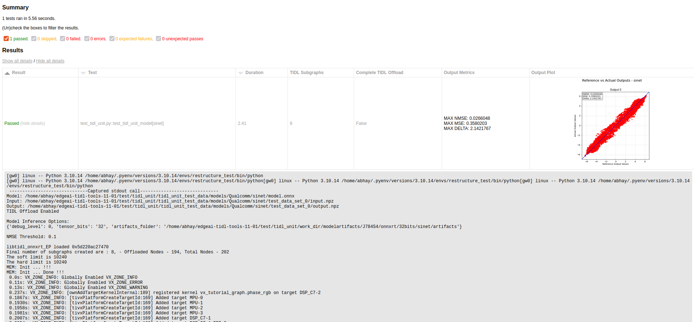
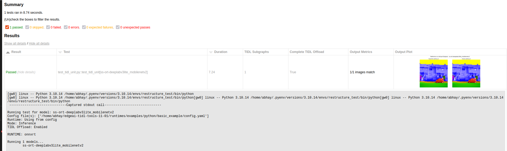

# TIDL Unit Test Framework

A pytest-based testing framework that uses the `basic_example.py` script to test models defined in config files. It allows you to run all models defined in a config file as separate tests.

<!-- TOC -->
- [Features](#features)
- [Requirements](#requirements)
- [Usage](#usage)
  - [Command-Line Arguments](#command-line-arguments)
  - [Basic Usage](#basic-usage)
  - [Suggestions](#suggestions)
- [How It Works](#how-it-works)
- [Evaluation Metrics](#evaluation-metrics)
  - [Binary Output Comparison](#binary-output-comparison)
  - [Post-Processed Output Comparison](#post-processed-output-comparison)
- [Test Reports](#test-reports)
- [Notes](#notes)
- [Troubleshooting](#troubleshooting)
<!-- /TOC -->

## Features

- Automatically discovers and runs tests for all models defined in config files
- Supports filtering by model name
- Supports both compilation and inference modes
- Generates HTML reports with output metrics and plots
- Configurable through command-line arguments

## Requirements

Install the required dependencies:

```bash
pip install -r requirements.txt
```

## Usage

### Command-Line Arguments

- `--configs`: Paths to the config files (required)
- `--models`: Filter models in the provided config files
- `--run-infer`: Run in inference mode (default is compilation mode)
- `--disable-tidl-offload`: Disable TIDL offload
- `--artifacts-dir`: Directory to store/use compiled models artifacts. (default: `./model-artifacts/<soc>/<runtime>/<tensor_bits>/`)
- `--reports-dir`: Directory to store resultant reports. (default: `./reports`)
- `--force-runtime`: Overwrite runtime defined in config file. Note: For ONNX models (.onnx), only 'onnxrt', 'tidlrt', or 'tvmrt' can be forced. For TFLite models (.tflite), only 'tflitert' can be forced.
- `--options`: Additional options to pass to the run function (e.g., `--options tensor_bits=8 advanced_options:quantization_scale_type=4`)
- `--nmse-threshold`: NMSE threshold for inference testing. Note: Only used in case of Binary Output Comparison.
- `--expected-fails`: Space separated expected failure tests
- `--disable-plot`: Disable output plot in generated report
- `--no-subprocess`: Disable running as subprocess
- `--exit-on-critical-error`: Force exit test on critical error
- `--num-frames`: Number of frames to run. Overwrites `num_frames` in the model config if specified.
- `--timeout`: Timeout for test in seconds (default: 10s on aarch64, pytest-timeout default on x86). When `--num-frames` is also specified, the timeout is scaled by the number of frames (capped at 300s).
- `--keep-full-model-artifacts`: Do not remove `tempDir` from the artifacts folder after compilation. Useful for debugging or inspecting intermediate compilation outputs.
- `-n`: Number of parallel processes (default: auto)


### Basic Usage

```bash
# Setup environment variables. You can also use setup_env.sh script packaged in the repository.
export SOC=j721e
export TIDL_TOOLS_PATH=/path/to/tidl/tools                  # Required only when running on x86
export LD_LIBRARY_PATH=$TIDL_TOOLS_PATH:$LD_LIBRARY_PATH    # Required only when running on x86

# Run compilation tests with a config file
# Note: Running 1 process at time for compilation test for better stability.
pytest test_tidl_unit.py --configs /path/to/config.yaml -n 1

# Run inference tests with a config file
pytest test_tidl_unit.py --configs /path/to/config.yaml --run-infer

# Run tests for specific models
pytest test_tidl_unit.py --configs /path/to/config.yaml --models model1 model2

# Force all models in config.yaml to run with specific runtime irrespective of what is defined in config
pytest test_tidl_unit.py --configs /path/to/config.yaml --force-runtime onnxrt

# Overwrite some compilation options defined in config
pytest test_tidl_unit.py --configs /path/to/config.yaml --options tensor_bits=16 advanced_options:quantization_scale_type=4

# Overwrite nmse-threshold and overwrite some inference options defined in config
pytest test_tidl_unit.py --configs /path/to/config.yaml  --nmse_threshold=0.1 --options debug_level=1 --run-infer
```

### Suggestions

When running on SoC:
   - Always use `-n 1` to run tests sequentially to avoid resource contention
   - Use `--exit-on-critical-error` to immediately stop testing if any model fails with a critical error leaving the hardware in undetermined state.
   - Use only `--run-infer` since compilation is not supported on SoC
   - Mount the repository from your development machine using NFS to avoid having to transfer model artifacts
   - Example command: `pytest test_tidl_unit.py --configs /path/to/config.yaml --run-infer -n 1 --exit-on-critical-error`

When running model compilation:
   - Reduce the number of threads using `-n` in case you are seeing instability due to resource contention for model compilation.

## How It Works

1. The framework parses the specified config files to discover all models
2. It creates a separate test for each model
3. For each test, it calls the `run()` function from `basic_example.py` with the appropriate parameters
4. It captures the output and performance metrics
5. For inference tests, it compares outputs against reference values:
   - If `expected_outputs` is defined in the model's entry in the config file (as a path to a reference output file), it uses that file as reference
   - If expected outputs are missing or invalid, it automatically generates reference outputs on the fly by running the model without TIDL offload
   - For TVMRT or TIDLRT if `expected_outputs` is not defined, it uses ONNXRT or TFLITERT to generate the golden reference based on the model
   ```yaml
   models:
      model_name:
         path: ...
         inputs: ...
         expected_outputs: *path to expected output*  #Optional
         ...
   ```
6. It generates an HTML report with the results

## Evaluation Metrics

The framework uses different evaluation metrics based on the model config:

### Binary Output Comparison
For **models without post-processing defined in config**, the framework compares the binary outputs using:
- **NMSE** (Normalized Mean Squared Error)
- **MSE** (Mean Squared Error)

### Post-Processed Output Comparison
For **models with post-processing defined in config**, the framework uses specialized metrics based on the task type:
- **Classification** - Top-N class match between actual and reference outputs (default N=3)
- **Object Detection** - IoU (Intersection over Union) (>=80%) for bounding boxes between actual and reference outputs
- **Segmentation** - Pixel-wise class match percentage (>=95%) between actual and reference outputs


## Test Reports

HTML test reports are generated in the reports directory (specified by `--reports-dir`, default: `./reports`) with filenames in the format `report_<date>_<time>.html` (e.g., `report_02-02-2026_10-23-37.html`). The reports include the following columns:

| Column | Description |
|---|---|
| Result | Pass / fail / xfail status |
| Test | Model name and parametrize ID |
| TIDL Offload Status | `ALL`, `PARTIAL`, or `NONE` with subgraph and node counts (e.g. `ALL - 1 subgraph(s) [186/186 nodes]`) |
| Perf Metrics | Inference timing and DDR bandwidth from the first TIDL run: `total_time`, `core_time`, `subgraph_time` (or `graph_time`), `read_total`, `write_total`, `ddr_total` |
| Output Metrics | For binary outputs: MAX NMSE, MAX MSE, MAX DELTA. For post-processed outputs: match count (e.g. `3/5 images match`) |
| Output Plot | Visual comparison of reference vs. actual outputs (binary tensor plot or post-processed images) |

> **Note:** When running tests on a TI SoC, the HTML reports might be generated with root ownership. If you want to view these reports on your PC as a non-root user, you may need to change the owner of the file using the `chown` command:
> ```bash
> sudo chown <your_username>:<your_group> <reports_dir>/report_*.html
> ```

<div align="center">

<p><u>Report with "Binary Output Comparison" evaluation technique</u></p> 
</div>
<br>
<div align="center">

<p><u>Report with "Post-Processed Output Comparison" evaluation technique</u></p> 
</div>

## Notes

- For models with multiple inputs or expected outputs defined in config, note that only the first input/output will be used for testing
- When using `--force-runtime`, ensure compatibility with the model format: ONNX models (.onnx) support 'onnxrt', 'tidlrt', or 'tvmrt', while TFLite models (.tflite) only support 'tflitert'
- Model compilation is not supported on SoC platforms. You must compile models on an x86 machine first and then transfer the model artifacts to the SoC for inference testing.

## Troubleshooting

- Ensure `SOC`, `TIDL_TOOLS_PATH` and `LD_LIBRARY_PATH` environment variables are set correctly
- If you see random failures and instability, try decreasing the number of parallel processes using `-n` option
- If tests fail with timeout errors, increase the timeout value using the `--timeout` option
- Tests are run in separate processes by default to isolate failures and handle crashes gracefully, use `--no-subprocess` to run tests in the main process for easier debugging
- You might want to stop test when you encounter a critical issue specially while running on SoC. By default if a test fails due to critical error it will not stop the other tests running in different processes. Use the `--exit-on-critical-error` flag to stop all the test run when a critical error is detected.
- For memory-related issues on x86, try using a different temporary buffer directory by adding `advanced_options:temp_buffer_dir=/path/to/dir advanced_options:temp_nc_dir=/path/to/dir` to the options
- When running on SoC, always use `-n 1` to run tests sequentially to avoid resource contention